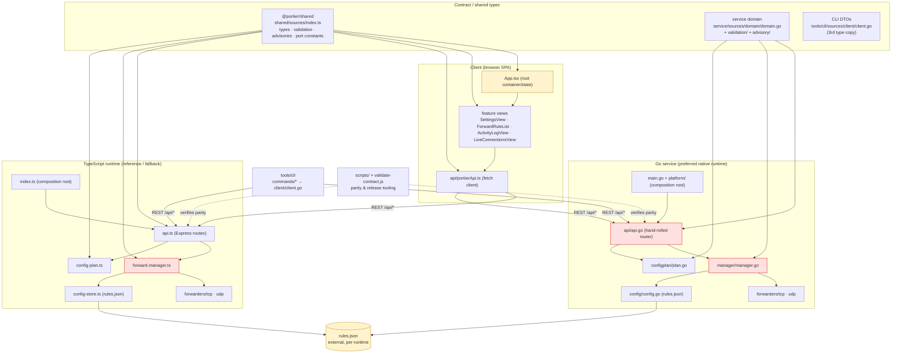

# Portier v1.6 Architecture Audit 1

**Date:** 2026-06-09
**Auditor:** Claude (automated) + manual classification
**Branch:** main (post v1.6-pre Slice A, commit 7997603 + working tree)
**Source checklist:** `claude-code-reviewing/Code Quality/initial-software-design-analyis.md`
**Goal:** Evaluate Portier's architecture (separation of concerns, pattern, boundaries, dependency flow, modularity, anti-patterns) and recommend whether to harden architecture before pushing further toward 100% meaningful coverage.

**Scope constraint:** Analysis only. No fixes implemented, no tests added, no behavior or contracts changed. Findings cite exact files and identifiers; unverifiable items are marked **Unable to verify**.

---

## Executive Summary

**Architecture rating: 7 / 10.**

Portier is a cleanly-layered **dual-runtime client/server** application. The boundaries that matter most are real and disciplined: a single shared contract package (`@portier/shared`) feeds the TypeScript stack, both runtimes expose the same REST API, the CLI is a pure API client, and the dependency graph is an acyclic DAG with `domain`/`shared` as leaf nodes. Coverage is healthy (all five gates pass: shared 100%, server 95.2%, client 95.2%, service 88.6%, cli 93.2%) so the codebase is in a good state to refactor safely.

The rating is held below 8 by one structural tension and a cluster of god-ish modules:

**Biggest architecture risks:**

1. **The product contract is defined three times and parity is only partially enforced.** Types live in `shared/sources/*.ts` (TS), `service/sources/domain/domain.go` + `configplan` (Go service), and `tools/cli/sources/client/client.go` (Go CLI, a separate `portier/cli` module that cannot import the service). `validate:contract` exercises the two *runtimes* against each other, but the CLI's type copy is verified only against `httptest` mocks, and the contract checker verifies advisory **codes and field shapes, not message text**. A drift has *already* occurred (see Finding A1): the `LAN_EXPOSURE` advisory message differs between TS and Go and no gate caught it.
2. **Config *apply* orchestration is duplicated in the HTTP handler of each runtime, not in a shared engine.** The plan engine is duplicated deliberately (`config-plan.ts` ↔ `configplan/plan.go`) and well-tested, but the *apply* step — filter operations, inject IDs, build a replace-import — is hand-written a second time inside `api.ts` `POST /api/config/apply` and `api.go` `configApply`. That is four places where plan/apply semantics must stay aligned.
3. **`manager.go` / `ForwardManager` are responsibility hotspots.** Each mixes rule storage, persistence, forwarder lifecycle, activity emission, live-connection registries, and import/export. The Go `manager.go` (773 lines) additionally carries ~10 copy-pasted `emitActivity` blocks.

**Biggest architecture strengths:**

- **One source of truth per language layer.** `shared/sources/index.ts` owns all TS types, validation, port constants, and advisory logic; client and server both import it and never redefine it.
- **Clean, acyclic dependency flow.** No import cycles in any of the four code trees; `domain`/`shared` are pure leaves with zero runtime dependencies.
- **The CLI is genuinely just a client.** No plan engine, no validation logic, no forwarding code leaked into `tools/cli/` — every config command calls `POST /api/config/plan` or `/apply` (verified: zero matches for `buildConfigPlan`/`validateForward`/`listenKey` under `tools/cli/sources/`).
- **Runtime parity is treated as a first-class concern** via `validate:contract` (156/156) and a fixture-based `validate:config`.

**Should v1.6 fix architecture before more coverage work?**

**No hard block.** Coverage gates already pass and the architecture is sound enough that further coverage work will not be wasted. However, **two low-risk slices should land before the bulk of the remaining coverage push** because they directly reduce maintenance risk and make the runtimes converge: (Arch-A) close the contract-drift gap, and (Arch-B) extract the duplicated apply orchestration. Both are small and improve testability rather than fighting it.

**Recommended first implementation slice:** **Arch-A — Contract drift guard** (fix the already-present `LAN_EXPOSURE` message drift and extend `validate:contract` to compare advisory message text + the full plan operation/warning payload, not just codes). It is the cheapest slice, fixes a live defect, and protects the project's core "two runtimes, one contract" promise.

---

## Architecture Map



**Legend:** red = responsibility hotspot (Findings A3/A4); amber = potential bottleneck / single point of contention.

**Potential bottlenecks (concurrency / scale, not yet a problem at this app's scale):**

- **`rules.json` single-writer.** Every mutation funnels through `manager.persist()` → `store.save(allRules)`, rewriting the whole file. Fine for a localhost dev tool; would not scale to high write rates. Not a defect — noted for completeness.
- **`App.tsx` central state.** All client view state (15+ `useState`, polling loop, diagnosis map) lives in the root component; every feature view depends on props threaded from it.
- **Per-runtime in-memory registries.** `TcpConnectionRegistry`/`UdpSessionRegistry` and `ActivityStore` are per-process; live-connection data is not shared between the Node and Go runtimes (by design — only one runs at a time).

---

## Current Architecture Pattern

**Primary pattern: Dual-runtime, layered client/server.** Concretely:

- **Client/server with a thin REST seam.** The browser SPA (`client/sources/`) and the CLI (`tools/cli/`) are pure HTTP clients of a documented REST API (`docs/api-contract.md`). Neither embeds forwarding or persistence logic. `client/sources/api/portierApi.ts` and `tools/cli/sources/client/client.go` are the only network boundaries.
- **Dual runtime.** Two interchangeable server implementations expose the *same* API: the TypeScript reference runtime (`server/sources/`, composition root `index.ts`) and the Go native runtime (`service/sources/`, composition root `main.go`). `RuntimeInfo.runtime` is `"node" | "go"` and both are surfaced via `GET /api/runtime` (`api.ts:127`, `api.go:551`).
- **Layered within each runtime.** A consistent stack appears in both: entry/composition root → HTTP/API layer → manager (domain service) → forwarders + config store + registries → domain/shared types. Example (Go): `main.go` → `api/api.go` → `manager/manager.go` → `forwarders/`, `config/`, `connections/` → `domain/`.
- **Shared-kernel for the TS half.** `@portier/shared` is a classic shared kernel imported by both client and server; the Go side re-implements that kernel in `domain/`, `validation/`, `advisory/`, `configplan/`.

It is **not** microservices (single deployable per runtime, in-process calls) and **not** MVC in the classic sense (no controller/view framework; React views + plain function modules).

**On the Portier-specific positioning questions:**

- *Is the TS↔Go split clean?* **Mostly yes.** Each runtime is self-contained with its own composition root and never imports the other. The seam is the REST contract. The leak is at the *contract definition* level (three copies), not the runtime level.
- *Is `server/` still a supported reference/fallback, not legacy?* **Yes.** It is a workspace, fully tested (95.2% stmts), referenced as `server.js` in the packaged runtime layout, and `RuntimeInfo.runtime: "node"` is live. No deprecation markers. CLAUDE.md and the package layout treat it as the Node fallback.
- *Is `service/` cleanly positioned as the preferred native runtime?* **Yes.** It is the binary shipped as `service`/`service.exe`, `DefaultStaticDir=web`, and the default packaged target.
- *Is the CLI only an API client?* **Yes, verified.** No forwarding/plan/validation logic under `tools/cli/sources/`.

---

## Findings

| Area | File / Identifier | Finding | Severity | Category | Recommended Action | Effort | Risk | Notes |
| ---- | ----------------- | ------- | -------: | -------- | ------------------ | ------ | ---- | ----- |
| Contract drift | `shared/sources/index.ts:354` vs `service/sources/advisory/advisory.go:108` | `LAN_EXPOSURE` advisory **message text differs** between runtimes ("…exposes this forwarded port on all interfaces. Other LAN devices may be able to connect if firewall settings allow it." vs "…exposes this forwarded port on the LAN."). Already-shipped drift. | 5 | HIGH | Pick one canonical message; align Go to TS (or vice-versa); add message-text assertion to `validate:contract`. | S | Low | Not caught by any gate today; contract checker only verifies codes/shape (`validate-contract.js:564-616`). |
| Contract definition | `shared/*.ts`, `service/sources/domain/domain.go`, `tools/cli/sources/client/client.go` | Contract types defined **three times**; only TS↔Go-service parity is automatically enforced. CLI DTOs (`ConfigPlanResponse`, `ForwardRuleResponse`, …) verified only against in-test `httptest` mocks. | 6 | HIGH | Add a CLI-vs-running-runtime contract check (or generate CLI DTOs); document the three-copy decision explicitly with the parity guarantee per copy. | M | Low | Inherent to a 2-language + separate-CLI-module design; the gap is *enforcement*, not the duplication itself. |
| Duplicated logic | `server/sources/api.ts:254-276` & `service/sources/api/api.go:667-705` | Config **apply orchestration** (filter ops, inject IDs, build replace-import) is hand-written in each HTTP handler rather than a shared apply function alongside the plan engine. 4th + 5th copy of plan/apply semantics. | 5 | MEDIUM | Extract `applyPlan(plan, manager)` into a unit next to each plan engine (`config-plan.ts` / `configplan`); handlers call it. Keeps deliberate cross-language duplication but removes *intra-runtime* mixing of HTTP and apply logic. | M | Med | Apply currently lives in the controller layer; moving it also unlocks direct unit tests (see Coverage Interaction). |
| God module | `service/sources/manager/manager.go` (773 lines) | Mixes 6 responsibilities: rule store, persistence, forwarder lifecycle, activity emission, live-connection registries, import/export. ~10 near-identical `emitActivity(... id,name,proto ...)` blocks. | 5 | MEDIUM | Optional split: extract an `activityEmitter` helper (collapses the copy-paste) and consider a `ruleStore` vs `lifecycle` seam. Do *after* coverage, behind existing tests. | M | Med | Highest churn file in service; rollback paths recently tested in Slice B. |
| God module | `server/sources/forward-manager.ts` (442 lines) `ForwardManager` | Same responsibility mix as Go manager (store + lifecycle + activity + registries + import/export). Less copy-paste than Go (activity calls are terser). | 4 | MEDIUM | Mirror whatever split is chosen for Go to keep parity; not urgent. | M | Med | Parity with Go manager matters more than the split itself. |
| Hand-rolled router | `service/sources/api/api.go:89-173` `serveAPI` | ~25-branch `if method/path` chain doing manual routing + path-splitting (`serveForwardByID:217-253`). Mixed levels of abstraction (routing + parsing + dispatch in one func). | 3 | LOW | Acceptable for std-lib-only constraint; if it grows, introduce a tiny route table. Leave as-is for v1.6. | M | Med | TS side uses Express so the asymmetry is inherent; not worth a dependency. |
| Copy-paste | `service/sources/manager/manager.go:733` `randomID` & `service/sources/api/api.go:707` `newApplyRuleID` | Two identical UUID-v4 generators in different packages. | 2 | LOW | Extract one `domain`/util `NewRuleID()`; have both call it. | S | Low | Pure dedupe; behavior identical. |
| Dead code | `service/sources/api/api.go:513-516` | `name := rule.Name; if name == "" { name = "" }` — no-op assignment. | 1 | LOW | Delete the no-op; assign `rule.Name` directly. | S | None | Cosmetic. |
| Container size | `client/sources/app/App.tsx` (417 lines) | Root component owns all cross-view state, polling loop, and handler refs; feature views are prop-driven. Function coverage 64% (per coverage audit). | 3 | OBSERVATION | Acceptable for app size; if growth continues, lift shared state into a context/hook. Not a v1.6 action. | M | Med | Common React "smart root" pattern; not a defect. |
| Boundary (positive) | `tools/cli/sources/` | CLI contains **no** forwarding/plan/validation logic; pure API client. | — | OBSERVATION | None — keep this invariant; add a guard test that fails if CLI imports plan/validation. | S | Low | Verified by grep (zero matches). |
| Boundary (positive) | `shared/sources/index.ts` | Single source of truth for all TS types/validation/advisories; no redefinition in client or server. | — | OBSERVATION | None — preserve. | — | — | Strongest boundary in the codebase. |

---

## Dependency Flow

**Allowed / actual direction (all four trees form acyclic DAGs):**

- **TypeScript:** `index.ts` → `api.ts` → {`forward-manager.ts`, `config-plan.ts`, `diagnose.ts`, `activity/`} → {`forwarders/`, `connections/`, `config-store.ts`} → `@portier/shared`. `@portier/shared` imports nothing internal (leaf). Verified by reading the import headers of `api.ts`, `forward-manager.ts`, `config-plan.ts`, `index.ts`. **No cycles.**
- **Go service:** `main.go` → `api/api.go` → {`manager`, `configplan`, `advisory`, `validation`, `connections`, `static`, `options`, `version`, `activity`} → {`forwarders`, `config`, `domain`}. `domain` is a pure leaf (`domain.go` imports nothing). `configplan` → {`domain`, `validation`}; `validation` → `domain`. **No cycles.**
- **Go CLI:** `main.go` → `commands/*` → {`client`, `output`, `version`}. `client` is the only networked leaf. **No cycles.**
- **Client:** `App.tsx` → feature views → `api/portierApi.ts` → `@portier/shared`. **No cycles.**

**Suspicious imports / leaks:** None found. No runtime-specific dependency leaks into `shared/` (it imports zero Node/Express/React modules — confirmed: `shared/sources/index.ts` has no imports). `client/` never imports `server/` internals; it consumes only `@portier/shared` types and the REST API. The CLI module (`portier/cli`) correctly does **not** import `portier/service` (verified: zero matches for `portier/service` under `tools/cli/sources/`), which is why it must redefine DTOs.

**Circular dependency risk:** **Low.** `domain`/`shared` being dependency-free leaves is the key structural protection. The only place a cycle could sneak in is if `manager` ever imported `api` (it does not) or if a `forwarders` package imported `manager` (it does not — `manager` injects loggers/registries into forwarders one-way).

**Duplicated contract types (the central concern):**

| Type family | TS (source of truth) | Go service | Go CLI |
| ----------- | -------------------- | ---------- | ------ |
| ForwardRule / Status / Response | `shared/sources/index.ts` | `domain/domain.go` | `client/client.go` |
| Config plan / apply | `shared/sources/plan.ts` | `configplan/plan.go` | `client/client.go` |
| Live connections | `shared/sources/connections.ts` | `connections/live_connections.go` | `client/client.go` |
| Activity | `shared/sources/activity.ts` | `activity/activity.go` | `client/client.go` |
| Advisories | `shared/sources/index.ts` | `advisory/advisory.go` | `client/client.go` (`PortAdvisory`) |

Three copies; **TS↔Go-service** parity enforced by `validate:contract` (codes/shape) and `validate:config`; **CLI copy** enforced only by its own `httptest` tests. This is the largest standing maintainability risk and the reason for Findings A1/A2.

**Config plan/apply — duplicated safely or drifting?** The **plan** engine is duplicated *safely*: `config-plan.ts` and `configplan/plan.go` are near-line-for-line ports (same field order, same error codes `INVALID_DESIRED_CONFIG`/`AMBIGUOUS_CURRENT_MATCH`/`DUPLICATE_DESIRED_ID`/…, same id-first-then-identity-key matching, same destructive rule) and are exercised together by `validate:contract`. The **apply** orchestration is duplicated *less safely* — it lives inside each HTTP handler (`api.ts:254-276`, `api.go:667-705`) rather than a tested engine function, so it is verified end-to-end but not unit-isolated, and any future change must be mirrored by hand in two controllers.

---

## God Module / Responsibility Hotspots

### 1. `service/sources/manager/manager.go` (773 lines) — **broadest module in the codebase**

**Why too broad:** It has at least six independent reasons to change:
1. Rule storage & ordering (`rules []domain.ForwardRule`, `indexOf`, `ReorderRules`)
2. Persistence (`persist`, `store.Save`, rollback on every mutation)
3. Forwarder lifecycle (`StartRule`/`StopRule`/`stopRuntime`, TCP+UDP branches)
4. Activity emission (~10 inlined `emitActivity` blocks repeating the `id, name, proto := …` pattern)
5. Live-connection registry ownership (`tcpRegistry`, `udpRegistry`, `GetLive*`)
6. Import/export business logic (`ImportConfig` replace/merge, `ExportConfig`)

**Suggested split (post-coverage):**
- Extract an **activity emitter** helper — e.g. `func (m *Manager) emitRuleEvent(evt EventType, sev Severity, rule domain.ForwardRule, msg string)` — collapsing the 10 copy-paste blocks into one call site shape. (Highest value, lowest risk; pure dedupe behind existing tests.)
- Optionally separate a `ruleStore` (CRUD + persistence + rollback) from `lifecycle` (start/stop/registries). Larger; do only if churn justifies it.

**Before or after coverage?** **After.** Slice B already raised manager rollback coverage to 88.6%; the emitter dedupe is safe behind those tests and should ride *with* the next coverage slice, not before it.

### 2. `server/sources/forward-manager.ts` (442 lines) `ForwardManager`

Same six-responsibility mix as the Go manager but with terser activity calls and Map-based storage. Not as acute (no 10× copy-paste). **Action:** keep structurally parallel to whatever the Go manager becomes; do not split one without the other or the runtimes diverge in shape.

### 3. `service/sources/api/api.go` (766 lines) — routing + apply orchestration

Two things make this broad: the hand-rolled `serveAPI` router and the embedded `configApply` business logic. The router is acceptable (std-lib-only). The apply logic is the part worth extracting (Finding A2 / Slice Arch-B) — moving it into the `configplan` package makes it unit-testable and removes HTTP/business mixing.

### 4. `client/sources/app/App.tsx` (417 lines) — smart root container

Owns all shared view state and the polling loop. Typical React pattern at this size; flagged as OBSERVATION only. No split recommended for v1.6.

---

## Missing Abstractions

Only abstractions that would *reduce concrete risk* are listed:

1. **`applyPlan(plan, manager)` engine function (both runtimes).** Today apply lives in controllers (Finding A2). A small pure-ish function next to each plan engine would (a) remove HTTP/business mixing, (b) make the ID-injection logic directly unit-testable, and (c) give `validate:contract` a clearer target. **Risk reduced:** silent apply drift between runtimes.
2. **One UUID-v4 generator.** `randomID` (`manager.go:733`) and `newApplyRuleID` (`api.go:707`) are identical. A single `domain.NewRuleID()` removes the duplicate. **Risk reduced:** the two could drift (e.g. one gets a different fallback) unnoticed.
3. **Activity-event emitter helper in the Go manager** (see Hotspot 1). **Risk reduced:** the 10 copy-paste blocks are exactly the kind of code where one site is edited and the others are missed.
4. **A CLI-DTO parity guard.** Either generate the CLI DTOs from the shared schema or add a contract test that runs a real runtime and decodes responses into the CLI structs. **Risk reduced:** the CLI's third type copy silently diverging from the live API.

**Explicitly NOT recommended:** Do not try to unify the TS and Go contract definitions into a single generated source for v1.6 — the two-language design is intentional and the cost/risk of a codegen pipeline outweighs the benefit at this scale. Keep them duplicated *but better-guarded* (Slice Arch-A).

---

## Anti-patterns

- **Copy-paste programming (confirmed):**
  - `randomID` / `newApplyRuleID` — identical UUID generators (`manager.go:733`, `api.go:707`).
  - ~10 repeated `emitActivity({ id, name, proto … })` blocks in `manager.go` (e.g. lines 173-181, 213-220, 233-241, 265-273, 284-292, 443-451, 459-467, 479-487, 495-503, 521-528).
  - Apply orchestration duplicated across `api.ts` and `api.go` (cross-language, partly intentional — see A2).
- **God modules (confirmed, moderate):** `manager.go` and `ForwardManager` (six responsibilities each). Detailed above.
- **Mixed levels of abstraction (confirmed, minor):** `api.go` `serveAPI` mixes routing, path-parsing, and dispatch; `configApply` mixes HTTP concerns with plan-apply business logic.
- **Tight coupling (low):** Manager↔forwarders coupling is one-directional and injected (loggers, registries passed in), which is healthy. No bidirectional coupling found.
- **Missing boundaries (one real instance):** apply logic has no boundary between controller and engine (A2).
- **Spaghetti code:** **None found.** Control flow in the large files is linear and readable; the size comes from breadth of responsibility, not tangled flow.
- **Dead code (trivial):** `api.go:513-516` no-op `name` assignment.

---

## 100% Coverage Interaction

How architecture helps or hinders the path to 100% meaningful coverage:

- **Composition roots are inherently hard to unit-test and should stay excluded** (already the plan in coverage-audit-1 Slice A): `server/sources/index.ts`, `service/sources/main.go`, `service/sources/platform/windows.go`, `client/sources/main.tsx`. These are OS/process-lifecycle entry points with no injectable seam — correctly Category C.
- **Apply logic is hard to cover *because* it lives in the HTTP handler.** Extracting `applyPlan()` (Slice Arch-B) would let the ID-injection and replace-import branches be unit-tested directly instead of only through full HTTP round-trips. This is the clearest case where a small refactor **unlocks** coverage rather than fighting it.
- **The Go manager's start/stop error branches** are reachable but require real socket binds. The recently-added rollback tests (Slice B) already cover the persistence-failure branches; the remaining gaps (`acceptLoop`, `listenLoop`) need mock `net.Listener`/`net.PacketConn`, which is a *testability* limitation, not an architecture defect — dependency injection of the listener factory would unlock them but is a larger change than v1.6 warrants.
- **Advisory/plan parity is testable at the contract layer**, not the unit layer — so the message-drift class of bug (A1) is best closed by *strengthening `validate:contract`*, not by adding more unit tests. This is an architecture-shaped coverage gap: the right "test" is a parity assertion, not a percentage.
- **No refactor is *required* before more coverage work.** Gates pass today. Arch-A (contract guard) and the small dedupes (UUID, activity emitter) are safe to do behind existing tests; the manager split should wait until after the coverage push so tests pin behavior first.

---

## Recommended Implementation Slices

Ordered by value-to-risk. Slices Arch-A and Arch-B are recommended before the bulk of remaining coverage work; the rest can interleave with or follow it.

### Slice Arch-A — Contract drift guard (do first)

**Goal:** Eliminate the live `LAN_EXPOSURE` message drift and make `validate:contract` catch advisory/plan *content* drift, not just codes/shape.
**Files likely touched:** `service/sources/advisory/advisory.go` (align message to the canonical TS text in `shared/sources/index.ts:354`), `scripts/validate-contract.js` (assert advisory `message` text and full plan operation/warning payloads across both runtimes).
**Tests to add/update:** Update the advisory expectation in `service/sources/advisory/advisory_test.go`; extend `validate-contract.js` assertions. (Note: this slice *does* touch a message string — confirm with the maintainer that aligning Go→TS wording is acceptable, since it is technically a user-visible response change, though both are advisory text only.)
**Expected coverage impact:** Negligible (~0); this is a parity/guard slice, not a percentage slice.
**Risk:** Low — single string + test tooling. The only behavior change is one advisory message becoming consistent.
**Validation:** `npm run validate:contract` (needs `build:runtime` first), `npm run test:cli`-unaffected, `npm run validate:coverage`.

### Slice Arch-B — Extract apply orchestration into the plan engines

**Goal:** Move config-apply orchestration out of the HTTP handlers into a tested function beside each plan engine, removing controller/business mixing and the 4th/5th semantic copy's exposure.
**Files likely touched:** `server/sources/config-plan.ts` (add `applyPlan`/`buildReplaceImport`), `server/sources/api.ts` (call it), `service/sources/configplan/plan.go` (add equivalent), `service/sources/api/api.go` (call it).
**Tests to add/update:** Unit tests for the new functions in `config-plan.test.ts` and `configplan/plan_test.go` (dry-run, drift, destructive-without-yes, ID injection for key-matched rules); existing `api.test.ts` / `api_test.go` apply integration tests stay green.
**Expected coverage impact:** Small positive for server/service (apply branches become unit-covered): server +~0.3%, service +~0.4%.
**Risk:** Medium — behavior must remain byte-identical; lean on existing `validate:contract` apply assertions (156/156) as the safety net.
**Validation:** `npm run test`, `npm run validate:contract`, `npm run validate:coverage`.

### Slice Arch-C — Dedupe within the Go service (safe cleanup)

**Goal:** Remove confirmed copy-paste: unify the UUID generator and collapse the manager's repeated activity-emission blocks.
**Files likely touched:** new `service/sources/domain` (or small util) `NewRuleID()`; `manager.go` and `api.go` call it; add `emitRuleEvent` helper in `manager.go`; delete the `api.go:513-516` no-op.
**Tests to add/update:** Existing `manager_test.go` covers the call sites; add a direct `NewRuleID` format test.
**Expected coverage impact:** Neutral-to-slightly-positive for service (fewer duplicated lines in the denominator).
**Risk:** Low — pure refactor behind existing tests.
**Validation:** `npm run test:cli`-unaffected, `npm run coverage:service`, `npm run validate:coverage`.

### Slice Arch-D — CLI DTO parity guard

**Goal:** Close the one unguarded contract copy — the CLI's `client.go` DTOs are verified only against mocks.
**Files likely touched:** `scripts/validate-contract.js` (or a new `validate:contract:cli` step) that builds the CLI, runs a real runtime, and decodes live responses into the CLI structs; OR a documented decision in `docs/api-contract.md` accepting mock-only verification with rationale.
**Tests to add/update:** New parity assertions; no product code change.
**Expected coverage impact:** None (tooling/guard).
**Risk:** Low — additive validation only.
**Validation:** the new contract step + `npm run validate:cli`.

### Slice Arch-E (optional, post-coverage) — Manager responsibility split

**Goal:** If churn justifies it after the coverage push, separate `ruleStore` (CRUD+persistence+rollback) from `lifecycle` (start/stop+registries) in both runtimes, keeping them structurally parallel.
**Files likely touched:** `manager/manager.go`, `forward-manager.ts` (+ their tests).
**Expected coverage impact:** Neutral if behavior-preserving.
**Risk:** Medium-high — largest blast radius; only after tests pin current behavior. **Defer past v1.6 unless a feature forces it.**

---

## Validation Commands Used

```powershell
npm run lint               # PASS — eslint . clean, no output
npm run typecheck          # PASS — shared, server, client all tsc --noEmit clean
npm run validate:coverage  # PASS — all five gates green:
                           #   shared  100.0% / 100.0% / 100.0%  (gate 100/100/100)
                           #   server   95.2% /  91.6% / 100.0%  (gate 89/91/99)
                           #   client   95.2% /  90.2% /  80.3%  (gate 94/89/78)
                           #   service  88.6% /     —  /  95.4%  (gate 88)
                           #   cli      93.2% /     —  /  98.6%  (gate 93)
```

Not run (per task constraints): release packaging, OS service install scripts, `validate:contract` (requires `build:runtime`; relevant for Slices Arch-A/B but out of scope for an analysis-only audit). `npm run test` not separately run because `validate:coverage` already executes the full Vitest + Go test suites under coverage and reported all green.

**Source inspection (read in full or in part):**
`shared/sources/index.ts`; `server/sources/{api.ts, forward-manager.ts, config-plan.ts, index.ts}`; `service/sources/{domain/domain.go, manager/manager.go, api/api.go, configplan/plan.go, validation/validation.go, advisory/advisory.go}`; `tools/cli/sources/{commands/configcmd.go, client/client.go}` (surface); `client/sources/{app/App.tsx, api/portierApi.ts}` (surface); `scripts/` listing + `scripts/validate-contract.js` advisory section. Module boundaries confirmed via `go.mod` (`portier/service`, `portier/cli`) and root `package.json` workspaces (`shared`, `server`, `client`). Import-cycle and leak checks done by reading import headers and grepping for cross-boundary identifiers.

---

## Final Recommendation

**Proceed to fix slice immediately — start with Slice Arch-A (contract drift guard).**

Architecture is fundamentally sound (7/10): clean DAG, real layering, disciplined runtime parity, CLI as a pure client, and all coverage gates passing. There is **no architecture issue that blocks further coverage work.** However, the audit surfaced a *live, already-shipped* contract drift (the `LAN_EXPOSURE` message), and that class of bug is invisible to the current gates — so the single most valuable next action is to land **Arch-A** (align the message + teach `validate:contract` to compare content, not just codes), immediately followed by **Arch-B** (extract apply orchestration, which also improves coverage). The god-module split (Arch-E) should be **deferred until after** the remaining coverage push so tests pin behavior first.

Running the *next* audit (e.g. forwarding-correctness or API-contract deep-dive) is also reasonable in parallel, but it is not a prerequisite for starting Arch-A.
