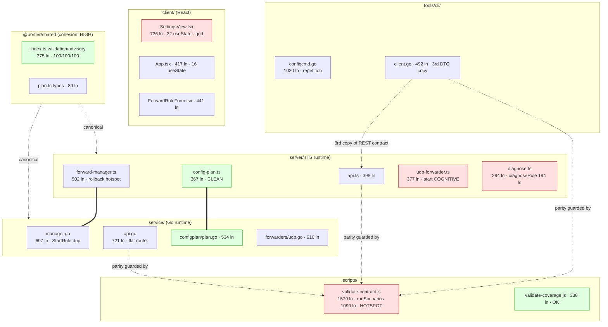

# Portier v1.6 Complexity / Metrics Audit 1

_Audit date: 2026-06-10. Scope: `shared/`, `server/`, `service/`, `client/`, `tools/cli/`, `tests/e2e/`, `scripts/`. Read-only analysis — no product code, tests, contracts, docs (other than this file), or coverage gates were changed._

This is the fourth v1.6 audit, following:

- `audits/v1.6-coverage-audit-1.md`
- `audits/v1.6-architecture-audit-1.md`
- `audits/v1.6-testing-audit-1.md`

It evaluates code complexity, maintainability, coupling, cohesion, and size, and checks whether the completed v1.6 slices (Arch-A…D, Test-A/D/E, Coverage C/D/E) raised or lowered complexity.

---

## Executive Summary

**Complexity / maintainability rating: 8 / 10.**

Portier is a small (~14.8k lines of non-test source) two-runtime codebase with consistent structure, strong layering, and — after the v1.5/v1.6 coverage push — a meaningful test net behind almost every hotspot. The architecture audits already extracted the highest-value seams (apply orchestration → `config-plan.ts`/`plan.go`, rule-event emission → `emitRuleEvent`, ID generation → `domain.NewRuleID`). What remains is mostly **localized, well-tested, domain-driven complexity** plus a few **size/duplication** smells that are real but low-risk.

**Biggest complexity strengths**

- The plan engine (`server/sources/config-plan.ts`, `service/sources/configplan/plan.go`) is the cleanest hotspot: pure functions, small helpers, exhaustive unit + contract coverage. Arch-B made the apply path *simpler* than the old handler logic.
- Rollback logic added in Test-D is uniform and shallow (snapshot → mutate → restore-on-throw), mirrored byte-for-byte across runtimes, and fully covered.
- Test helpers (Test-A port retry, E2E `network.ts`) are centralized, named, and shallow — no mini-framework sprawl.
- Go API router (`serveAPI`) and CLI command files are high-*cyclomatic* but near-zero-*cognitive*: flat dispatch tables, not nested logic.

**Biggest complexity risks**

1. `scripts/validate-contract.js::runScenarios` is a single ~1090-line function (lines 384–1476) holding ~50 inline scenarios. It is the contract guard yet is itself untested and monolithic. (HIGH)
2. `server/sources/forwarders/udp-forwarder.ts::start()` is a ~154-line method with 3-deep socket-callback nesting and two near-duplicate send-callbacks (forward / return). Highest *cognitive* complexity in product code. (MEDIUM)
3. `server/sources/diagnose.ts::diagnoseRule()` is a ~194-line function mixing five check phases with interleaved try/timeout/error handling. (MEDIUM)
4. Two "god" surfaces — `client/.../SettingsView.tsx` (736 lines, 22 `useState`) and `manager.go::StartRule` (duplicated TCP/UDP arms) — are large but covered. (MEDIUM / LOW)
5. CLI `configcmd.go` (1030 lines) repeats the flag→read→parse→validate→call prelude and the `client.ConfigRule{…}` mapping 3×. (LOW)

**Does any complexity issue block further audit work?** No. Every hotspot is either well-covered or is test/script infrastructure. Nothing here is a correctness or release risk. Complexity work can proceed in parallel with, or after, remaining audits.

**Recommended first implementation slice:** **Complexity-A** — decompose `runScenarios` in `validate-contract.js` into per-endpoint scenario functions driven by a small registry. It is the single highest-leverage readability win, touches no product code, no contract, and no coverage gate.

---

## Complexity Map

Coupling pressure concentrates on three nodes: `@portier/shared` (imported by both runtimes — by design, canonical), the plan engine pair (semantically duplicated TS/Go — guarded by `validate:contract`), and `validate-contract.js` (the parity hub that touches every endpoint of both runtimes plus the CLI DTOs).

---

## Current Complexity Inventory

| Component | Largest file (src ln) | Largest function (≈ln) | Highest apparent branching | High-coupling module | Cohesion | Test confidence |
|-----------|----------------------|------------------------|----------------------------|----------------------|----------|-----------------|
| shared | `index.ts` (375) | advisory/validation builders (~40) | advisory rules | imported everywhere (intended) | HIGH | Very high (100/100/100) |
| server | `forward-manager.ts` (502) | `importConfig` (~120) | `importConfig`, `buildConfigPlan` | `forward-manager.ts`, `api.ts` | MED–HIGH | Very high (98.9/93.6/100) |
| server | `udp-forwarder.ts` (377) | `start` (~154) | `start` (nested callbacks) | — | MEDIUM | High (99.4% file) |
| server | `diagnose.ts` (294) | `diagnoseRule` (~194) | `diagnoseRule` | — | MEDIUM | High (98.0% file) |
| service | `api.go` (721) | `serveAPI` (~85, flat) | `serveAPI` router | `manager.go` | HIGH (router), MED (api.go overall) | High (90.3%) |
| service | `manager.go` (697) | `ImportConfig` (~94), `StartRule` (~54 dup) | `ImportConfig`, `StartRule` | central manager | MEDIUM | High |
| service | `forwarders/udp.go` (616) | `listenLoop` (~96) | `listenLoop`, `handleMultiClientPacket` (~77) | — | MEDIUM | High |
| client | `SettingsView.tsx` (736) | component body (22 useState) | apply/plan handlers | App→views | LOW | High (1024 test ln) |
| client | `App.tsx` (417) | component body (16 useState) | refresh/handlers | hub container | MEDIUM | High |
| cli | `configcmd.go` (1030) | `RunConfigApply` (~98) | `validateLocalConfig` (~73) | `client.go` DTOs | HIGH (per-cmd), repetitive | Very high (97.7%) |
| scripts | `validate-contract.js` (1579) | `runScenarios` (~1090) | `runScenarios` | every endpoint, both runtimes | LOW | None (is itself the test; untested) |

---

## Findings

| Area | File / Function / Identifier | Finding | Severity | Category | Recommended Action | Effort | Risk | Notes |
|------|------------------------------|---------|---------:|----------|--------------------|--------|------|-------|
| scripts | `scripts/validate-contract.js` `runScenarios` (384–1476) | One ~1090-line function with ~50 inline scenarios; the contract guard itself is monolithic and untested | 6 | HIGH | Split into per-endpoint scenario fns + a small registry; keep assertions identical | M | Low (test infra; output unchanged) | Confirmed by section markers; no nested fns until L920 echo-server promise |
| server | `udp-forwarder.ts` `start` (45–198) | ~154-line method, 3-deep socket-callback nesting; forward-send and return-send callbacks are near-duplicates | 5 | MEDIUM | Extract `wireMessageHandler`/`emitForwarded`/`emitReturned`; behavior-preserving | M | Medium (live socket path) | Well covered (99.4%); refactor only with Test-A deadline polling intact |
| server | `diagnose.ts` `diagnoseRule` (9–202) | ~194-line function mixing 5 check phases (advisory, bind, target-connect, udp-mode, summary) with interleaved timeout/try-catch | 5 | MEDIUM | Extract per-phase helpers returning `DiagnosticCheck[]`; keep one assembling fn | M | Low | 98.0% covered; timeout branches already documented as structurally hard |
| client | `SettingsView.tsx` (whole) | 736 ln, 22 `useState` across 5 unrelated concerns (export, import, runtime info, diagnostics export, plan/apply) | 5 | MEDIUM | Split plan/apply into a `PlanApplySection` subcomponent (+ optional `useImportConfig` hook) | M | Medium (heavy test surface) | LOW cohesion; 1024 test ln must follow the split |
| service | `manager.go` `StartRule` (380–434) | TCP and UDP arms are ~95% identical (start → on-error state set → emit error; on-success state set → emit started) | 4 | MEDIUM | Extract a `startForwarder(rule, build func) error` to collapse the two arms | S–M | Low | Pure dedupe; covered by manager tests |
| server / service | `forward-manager.ts` `importConfig` (294–414) / `manager.go` `ImportConfig` (285–378) | Highest branching in product code: validate → dup check → replace/merge → merge conflict loop → persist rollback → post-persist start loop | 4 | MEDIUM | Leave as-is OR extract `planMerge`/`applyReplace` helpers; document if kept | M | Medium | Domain-driven, not accidental; fully covered incl. rollback (Test-D) |
| cli | `configcmd.go` (whole) | 1030 ln; flag→read→parse→validate prelude repeated 4× (validate/plan/diff/apply); `client.ConfigRule{…}` mapping inlined 3× | 3 | LOW | Extract `loadAndValidateConfigFile(path)` and `toConfigRules(rules)` helpers | S | Low | HIGH per-command cohesion; ~140 ln are help-text constants |
| scripts | `scripts/validate-coverage.js` (338) | Cleanly structured but untested; gate logic (`checkGate`, `readSummary` ghost-entry dedup) is correctness-bearing | 2 | LOW | Optional: a tiny unit test for `checkGate`/`normalizePath`; otherwise document | S | Low | Not over-complex; flagged only because it gates the build |
| service | `api.go` `serveAPI` (87–171) | Long if-chain router (~16 branches) | 2 | OBSERVATION | Keep as-is | — | — | High cyclomatic, ~zero cognitive; idiomatic flat Go routing |
| client | `App.tsx` (whole) | 16 `useState` + 4 `useEffect` hub container mixing CRUD, autorefresh, diagnosis, mobile, keyboard | 3 | LOW | Optional: extract `useAutoRefresh`/`useKeyboardShortcuts` hooks | S–M | Low | MEDIUM cohesion; expected for a top-level container |
| tests | `service/.../api_test.go` (3313), `manager_test.go` (1686), `server/.../api.test.ts` (1612) | Very large test files | 2 | OBSERVATION | Keep; optionally group by endpoint with sub-describes later | — | Low | Size reflects breadth, not brittle complexity; helpers already shared |

---

## Cyclomatic / Branching Complexity

Major branching hotspots (decision-point estimates; no tooling — counted by hand from the cited ranges):

1. **`validate-contract.js::runScenarios`** — by far the highest (CC ~80+). Each scenario is an independent `httpMethod(...)` call followed by inline status/shape assertions. Complexity is **accidental** (a flat script grown by accretion), not domain-driven. The branches *are* the contract checks and are exercised every `validate:contract` run (167/167), but the function has no unit test of its own and cannot be partially run. **Extraction strongly reduces risk** (Complexity-A): one function per endpoint makes a failing check locatable and lets scenarios be reordered/added without scrolling 1k lines.

2. **`config-plan.ts::buildConfigPlan` / `plan.go::BuildConfigPlan`** (CC ~20). Branches: invalid-desired early return, per-rule validation, duplicate-id + duplicate-key detection, id-match vs identity-key-match vs ambiguous, update/unchanged/add, LAN-exposure warning, removes loop. **Domain-driven** — this is the diff algorithm. **Adequately covered** (65 TS + 49 Go engine tests, plus contract parity). Extraction already done where it helps (small helpers `diffMaterialFields`, `detectDuplicate*`, `makeResponse`). Leave as-is.

3. **`forward-manager.ts::importConfig` / `manager.go::ImportConfig`** (CC ~18–20). Branches: error aggregation, replace vs merge, merge conflict, three persist-rollback sites, post-persist start loop. **Domain-driven.** **Fully covered** including the Test-D rollback paths. Optional helper extraction (`applyReplace`/`planMerge`) would lower CC but adds indirection; acceptable either way — document the decision.

4. **`manager.go::StartRule`** (CC ~12). Branching is **accidental duplication**: the TCP and UDP arms differ only in forwarder constructor and the `state.tcp`/`state.udp` field. Extraction (Complexity-C) removes ~40 lines and one whole class of "edited one arm, forgot the other" bugs. Covered.

5. **`configcmd.go::validateLocalConfig`** (CC ~16). One loop with ~8 field validations + duplicate-binding map. **Domain-driven** (local pre-flight validation), flat, readable, covered. Leave as-is.

6. **`udp.go::listenLoop` / `handleMultiClientPacket`** (CC ~12 each). Mode dispatch + per-packet session/registry bookkeeping + send-error branches. Domain-driven; covered (the send-error read-loop branches are the documented structurally-hard gap from Coverage Slice D).

---

## Cognitive Complexity

Functions hard to *read* (independent of raw branch count):

- **`udp-forwarder.ts::start` (server) — highest in product code.** Three levels of nesting: `listenSocket.on("message", cb)` → `targetSocket.send(…, cb)` with an error branch and a throttled-log branch, *plus* a sibling `targetSocket.on("message", cb)` → `listenSocket.send(…, cb)` with the same two-branch shape. The forward-path and return-path callbacks are ~90% identical (error → set `lastError` + emit `udp.packet.error`; success → throttle by `UDP_LOG_INTERVAL_MS` + emit forwarded/returned). The mixed abstraction (socket wiring + byte accounting + registry calls + activity emission + log throttling all in one closure) is what makes it hard, not the line count. **Helpers would clearly help** (`emitForwarded`/`emitReturned`/`emitSendError` already exist as a pattern in the Go twin `udp.go::maybeEmitForwarded`/`maybeEmitReturned` — the TS side should mirror that factoring).

- **`diagnose.ts::diagnoseRule` (server).** Five sequential check phases with interleaved async/timeout/try-catch and conditional skips (e.g. UDP skips target-connect). The early-return-free, append-to-`checks` style is consistent, but the function holds all phases inline. **Per-phase helper extraction** (each returning `DiagnosticCheck[]`) would make each phase independently readable and testable.

- **`SettingsView.tsx` (client).** Not deeply nested, but 22 `useState` declarations interleave five unrelated workflows; understanding any one (e.g. plan/apply) requires scanning past the others. This is a **cohesion** problem expressed as cognitive load — addressed by splitting subcomponents, not by comments.

- **`importConfig` (both runtimes).** Moderate cognitive load from the replace/merge fork plus rollback interleaving, but the heavy inline comments (Test-D added clear "roll back …" rationale at each site) keep it followable. Comments are doing real work here; keep them if the function stays inline.

Functions that look scary but read fine: `serveAPI` (flat dispatch), CLI `Run*` commands (linear flag→act→print), `buildConfigPlan` (well-named helpers).

---

## Size / Modularity Analysis

**Files > ~300 source lines:** `configcmd.go` (1030), `SettingsView.tsx` (736), `api.go` (721), `manager.go` (697), `udp.go` (616), `plan.go` (534), `forward-manager.ts` (502), `client.go` (492), `ForwardRuleForm.tsx` (441), `App.tsx` (417), `LiveConnectionsView.tsx` (404), `ForwardRuleList.tsx` (396), `api.ts` (398), `udp-forwarder.ts` (377), `index.ts` (375), `config-plan.ts` (367), `ActivityLogView.tsx` (366), `tcp.go` (342).

- **`configcmd.go` (1030)** — *split later (low priority).* ~140 lines are help-text constants; the rest is 6 cohesive subcommands. Could split into `configcmd.go` (validate/export/import) + `configplancmd.go` already exists as a sibling — actually plan/diff/apply live here too. A light split (move plan/diff/apply to a `configapply.go`) + the two extraction helpers would bring it under ~700. Not urgent.
- **`SettingsView.tsx` (736)** — *split now (Complexity-E candidate, deferred).* Real maintainability risk: lowest cohesion in the client. Split the plan/apply block into `PlanApplySection.tsx`.
- **`api.go` (721) / `manager.go` (697)** — *keep / light dedupe.* Size is breadth (full REST surface / full rule lifecycle), not tangling. `manager.go` benefits from the `StartRule` dedupe (Complexity-C); otherwise acceptable. Arch-C2 already reduced it.
- **`udp.go` (616) / `udp-forwarder.ts` (377)** — *keep file, refactor the `start`/`listenLoop` methods.* The files are cohesive (one forwarder each); the methods are the issue, not the files.
- **`plan.go`/`config-plan.ts`/`forward-manager.ts`** — *keep as-is.* Well-factored for their responsibility.

**Functions > ~50 lines:** `runScenarios` (~1090, scripts), `diagnoseRule` (~194), `udp-forwarder.start` (~154), `importConfig`/`ImportConfig` (~120/94), `listenLoop` (~96), `RunConfigApply` (~98), `handleMultiClientPacket` (~77), `validateLocalConfig` (~73), `handleMultiClientMessage` (~113, server udp). Covered in findings; only `runScenarios`, `start`, and `diagnoseRule` warrant action.

**Classes/modules > ~500 lines:** none are a single cohesive class except `Manager` (Go, 697) and `ForwardManager` (TS, 502) — both are the legitimate domain aggregate (rule store + runtime + registries + activity). Acceptable; do not split the class, only dedupe methods.

**Large test files** (`api_test.go` 3313, `manager_test.go` 1686, `api.test.ts` 1612, `client_test.go` 1205): size reflects endpoint/scenario breadth and is **not** hiding brittle complexity — assertions are concrete, helpers are shared (Test-A `start*OnFreePort`, `ControllableStore`, `failingStore`). No fixed sleeps. Keep; optional future grouping into sub-`describe`/`t.Run` blocks for navigability only.

---

## Coupling & Cohesion Analysis

- **Server manager ↔ API coupling — healthy.** `api.ts` depends on `forward-manager.ts` through a narrow method surface and maps domain errors (`ValidationError`/`ConflictError`/`NotFoundError`) to status codes in one place (`writeManagerError` mirror). No leakage of socket internals into the handler. Cohesion HIGH.
- **Go service manager/API/config/forwarder — healthy after Arch-C.** `manager.go` orchestrates `config.Store`, `forwarders`, `connections` registries, and `activity` behind one aggregate. Arch-C1/C2 removed the ID-generator and activity-emission duplication. Remaining coupling is intrinsic. The only residual smell is the `StartRule` TCP/UDP arm duplication (intra-method, not cross-module).
- **CLI command ↔ client coupling — intended, guarded.** `tools/cli/sources/commands/*` depend on `client.go` DTOs, which are the **third copy** of the REST contract. Arch-D added the live-runtime decode guard (`contract_decode_test.go`), so drift is caught. The CLI correctly imports no server/service internals. Coupling acceptable; the only refactor is intra-CLI duplication (Complexity-D).
- **Contract validation script coupling — the highest in the repo.** `validate-contract.js` couples to *every* endpoint of *both* runtimes plus the CLI DTO guard. This is inherent to a parity harness, but the monolithic `runScenarios` makes the coupling opaque — you cannot see which endpoints a change affects without reading the whole function. Complexity-A directly mitigates this.
- **E2E helper coupling — clean.** `tests/e2e/helpers/` is 7 small files; `network.ts` (216) exposes 7 well-named functions (~30 ln each: `startTcpEchoServer`, `sendTcpAndReceive`, `createUdpReceiver`, `startUdpEchoServer`, `createUdpClient`, `sendUdpMessage`, …). Specs depend on helpers, not on each other. No mini-framework. Test-E left this readable.
- **Cross-runtime duplicated logic — the structural constant.** The plan engine, manager rollback semantics, validation rules, and advisory wording exist twice (TS + Go) by design. This is *semantic* coupling that the compiler cannot enforce; `validate:contract` (167/167) and the shared canonical strings (Arch-A) are the only guards. This is the right trade for a two-runtime product, but every behavioral change must touch both sides — the audits have institutionalized this.

Cohesion ratings: shared **HIGH**; plan engines **HIGH**; Go api router **HIGH**; manager aggregates **MEDIUM** (broad but coherent); `App.tsx` **MEDIUM**; `SettingsView.tsx` **LOW**; `runScenarios` **LOW** (everything in one bag).

---

## Recent Slice Regression Check

| Slice | Effect on complexity | Verdict |
|-------|---------------------|---------|
| **Arch-A** (contract drift guard) | Added `normalize*`/`compareParity`/`firstDeepDiff`/`captureParity` + canonical-string constants to `validate-contract.js`. These are small, well-named helpers — *good* — but they sit above the already-huge `runScenarios`, raising the file to 1579 ln. | Net neutral-to-slightly-worse at file level; the helpers themselves are clean. Reinforces Complexity-A. |
| **Arch-B** (apply extraction) | Moved apply transformation into `buildApplyImportFromPlan` / `BuildApplyImportFromPlan` beside the plan engine. Handlers (`configApply` in `api.ts`/`api.go`) are now thin gating/wiring. | **Improved.** Apply logic is simpler and more testable than the prior inline handler code. Exactly the intended outcome. |
| **Arch-C1/C2** (Go ID + activity dedupe) | Removed duplicate UUID generators and collapsed 10 emission blocks into `emitRuleEvent`. | **Improved.** `manager.go` is more cohesive; payload shape can't drift. |
| **Arch-D** (CLI DTO parity guard) | Added `contract_decode_test.go` + a live-fixture capture step in `validate-contract.js` (`captureCLIFixtures`, `runCLIContractGuard`). | Slightly more script surface, but isolated in named helpers. Acceptable; value > cost. |
| **Test-A** (port retry helpers) | Centralized `start*OnFreePort` / `startRuleStable` with bounded bind-retry. | **Centralized, not duplicated.** One bounded-retry pattern reused across suites; removed ad-hoc allocate-close-rebind flake. Good. |
| **Test-D** (TS rollback) | Added snapshot/restore-on-throw to `addRule`/`updateRule`/`deleteRule`/`reorderRules`/`importConfig`. | Added ~6–10 lines per method, all the *same* shallow shape, with clear comments. Raised cyclomatic slightly but **did not raise cognitive load meaningfully** and achieves Go parity. Acceptable — see Portier-specific Q below. |
| **Coverage C/D/E** (CLI/service/server error tests) | Added focused failure-path tests. CLI used a shared `failingWriter`; server used clean instance-level `.send`/`.emit` overrides; service used `manager.NewWithStore` persist-failing path. | **No production complexity added.** Test repetition is table-style and helper-backed, not copy-paste sprawl (see Q below). |
| **Test-E** (E2E) | Added a populated-table E2E and an API-failure-banner E2E; removed brittle CSS selectors. | **Improved** E2E readability/robustness; helpers stayed small. |

**New helpers that risk becoming mini-frameworks:** none yet. The closest is the cluster of normalize/compare helpers in `validate-contract.js` — fine in isolation, but if `runScenarios` stays monolithic the file as a whole keeps trending toward an unmaintainable bespoke harness. Complexity-A pre-empts that.

---

## 100% Meaningful Coverage Interaction

- **Hotspots safe because well-covered (refactor freely):** `config-plan.ts`/`plan.go` (65+49 engine + contract tests), `forward-manager.ts`/`manager.go` rollback + import (Test-D + Go `*PersistFailureRollsBack`), `udp-forwarder.ts` (99.4% incl. all four send-callback error branches from Slice E), `diagnose.ts` (98.0%), CLI commands (97.7%, every JSON-encode and exit-code path). Any extraction here is backstopped — `validate:coverage` + `validate:contract` will catch regressions.
- **Hotspots needing care (not more tests, but careful refactor):** `udp-forwarder.ts::start` — covered, but it is live-socket code; refactor must keep Test-A deadline polling and must not reorder the bind handshake. `SettingsView.tsx` — covered by 1024 test lines that assert on the current single-component structure; a split must port those assertions, not rewrite them.
- **Hotspots that block *future* meaningful coverage:** `runScenarios` does not block coverage (it is not measured), but its monolithic shape blocks *adding* new contract scenarios cleanly — a soft block on future contract work. The documented structurally-unreachable branches (diagnose 2s timeouts, UDP read-loop send errors, crypto/rand fallbacks, atomic-rename recovery) remain correctly out of scope per the durable rules in `docs/coverage-baseline.md`.
- **Should complexity be reduced before more audits/fixes?** No mandatory pre-work. The coverage net is the prerequisite the v1.4/v1.5 push was meant to provide, and it is in place. Complexity slices are now *safe to do whenever*, which is the desired state.

---

## Recommended Implementation Slices

Small, behavior-preserving, coverage-neutral unless noted.

### Complexity-A — Decompose `runScenarios` in `validate-contract.js`
- **Goal:** Replace the single ~1090-line function with one function per endpoint group (`runRuntimeScenarios`, `runForwardsScenarios`, `runConfigPlanScenarios`, `runConnectionsScenarios`, `runDiagnoseScenarios`, …) invoked from a small ordered registry. Assertions unchanged.
- **Files:** `scripts/validate-contract.js` only.
- **Tests:** none added (it *is* the test harness); the regression check is that `validate:contract` still reports the same count.
- **Coverage impact:** none.
- **Risk:** Low. No product/contract change. Risk is accidental scenario reordering — mitigate by moving blocks verbatim.
- **Validation:** `npm run validate:contract` (expect 167/167, same as before).

### Complexity-B — Simplify `udp-forwarder.ts::start` (server)
- **Goal:** Extract the message-handler wiring and collapse the duplicated forward/return send-callbacks into `emitForwarded`/`emitReturned`/`emitSendError` helpers, mirroring the Go `udp.go` factoring (`maybeEmitForwarded`/`maybeEmitReturned`/`emitPacketError`). Behavior identical.
- **Files:** `server/sources/forwarders/udp-forwarder.ts`.
- **Tests:** reuse existing `udp-forwarder.test.ts` (no new tests; the four send-error branches already exist). Update only if helper names are asserted (they should not be).
- **Coverage impact:** neutral (file already 99.4%).
- **Risk:** Medium — live socket path. Keep the bind handshake and `UDP_LOG_INTERVAL_MS` throttle exactly; run the UDP E2E (`tests/e2e/udp.spec.ts`).
- **Validation:** `npm run test -w server`, `npm run build:client && npm run test:e2e` (udp spec), `npm run validate:contract`.

### Complexity-C — Collapse `manager.go::StartRule` TCP/UDP arms (Go)
- **Goal:** Extract a single `startForwarder` that takes a constructor closure and assigns the right runtime field, removing the ~40-line near-duplicate. Pure dedupe.
- **Files:** `service/sources/manager/manager.go`.
- **Tests:** existing `manager_test.go` covers start success/failure + activity emission; no new tests required.
- **Coverage impact:** neutral/slightly positive (fewer lines).
- **Risk:** Low.
- **Validation:** `npm run test:cli` is unrelated; run `go test ./...` in `service` (via `npm run coverage:service` or `npm run validate:coverage:service`) and `npm run validate:contract`.

### Complexity-D — Consolidate CLI config-file plumbing
- **Goal:** Extract `loadAndValidateConfigFile(path) ([]rawConfigRule, exitCode)` and `toConfigRules([]rawConfigRule) []client.ConfigRule`, removing the 4× prelude and 3× DTO-mapping duplication across `RunConfigImport`/`RunConfigPlan`/`RunConfigDiff`/`RunConfigApply`.
- **Files:** `tools/cli/sources/commands/configcmd.go` (optionally split plan/diff/apply into `configapplycmd.go`).
- **Tests:** existing command tests cover all paths (97.7%); keep exit-code priority assertions intact. Add none.
- **Coverage impact:** neutral (gate stays 95%).
- **Risk:** Low — exit codes are the contract; the extracted helper must preserve the read-error (2) vs validation-error (varies) distinction per command.
- **Validation:** `npm run validate:cli`, `npm run validate:coverage:cli`.

### Complexity-E — Extract `PlanApplySection` from `SettingsView.tsx` (client) — _deferred / optional_
- **Goal:** Move the plan/apply state + UI (12 of the 22 `useState`) into a `PlanApplySection.tsx` subcomponent (and optionally a `useImportConfig` hook for the import block), raising `SettingsView` cohesion.
- **Files:** `client/sources/features/settings/SettingsView.tsx` (+ new `PlanApplySection.tsx`), and port the relevant assertions out of `SettingsView.test.tsx` into a `PlanApplySection.test.tsx`.
- **Tests:** re-partition existing tests; the client coverage gate (94/89/78) must hold.
- **Coverage impact:** neutral if assertions are ported faithfully.
- **Risk:** Medium — large test surface and an E2E (`settings.spec.ts`) depends on the rendered structure/labels. Do this only with the E2E green before and after.
- **Validation:** `npm run test -w client`, `npm run validate:coverage:client`, `npm run build:client && npm run test:e2e`.

**Suggested order:** A → C → D (all low risk, high clarity) → B (medium, contained) → E (defer; biggest test churn). No large rewrites recommended.

---

## Validation Commands Used

| Command | Result |
|---------|--------|
| `npm run lint` | **PASS** (eslint, no output) |
| `npm run typecheck` | **PASS** (shared + server + client `tsc --noEmit`) |
| `npm run validate:coverage` | **PASS** — all 5 gates: shared 100/100/100, server 98.9/93.6/100, client 95.2/90.2/80.3, service 90.3 (funcs 95.9), cli 97.7 (funcs 98.6) |

Not run (per task scope / cost): `npm run test`, `npm run validate:contract` (full TS+Go parity build), release packaging, OS service install scripts. Coverage run already executed the unit/Go suites under coverage, so the test bodies behind the cited hotspots did exercise during validation. `validate:contract` was not re-run because no product/contract code was changed by this audit; the last recorded result is 167/167.

---

## Final Recommendation

**Continue to next audit first, then proceed to Complexity-A.**

The codebase is in good complexity health (8/10): the high-value seams are already extracted, every product hotspot is well-covered, and the remaining issues are localized readability/duplication smells with no correctness or release risk. Nothing here blocks further audit work. When fix work resumes, **Complexity-A** (decompose `runScenarios`) is the highest-leverage, lowest-risk first slice — it removes the one genuinely unmaintainable artifact (a 1090-line untested function) without touching product code, contracts, or coverage gates.
