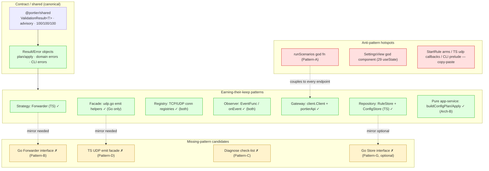

# Portier v1.6 Design Pattern Usage Audit 1

_Audit date: 2026-06-10. Scope: `shared/`, `server/`, `service/`, `client/`, `tools/cli/`, `tests/e2e/`, `scripts/`. Read-only analysis — no product code, tests, contracts, docs (other than this file), or coverage gates were changed._

This is the sixth v1.6 audit, following:

- `audits/v1.6-coverage-audit-1.md`
- `audits/v1.6-architecture-audit-1.md`
- `audits/v1.6-testing-audit-1.md`
- `audits/v1.6-complexity-metrics-audit-1.md`
- `audits/v1.6-solid-audit-1.md`

It evaluates the **use, misuse, absence, and appropriateness of design patterns** — creational, structural, behavioral, domain/application, and test patterns — plus anti-patterns and the places where simple procedural code rightly beats a pattern. It deliberately reuses the complexity/SOLID hotspot map but re-frames it through *pattern* language: which patterns are present and earning their keep, which are missing in a way that causes concrete duplication/test pain, and which patterns must **not** be introduced. Findings cite exact files/identifiers; anything not verifiable from code is marked **Unable to verify**.

---

## Executive Summary

**Design-pattern health rating: 8 / 10.**

Portier uses a small, disciplined, mostly *emergent* set of patterns and — notably — **resists pattern theater**. There is no speculative abstraction, no factory-of-factories, no DI container, no event-bus-for-its-own-sake. The patterns that exist (Strategy via the TS `Forwarder` interface, Repository via `RuleStore`, Registry for live connections, Observer via the activity `EventFunc`/`onEvent` callbacks, Result objects via `ValidationResult<T>` and the plan/apply responses, Gateway via the CLI `client.Client`, flat Command dispatch in the CLI and Go router) are the *right* patterns at the *right* size and are nearly all backstopped by tests.

The defining theme — consistent with the SOLID audit — is **cross-runtime pattern asymmetry**, and crucially it runs in **both directions**:

- The **TypeScript runtime is the stronger structural citizen at the manager seams**: it has a `Forwarder` interface (`server/sources/forwarders/types.ts`) and a `RuleStore` Repository interface (`server/sources/forward-manager.ts:11`). The Go runtime achieves identical behavior with **concrete types and no interfaces** (`manager.runtimeState` holds separate `*TCPForwarder`/`*UDPForwarder`; `Manager.store` is a concrete `*config.Store`). This forces the duplicated `StartRule` TCP/UDP arms and the OS-misconfiguration `failingStore` test.
- The **Go runtime is the stronger structural citizen inside the UDP forwarder**: `service/sources/forwarders/udp.go` factors event emission into a clean **facade of helpers** (`maybeEmitForwarded`, `maybeEmitReturned`, `emitPacketError`, `emitSessionOpened`, `emitSessionClosed`, `emitEvent`). The TypeScript twin `server/sources/forwarders/udp-forwarder.ts::start` **inlines all of that** into 3-deep nested socket callbacks with near-duplicate forward/return send handlers. Here the *TS* side is missing the pattern the Go side already has.

So the headline is not "TS good, Go bad" — it is **each runtime is missing the structural pattern the other already proved out**, and a small, mutual borrowing closes both gaps with no behavior change.

**Strongest existing patterns**
- **Result/Error object, used consistently end-to-end.** `ValidationResult<T>` (`shared/sources/index.ts:174`), the `ConfigPlanResponse`/`ApplyImportResult` plan results (`config-plan.ts`/`plan.go`), the typed domain errors (`ValidationError`/`ConflictError`/`NotFoundError` in both runtimes), the CLI `ConnectionError`/`APIError` (`client.go:33,46`), and the CLI exit-code contract are one coherent "return a described outcome, don't throw raw" discipline.
- **Repository + Dependency Injection (TS).** `ForwardManager(store: RuleStore, activity?: ActivityStore)` is textbook DIP; it is exactly what let `ControllableStore` (`forward-manager.test.ts:24`) test rollback cleanly.
- **Strategy (TS `Forwarder`).** Two implementations, consumed polymorphically; adding a protocol touches one ternary (`forward-manager.ts:221`).
- **Registry.** `TcpConnectionRegistry`/`UdpSessionRegistry` in both runtimes — a genuine, useful pattern for live-connection tracking, 98–100% covered.
- **Gateway / API client (Go CLI).** `client.Client` is a clean gateway with typed errors; the CLI imports no runtime internals (Arch-D-guarded).

**Weakest / missing patterns**
1. **`scripts/validate-contract.js::runScenarios`** (lines 384–1476, ~1090 lines, ~50 inline scenarios) is a **god function with no scenario-registry pattern** — the same artifact flagged by Complexity-A and SOLID-A. (HIGH)
2. **Go forwarder Strategy seam absent** despite the methods already matching (`Start() error`/`Stop()`/`Status() domain.ForwardStatus` exist on both `*TCPForwarder` and `*UDPForwarder`) — an interface is one declaration away and would delete the `StartRule` duplication. (MEDIUM)
3. **TS UDP send-event facade absent** — the Go `udp.go` emit-helper pattern is not mirrored in `udp-forwarder.ts`. (MEDIUM)
4. **Diagnose has no check-phase pattern** — `diagnose.ts::diagnoseRule` inlines 8 checks; a tiny list/helper pattern opens it. (MEDIUM)

**Anti-pattern risks:** the three god functions above; copy-paste in `StartRule` arms / TS UDP forward+return callbacks / CLI config prelude (4×); a god component in `SettingsView.tsx` (29 `useState`, 736 lines). All are *covered* and none are correctness risks. One mild leaky-abstraction smell: the Go `failingStore` test forces failure by OS misconfiguration because there is no `Store` seam.

**Does any pattern issue block further audit work?** **No.** Every finding is a maintainability/test-friction concern behind a passing test net. There is no pattern misuse causing a correctness or release risk.

**Recommended first implementation slice:** **Pattern-A — introduce a scenario registry in `validate-contract.js`** (== Complexity-A == SOLID-A). It is the single highest-leverage pattern fix, removes the worst god function, and touches no product code, contract, or gate.

---

## Pattern Inventory

| Pattern | Location | Purpose | Assessment | Keep / Improve / Avoid |
| ------- | -------- | ------- | ---------- | ---------------------- |
| **Strategy** | `server/sources/forwarders/types.ts` `Forwarder`; `TcpForwarder`/`UdpForwarder` | Protocol-polymorphic forwarding behind one interface | Intentional, minimal (3 methods), LSP-clean, test-protected | **Keep** |
| **Strategy (absent in Go)** | `service/sources/forwarders/{tcp,udp}.go` + `manager.runtimeState` | Same role as TS, but no interface — methods duck-match | Emergent parallelism, not compiler-enforced; forces dup | **Improve** (Pattern-B) |
| **Repository** | `RuleStore` interface (`forward-manager.ts:11`) + `ConfigStore` (`config-store.ts:6`) | Abstract rule persistence | Intentional, clean DIP seam, enables clean rollback tests | **Keep** |
| **Repository (concrete in Go)** | `config.Store` (`config/config.go:14`), `Manager.store *config.Store` | Same role, concrete type, no interface | Idiomatic Go, but blocks clean failure-substitution | **Improve, optional** (Pattern-G) |
| **Registry** | `connections/{tcp-connection-registry,udp-session-registry}.ts`; `service/.../connections/*` | Track live TCP conns / UDP sessions | Intentional, cohesive, 98–100% covered both runtimes | **Keep** |
| **Observer / Event emitter** | `activity.EventFunc` (`activity.go:57`); `onEvent`/`ActivityStore.add`; forwarder `onEvent` callbacks | Decouple forwarders/manager from activity log | Intentional, narrow callback (not a heavy bus) | **Keep** |
| **Facade (event emission)** | `service/.../udp.go` `maybeEmitForwarded`/`maybeEmitReturned`/`emitPacketError`/`emitSession*` | Hide event-shape + throttling behind named helpers | Intentional, clean — **good** | **Keep** (and mirror in TS) |
| **Facade absent (TS UDP)** | `server/.../udp-forwarder.ts::start` | Same emission inlined in nested callbacks | Missing — duplication + cognitive load | **Improve** (Pattern-D) |
| **Result / Error object** | `ValidationResult<T>` (`index.ts:174`); plan/apply responses; `ValidationError`/`ConflictError`/`NotFoundError` (both runtimes); CLI `ConnectionError`/`APIError` | Return described outcomes; map to status/exit codes | Intentional, consistent, the codebase's strongest theme | **Keep** |
| **Gateway / API client** | `tools/cli/.../client/client.go` `Client`; `client/.../api/portierApi.ts` | Single REST access layer | Intentional; CLI gateway is the 3rd contract copy (Arch-D guarded) | **Keep** |
| **Mapper / DTO** | CLI DTOs (`client.go`); `rulesToResponses` (`api.go`); `validatedToSnapshot`/`ruleToSnapshot` (`config-plan.ts`); `validation.InputFromRule` (Go) | Translate domain ↔ wire/snapshot | Intentional and small; inline DTO-map repeated 3× in CLI | **Keep** (Improve CLI dup, Pattern-E) |
| **Factory (functions)** | `New`/`NewWithStore`/`NewFromConfig` (manager); `NewTCPForwarder*`/`NewUDPForwarder*` variants | Construct with sane defaults / optional registry | Idiomatic Go constructors; slight `New*WithX` fan-out | **Keep** |
| **Command / flat dispatch** | CLI `RunConfig` switch (`configcmd.go:162`), top-level `run()` table; Go `serveAPI` if-chain (`api.go:87`) | Route subcommand/endpoint to handler | Intentional, additive (OCP-open), ~zero cognitive | **Keep** |
| **Safe resolver** | `tools/cli/.../resolver.go` `ResolveRule` | id-or-name → rule with ambiguity handling | Intentional, single-purpose, well-tested | **Keep** |
| **Dependency Injection (ctor)** | `ForwardManager(store, activity)`; forwarder `(rule, onEvent, registry)`; Go `SetActivityStore`/`SetEventLogger` | Inject collaborators | Intentional (TS ctor), setter-style (Go) | **Keep** |
| **Test fixture / fake (Repository fake)** | `MemoryStore`/`ControllableStore` (`forward-manager.test.ts`); `failingStore` (`manager_test.go:1534`); `failingWriter` (CLI); Test-A `start*OnFreePort`; E2E `network.ts` | Faithful doubles for failure/lifecycle paths | Mostly clean; `failingStore` is OS-trickery (leaky) | **Keep** (Improve `failingStore` via Pattern-G) |
| **Pure-function application service** | `buildConfigPlan`/`buildApplyImportFromPlan` (TS), `BuildConfigPlan`/`BuildApplyImportFromPlan` (Go) | Plan/apply orchestration as pure deps (Arch-B) | Intentional, excellent — the model to follow | **Keep** |
| **Template Method (absent, fine)** | `diagnose.ts::diagnoseRule` | Sequential checks inlined, no template | Acceptable, but a check-list pattern would help | **Improve** (Pattern-C) |
| **Scenario registry (absent)** | `scripts/validate-contract.js::runScenarios` | One monolith vs per-endpoint registry | Missing — god function | **Improve** (Pattern-A) |

---

## Pattern Map

**Reading the map:** the green "earning-their-keep" cluster is healthy and broad. The yellow "missing" cluster is four *small* seams, two of which are simply "mirror what the other runtime already does." The red cluster is three localized anti-patterns, all covered.

---

## Findings

| Pattern / Anti-pattern | File / Identifier | Finding | Severity | Category | Recommended Action | Effort | Risk | Notes |
| ---------------------- | ----------------- | ------- | -------: | -------- | ------------------ | ------ | ---- | ----- |
| God function / missing registry | `scripts/validate-contract.js` `runScenarios` (384–1476) | ~1090-line function, ~50 inline scenarios; no scenario-registry pattern; the contract guard is itself the least-patterned artifact | 6 | HIGH | Per-endpoint `run<Endpoint>Scenarios` + ordered registry (Pattern-A == Complexity-A == SOLID-A) | M | Low (test infra; output unchanged) | Move blocks verbatim; regression = same count |
| Missing Strategy / copy-paste | `service/.../manager/manager.go` `runtimeState` (27), `StartRule` (380–434), `stopRuntime` (452), `statusForRule` (482) | No Go `Forwarder` interface though `Start/Stop/Status` already match on both forwarders; TCP/UDP arms ~95% duplicated; 3 methods nil-branch | 4 | MEDIUM | Extract `Forwarder` interface; one `forwarder Forwarder` field; collapse arms (Pattern-B == Complexity-C, fixes SOLID-E) | S–M | Low (manager tests cover) | Interface is one declaration away |
| Missing Facade / copy-paste | `server/.../forwarders/udp-forwarder.ts` `start` (45–198) | Event emission + throttling inlined in 3-deep nested callbacks; forward-send & return-send are near-duplicates. Go twin already factors `maybeEmit*`/`emitPacketError` | 5 | MEDIUM | Extract `emitForwarded`/`emitReturned`/`emitSendError` to mirror `udp.go` (Pattern-D == Complexity-B == SOLID-B). **No socket seam** | M | Medium (live socket) | The one place TS lacks a pattern Go has |
| Missing check-phase pattern | `server/.../diagnose.ts` `diagnoseRule` (9–201) | 8 checks inlined; no check list/helper; adding a check edits the monolith | 5 | MEDIUM | Per-phase helpers returning `DiagnosticCheck[]`, assembled by a thin driver (Pattern-C == SOLID-C) | M | Low (98.0% covered) | Each phase is an independent append |
| God component | `client/.../settings/SettingsView.tsx` (736 ln, 29 `useState`) | One component owns 5 workflows (export, import, runtime info, diagnostics export, plan/apply); no composition split | 5 | MEDIUM | Extract `PlanApplySection` (+ optional `useImportConfig`) (Pattern-F == Complexity-E == SOLID-D) | M | Medium (large test + settings E2E) | Props surface fine (2); internal state is the smell |
| Copy-paste / missing loader-mapper | `tools/cli/.../commands/configcmd.go` (1030 ln) | flag→read→parse→validate prelude repeated 4×; `client.ConfigRule{…}` map inlined 3× | 3 | LOW | Extract `loadAndValidateConfigFile` + `toConfigRules` (Pattern-E == Complexity-D == SOLID-F) | S | Low | Preserve exit-code priority |
| Leaky abstraction (test) | `service/.../manager_test.go` `failingStore` (1534) + `m.store =` injection | Persist-failure forced by pointing a real `config.Store` at an unwritable path; white-box field write | 3 | LOW | Resolved if Go `Store` interface added (Pattern-G); else keep + document | S | Low | Symptom of missing Repository seam |
| Constructor fan-out | `service/.../forwarders/udp.go` `New*`/`newUDPForwarder*` (5 constructors) | `NewUDPForwarder`/`WithTimeout`/`WithRegistry`/`WithRegistryAndTimeout`/`new…` — a small telescoping-constructor smell | 2 | OBSERVATION | Acceptable; consider a functional-options ctor only if it grows | — | — | Not worth options-pattern now |
| Primitive/stringly-typed contract | plan op `Type` strings; `ActivityEventType`; `udpMode` strings | Domain values are bare strings, not enums/consts in some paths | 2 | OBSERVATION | Acceptable — contract-fixed, validated centrally; no enum abstraction | — | — | Adding an op type already touches engine+CLI; closed set |
| Pattern theater risk | (whole repo) | **Absence** of overengineering: no DI container, no event bus, no abstract factory, no codegen for the 3 contract copies | — | OBSERVATION | None — preserve restraint; reject speculative abstraction | — | — | A strength, recorded so it stays one |
| Positive: pure app-service | `buildApplyImportFromPlan`/`BuildApplyImportFromPlan` (Arch-B) | Apply orchestration is a pure-function dependency beside the engine | — | OBSERVATION | Preserve; the model the manager methods should follow | — | — | Arch-B materially improved pattern quality |
| Positive: Repository fake | `ControllableStore` (`forward-manager.test.ts:24`) | Faithful `RuleStore` double enabling clean rollback tests | — | OBSERVATION | Keep; this is the payoff of the TS Repository seam | — | — | The Go side lacks the equivalent |

---

## Existing Pattern Analysis

**Patterns already useful (keep as-is):**

- **Result/Error objects — the spine of the codebase.** `ValidationResult<T>` (`shared/sources/index.ts:174`) is returned by `validateForwardRule`/`validateForwardRulePatch` and consumed identically by the TS manager and (via the Go `validation` package) the Go manager. Failures flow as typed domain errors (`ValidationError`/`ConflictError`/`NotFoundError`) that the HTTP layer maps to status codes in one place per runtime, and the CLI maps `ConnectionError`/`APIError` to exit codes. The plan/apply path returns rich result objects (`ConfigPlanResponse`, `ApplyImportResult`) rather than throwing. This is one consistent, intentional discipline and the single biggest reason the error-path coverage slices (C/D/E) were tractable.
- **Strategy (TS `Forwarder`).** Small (3 methods), substitutable, and consumed at exactly one construction site. A real, useful Strategy — not ceremony.
- **Repository + DI (TS).** `RuleStore` is a 2-method interface injected through the `ForwardManager` constructor; `ConfigStore` is the production detail. This is the cleanest seam in the repo and is directly responsible for the clean Test-D rollback tests.
- **Registry.** The connection registries are a legitimate Registry pattern with snapshot semantics; they exist symmetrically in both runtimes and are near-fully covered.
- **Gateway.** The Go CLI `client.Client` is a clean gateway with typed transport errors and a private `do`/`get` core; `portierApi.ts` is the browser-side equivalent as à-la-carte free functions.

**Accidental but good (emergent, keep):**

- **Facade in Go `udp.go`.** The `maybeEmitForwarded`/`maybeEmitReturned`/`emitPacketError`/`emitSessionOpened`/`emitSessionClosed`/`emitEvent` cluster reads like a deliberate emission facade, but it grew out of refactoring the read loops. It is exactly the structure the TS twin should adopt.
- **Flat Command dispatch.** `RunConfig`'s switch, the CLI `run()` table, and Go `serveAPI` are emergent "command tables" — high cyclomatic, ~zero cognitive, idiomatic, additive. Good accidental OCP.
- **Safe resolver.** `ResolveRule` is an emergent application helper that encapsulates the id-vs-name-vs-ambiguous policy in one tested place.

**Unnecessary but harmless:**

- **Constructor fan-out in `udp.go`** (`NewUDPForwarder` + three `…With…` variants + private `newUDPForwarder`). A mild telescoping-constructor smell. Harmless at current size; do **not** convert to functional options unless the parameter set grows.

**Preserve as guardrails (do not remove):**

- The **pure-function plan/apply services** (Arch-B) — they keep transformation logic out of HTTP handlers and are the template for future extraction.
- The **Repository fake** `ControllableStore` and the **Arch-D live-decode guard** — these are the test-side patterns that keep the Result/substitutability discipline honest.

---

## Missing Pattern Analysis

**Where a small pattern would reduce concrete risk:**

1. **Scenario registry for `validate-contract.js` (Pattern-A).** The absence of any decomposition pattern is the worst structural problem in the repo. A trivial registry (`const groups = [runRuntimeScenarios, runForwardsScenarios, …]`) converts a 1090-line god function into locatable, individually-reorderable units and makes adding a contract family additive instead of a scroll-and-splice. **High value, near-zero risk.**

2. **Go `Forwarder` Strategy interface (Pattern-B).** The methods already match (`Start() error`, `Stop()`, `Status() domain.ForwardStatus` exist on both `*TCPForwarder` and `*UDPForwarder`). A one-line interface plus a single `forwarder Forwarder` field on `runtimeState` collapses the duplicated `StartRule` arms and the nil-branches in `stopRuntime`/`statusForRule`. This is *the* case where introducing a pattern simultaneously removes duplication, adds compiler-enforced parity, and deletes a class of "edited one arm, forgot the other" bugs.

3. **TS UDP emit facade (Pattern-D).** Mirror the Go `udp.go` emit helpers in `udp-forwarder.ts`. This removes the near-duplicate forward/return send callbacks and lowers the highest cognitive load in TS product code, **without** introducing a socket seam (explicitly out of scope — see anti-overengineering note).

4. **Diagnose check-list (Pattern-C).** Give each of the 8 checks its own helper returning `DiagnosticCheck[]`, assembled by a thin driver. This is a lightweight Template-Method-ish / collection-of-strategies shape — *not* a plugin framework — that opens `diagnoseRule` to new checks.

**Where a missing pattern causes duplication / shotgun surgery / test pain:**

- **Adding a protocol (Go)** is shotgun surgery today: edit `StartRule` (new arm), `stopRuntime` (new nil-branch), `statusForRule` (new branch), `runtimeState` (new field). Pattern-B reduces this to "implement the interface + one construction branch."
- **Adding a diagnostics check** edits one monolith and its test. Pattern-C makes it additive.
- **Persist-failure testing (Go)** needs OS misconfiguration (`failingStore`) because there is no `Store` seam (Pattern-G).

**Where pattern introduction would be overengineering (do NOT do):**

- **No socket/listener-factory seam** in the forwarders or the API `/start` path. The coverage, Test-A, and SOLID audits already weighed and rejected this; the right tool is the Test-A bounded bind-retry helper, not a product abstraction.
- **No `fs` interface** for `config.Save` — the atomic-rename recovery branch is documented-unreachable; an abstraction would cover dead code.
- **No enum/registry for the 4 fixed plan operation types** — a contract-closed set; an abstraction adds indirection for no risk reduction.
- **No codegen** to unify the three contract copies (TS shared / Go domain / CLI DTO) — the architecture audit rejected this; `validate:contract` + Arch-D guard the parity at lower cost.
- **No role-interface decomposition** of the managers into micro-services — there is one implementation per runtime; speculative ISP would add surface without removing risk.

---

## Anti-pattern Analysis

**God functions.** Three, all covered, none correctness-critical:
- `runScenarios` (~1090 ln) — the archetype; Pattern-A.
- `diagnose.ts::diagnoseRule` (~194 ln) — Pattern-C.
- `udp-forwarder.ts::start` (~154 ln) — Pattern-D.

**God component.** `SettingsView.tsx` — 736 lines, **29** `const [...] = useState` declarations across 5 unrelated workflows. The prop surface is lean (2 props); the smell is internal state cohesion. Pattern-F (extract `PlanApplySection`) is the fix, deferred for test-churn reasons.

**Copy-paste programming.** Three concrete instances:
- `manager.go::StartRule` TCP and UDP arms are ~95% identical (constructor + `state.tcp`/`state.udp` field differ) — root cause is the missing Strategy (Pattern-B).
- `udp-forwarder.ts::start` forward-send and return-send callbacks (`error → set lastError + emit udp.packet.error`; `success → throttle + emit forwarded/returned`) are ~90% identical — Pattern-D.
- `configcmd.go` prelude repeated 4× and DTO mapping 3× — Pattern-E.

**Leaky abstraction.** `failingStore(t)` + `m.store = …` (`manager_test.go`) reaches through the (absent) persistence abstraction to force failure via OS state and an unexported field write. Faithful to real failure, but a leak; resolved by Pattern-G or accepted-and-documented.

**Anemic wrapper.** None material. The CLI DTOs (`client.go`) are thin but are a *deliberate* third contract copy with a guard (Arch-D), not an accidental anemic layer. `output.PrintField`/`FormatBool` are thin but are genuine formatting helpers, not wrappers around a single call.

**Over-mocking.** **Not present.** The doubles model real failure modes: `ControllableStore.save()` throws only when armed; `failingStore` fails on real I/O; `failingWriter` returns a real `io.Writer` error; E2E `page.route` aborts model real network failure. No double fakes success it shouldn't. This is a healthy test-double posture worth preserving as a rule.

**Pattern theater / overengineering.** **Notably absent** — recorded as a positive. No DI container, no event bus, no abstract-factory hierarchy, no premature interface fan-out, no codegen. The few patterns present are small and load-bearing.

**Test helper mini-frameworks.** **Not present.** Test-A helpers (`start*OnFreePort`, `startRuleStable`), E2E `network.ts` (7 ~30-line functions), and the Repository/Writer fakes are each single-purpose and shallow. No threaded "test context" god object. The closest creep is the `normalize*`/`compareParity`/`captureParity` cluster in `validate-contract.js`, which is fine in isolation but sits atop the `runScenarios` monolith — Pattern-A keeps that file from trending toward a bespoke unmaintainable harness.

**Big ball of mud.** No. Layering is clean (`shared` → runtimes → client/CLI); the only "everything touches it" node is `validate-contract.js`, which is inherent to a parity harness and is mitigated by Pattern-A.

**Global mutable state where harmful.** None observed. Module-level constants (`UDP_LOG_INTERVAL_MS`, timeouts) are immutable; the managers own their mutable state behind methods; registries are instance-scoped. **Unable to verify** any process-global mutable singleton — none found in the inspected files.

---

## Pattern Appropriateness

For each recommended pattern, the why / why-not-simpler / why-not-bigger / benefit / risk / test impact:

- **Pattern-A (scenario registry).** *Why:* one god function with ~50 reasons to change. *Why not simpler:* it is already "simple procedural" — that is the problem; it cannot be partially run or located. *Why not bigger:* no DSL or data-driven scenario engine — just one function per endpoint group + an array. *Benefit:* locatability, additive growth. *Risk:* accidental reordering (mitigate: verbatim moves). *Test impact:* none — it *is* the harness; regression = same 167 count.
- **Pattern-B (Go Forwarder interface).** *Why:* removes duplication + adds compiler-enforced parity. *Why not simpler:* a plain `startForwarder` closure (Complexity-C) dedupes but leaves the type-level parity unenforced; the interface is barely more code and strictly better. *Why not bigger:* no forwarder factory/registry — just `interface { Start; Stop; Status }`. *Benefit:* add-a-protocol = one site; deletes nil-branching. *Risk:* low; verify `Status().StartedAt` wiring per protocol. *Test impact:* existing `manager_test.go` covers; add a one-line interface-satisfaction assertion.
- **Pattern-C (diagnose check-list).** *Why:* opens an OCP-closed monolith. *Why not simpler:* inline is the status quo and is the smell. *Why not bigger:* no check-registry/plugin system — just helpers + a driver array. *Benefit:* per-phase readability/testability. *Risk:* low (98% covered); keep documented 2 s-timeout branches as-is. *Test impact:* neutral; optional later per-helper tests.
- **Pattern-D (TS UDP facade).** *Why:* removes ~90% duplicate callbacks; matches Go. *Why not simpler:* the duplication *is* the simple version. *Why not bigger:* **no socket seam** — helpers only. *Benefit:* lowest-risk cognitive-load reduction in TS. *Risk:* medium (live socket) — preserve bind handshake + `UDP_LOG_INTERVAL_MS` throttle. *Test impact:* reuse `udp-forwarder.test.ts` (99.4%); assert no helper names.
- **Pattern-E (CLI loader/mapper).** *Why:* removes 4×/3× duplication. *Why not bigger:* two free functions, not a config-command framework. *Risk:* low — **exit-code priority is the contract**; the helper must preserve read-error(2) vs validation vs API(3/1) vs drift(4). *Test impact:* existing CLI tests cover (97.7%).
- **Pattern-G (Go Store interface) — explicitly optional.** *Why:* DIP parity with TS + deletes the leaky `failingStore`. *Why not:* borderline against Go's "avoid premature abstraction" (one implementation). *Constraint:* keep to `Load`/`Save` only. *Benefit:* clean failure substitution. *Test impact:* lets persist-failure be a faithful fake instead of OS-misconfiguration. **Defer unless** Pattern-B is being done anyway (natural pairing) or a second storage backend appears.

**Where a pattern should NOT be introduced (explicit):** socket/listener factories; `config.Save` `fs` seam; plan-op enum/registry; manager role-interface splits; contract codegen; functional-options constructor for `udp.go` (not yet). All would be abstraction-for-its-own-sake at Portier's scale.

---

## Runtime Symmetry Analysis

| Seam | TypeScript | Go | Verdict |
| ---- | ---------- | -- | ------- |
| Forwarder polymorphism | `Forwarder` interface (Strategy) | concrete `*TCPForwarder`/`*UDPForwarder`, no interface | **Risky asymmetry — fix (Pattern-B).** Methods already match; the gap is pure cost |
| Rule persistence | `RuleStore` interface + `ConfigStore` (Repository+DI) | concrete `config.Store`, setter-style | **Asymmetry — optional fix (Pattern-G).** Idiomatic Go; cost is the leaky test |
| UDP event emission | inlined in `start` (no facade) | `maybeEmit*`/`emitPacketError` facade | **Risky asymmetry — fix (Pattern-D).** Here *Go* leads; mirror into TS |
| Contract definition | `@portier/shared` (canonical) | `domain` structs + `validation` | **Acceptable idiom difference** — guarded by `validate:contract` (Arch-A content parity) |
| CLI third copy | n/a | `client.go` DTOs | **Acceptable** — deliberate, Arch-D live-decode guarded |
| HTTP routing | Express routes | flat `serveAPI` if-chain (Command table) | **Acceptable idiom difference** — both additive/OCP-open |
| Config plan/apply | `buildConfigPlan`/`buildApplyImportFromPlan` (pure fns) | `BuildConfigPlan`/`BuildApplyImportFromPlan` (pure fns) | **Good symmetry** — same pattern, parity-guarded |
| Activity emission | `ActivityStore.add` + `onEvent`; rule events inlined per call site (TS) | `emitRuleEvent` helper (Arch-C2) + `emitActivity` | **Minor asymmetry** — Go has a rule-event helper (Arch-C2), TS repeats the `activity?.add({type,...})` shape ~6× in `forward-manager.ts`. Low priority; a TS `emitRuleEvent` would mirror Arch-C2 |
| Error model | `ValidationError`/`ConflictError`/`NotFoundError` classes | same-named structs | **Good symmetry** |
| Registry | `TcpConnectionRegistry`/`UdpSessionRegistry` | same | **Good symmetry** |

**Which asymmetries are acceptable idiom differences:** contract-definition style, CLI DTO copy, Express-vs-flat routing, ctor-injection vs setter-injection. These are language idioms with parity guards; do not homogenize.

**Which create drift/test risk:** the **Forwarder** gap (forces duplication + unenforced parity) and the **UDP-facade** gap (forces near-duplicate callbacks). Both are fixable by mutual borrowing with no behavior change.

**Which should be fixed:** Pattern-B (Go Forwarder) and Pattern-D (TS UDP facade) — the two "each runtime borrows the other's better pattern" slices. Pattern-G (Go Store) and a TS `emitRuleEvent` mirror are *optional* parity polish.

---

## Interaction With Previous Audits

**Architecture audit (7/10).** This audit *confirms* and re-labels its conclusions in pattern terms. "Contract defined three times" = three copies of one DTO/Mapper contract, now Arch-D-guarded. "Apply orchestration in handlers" was the absence of an application-service pattern, **fixed by Arch-B** (now a pure app-service — this audit's model exemplar). The god-module observations map to the god-function/component anti-patterns here. **New:** the architecture audit did not frame the **bidirectional** pattern asymmetry (TS leads at the manager seams; Go leads inside the UDP forwarder) — that is this audit's most distinctive contribution.

**Testing audit.** Confirms its work strengthened patterns: Test-D restored the **Repository-fake-driven rollback** symmetry; Test-A centralized **fixture helpers** (no mini-framework); Test-E cleaned brittle selectors (better test patterns). This audit additionally credits the test suite for a **healthy no-over-mocking** posture and flags `failingStore` as the lone leaky-abstraction double.

**Complexity audit (8/10).** Same hotspots, pattern lens. Complexity-A/B/C/D/E target the same artifacts as Pattern-A/D/B/E/F. Pattern adds *why*: `StartRule` is duplicated *because* the Strategy interface is absent — so Pattern-B (interface) is structurally superior to a pure `startForwarder` dedupe (Complexity-C). This audit slightly upgrades the recommended Go fix from "dedupe" to "introduce the interface."

**SOLID audit (7/10).** Near-complete overlap, by design: SOLID-A=Pattern-A, SOLID-B=Pattern-D, SOLID-C=Pattern-C, SOLID-E≈Pattern-B, SOLID-F=Pattern-E, SOLID-G=Pattern-G. The SOLID audit reached the Forwarder/Store asymmetry via DIP/LSP; this audit reaches the *same* seams via Strategy/Repository, and **adds the reverse asymmetry** (the Go UDP emit facade the TS side lacks) which the SOLID audit noted only as an SRP target, not as a pattern Go already owns.

**Coverage audit.** Its "structurally unreachable / no-seam" Category-C items (socket internals, atomic-rename recovery, crypto/rand fallbacks, composition roots) are the same boundaries this audit reaches by asking "would a pattern help here?" — and the answer is the same: **document, don't abstract.** The lone convergence on a *fix* is the Go `Store` seam (Pattern-G), which would let persist-failure be tested by substitution.

**Where prior fixes improved pattern quality:**
- **Arch-B** → introduced the pure **application-service** pattern (apply out of handlers).
- **Arch-C1** (`domain.NewRuleID`) → one Factory for IDs; can't drift.
- **Arch-C2** (`emitRuleEvent`) → a rule-event **Facade** in Go (TS could mirror).
- **Arch-D** (CLI DTO guard) → proved the **Mapper/DTO** copy substitutable against live runtime.
- **Test-A** (port helpers) → centralized **fixture** pattern, the correct answer to the no-socket-seam gap.
- **Test-D** (TS rollback) → restored **Repository-fake**-driven parity.
- **Test-E** (E2E) → better **test selectors**/page-interaction patterns.

---

## 100% Meaningful Coverage Interaction

- **Missing patterns that make meaningful coverage harder:** (1) the absent Go `Store` Repository seam forces persist-failure tests to misconfigure the filesystem (`failingStore`) and write an unexported field — coverage is achieved, but via a leak (Pattern-G would make it a clean substitution); (2) the monolithic `runScenarios` doesn't lower a measured percentage but **soft-blocks adding** new contract scenarios cleanly (Pattern-A unblocks).
- **Existing patterns that support coverage:** the TS **Repository+DI** seam (`ControllableStore` covers all rollback paths), the **Strategy** `Forwarder` (forwarders covered polymorphically), the **Result objects** (every error path is a returnable value the slices C/D/E could assert), and the **pure app-services** (apply branches unit-coverable). These are exactly sufficient — no new TS seam is warranted for coverage.
- **Branches that should remain documented, not pattern-forced:** socket-internal send/timeout branches, `config.Save` atomic-rename recovery, crypto/rand fallbacks, composition roots. Adding a pattern seam to hit these is overengineering; the coverage baseline already documents them.
- **Where a pattern seam improves both design and testability:** only the Go `Store` interface (Pattern-G) — the single justified new seam, and even it is optional/small and best paired with Pattern-B.
- **Where a pattern seam would be test-only overengineering:** any socket/listener factory in the forwarders or `/start` path — rejected here, consistent with Test-A/coverage/SOLID.

---

## Recommended Implementation Slices

Small, behavior-preserving, coverage-neutral unless noted. Ordered by value-to-risk. Targets coincide with the complexity/SOLID audits so one fix discharges all three.

### Pattern-A — Scenario registry for `validate-contract.js`
- **Goal:** Replace the ~1090-line `runScenarios` with one `run<Endpoint>Scenarios(...)` per endpoint group invoked from a small ordered registry array. Assertions moved verbatim. Introduces the missing decomposition/registry pattern; removes the worst god function.
- **Files:** `scripts/validate-contract.js` only.
- **Tests to add/update:** none (it is the harness); regression = identical scenario count.
- **Coverage impact:** none (unmeasured).
- **Risk:** Low — only hazard is accidental reordering; move blocks verbatim.
- **Validation:** `npm run validate:contract` (expect 167/167, unchanged).

### Pattern-B — Go `Forwarder` Strategy interface + collapse `StartRule` arms
- **Goal:** Declare `type Forwarder interface { Start() error; Stop(); Status() domain.ForwardStatus }` (both forwarders already satisfy it); store one `forwarder Forwarder` in `runtimeState`; collapse the TCP/UDP arms of `StartRule` and the nil-branches in `stopRuntime`/`statusForRule`. Adds compiler-enforced TS/Go parity and removes duplication in one move.
- **Files:** `service/sources/forwarders/` (add interface), `service/sources/manager/manager.go`.
- **Tests:** existing `manager_test.go` covers start success/failure + activity emission; add a one-line interface-satisfaction assertion (`var _ Forwarder = (*TCPForwarder)(nil)`).
- **Coverage impact:** neutral/slightly positive (fewer lines).
- **Risk:** Low–Medium — verify `Status().StartedAt` wiring preserved for both protocols.
- **Validation:** `cd service && go test ./...` (or `npm run validate:coverage:service`), `npm run validate:contract`.

### Pattern-C — Diagnose check-phase helpers
- **Goal:** Extract each of the 8 checks in `diagnoseRule` into a helper returning `DiagnosticCheck[]`; assemble via a thin driver. A lightweight collection-of-checks pattern (not a plugin framework) that opens the function to new checks.
- **Files:** `server/sources/diagnose.ts`.
- **Tests:** existing `diagnose.test.ts` (98.0%) covers all branches; keep assertions; optional per-helper tests later.
- **Coverage impact:** neutral/slightly positive.
- **Risk:** Low — pure restructure; keep documented 2 s-timeout branches as-is.
- **Validation:** `npm run test -w server`, `npm run validate:coverage:server`.

### Pattern-D — Server UDP emit facade (mirror Go `udp.go`)
- **Goal:** Extract `emitForwarded`/`emitReturned`/`emitSendError` from `udp-forwarder.ts::start`, collapsing the near-duplicate forward/return send callbacks — mirroring the Go `maybeEmitForwarded`/`maybeEmitReturned`/`emitPacketError` facade. **No socket seam.**
- **Files:** `server/sources/forwarders/udp-forwarder.ts`.
- **Tests:** reuse `udp-forwarder.test.ts` (the four send-error branches already exist); assert no helper names.
- **Coverage impact:** neutral (file already 99.4%).
- **Risk:** Medium (live socket) — preserve bind handshake + `UDP_LOG_INTERVAL_MS` throttle exactly.
- **Validation:** `npm run test -w server`; `npm run build:client && npm run test:e2e` (udp spec).

### Pattern-E — CLI config loader/mapper helpers
- **Goal:** Extract `loadAndValidateConfigFile(path)` and `toConfigRules(rules)` to remove the 4× prelude and 3× DTO-mapping duplication across `RunConfigImport`/`Plan`/`Diff`/`Apply`. A small loader + mapper, not a command framework.
- **Files:** `tools/cli/sources/commands/configcmd.go` (+ optional `configapplycmd.go` split).
- **Tests:** existing command tests cover all paths (97.7%); **preserve exit-code priority** (read-error 2 vs validation vs API 3/1 vs drift 4).
- **Coverage impact:** neutral (gate stays 95%).
- **Risk:** Low — exit codes are the contract.
- **Validation:** `npm run validate:cli`, `npm run validate:coverage:cli`.

**Optional / weigh carefully:**

### Pattern-G (optional) — Go `Store` Repository interface
- **Goal:** Define a 2-method `Store` interface (`Load`/`Save`) the manager accepts, mirroring TS DIP and deleting the white-box `m.store = failingStore(t)` leak.
- **Why optional:** borderline against Go's "avoid premature abstraction" (one implementation). Keep to `Load`/`Save` only. **Defer unless** Pattern-B is being done anyway (natural pairing) or a second storage backend appears. If not done, document the asymmetry in `docs/coverage-baseline.md`.
- **Risk:** Low.

**Suggested order:** A → C → E (low risk) → B (low–med, highest structural value) → D (med, contained) → G (optional, pair with B). **Pattern-F (SettingsView split) remains deferred** — biggest test churn, lowest correctness payoff. No large rewrites recommended.

---

## Validation Commands Used

| Command | Result |
|---------|--------|
| `npm run lint` | **PASS** (eslint, clean — no output). |
| `npm run typecheck` | **PASS** (shared + server + client `tsc --noEmit`). |
| `npm run validate:coverage` | **PASS** — all 5 gates: shared 100/100/100, server 98.9/93.6/100, client 95.2/90.2/80.3, service 90.3 (funcs 95.9), cli 97.7 (funcs 98.6). No transient socket flake this run (clean first pass). |

Not run (per task scope / cost): `npm run test` (the coverage run executes the full Vitest + Go suites under coverage), `npm run validate:contract` (no product/contract code changed by this read-only audit; last recorded 167/167), release packaging, OS service install scripts.

**Source inspection (read in full or part):** `server/sources/{forward-manager.ts, forwarders/types.ts, forwarders/udp-forwarder.ts, diagnose.ts, config-store.ts, config-plan.ts (surface), forward-manager.test.ts (doubles)}`; `service/sources/{manager/manager.go, forwarders/tcp.go, forwarders/udp.go (emit helpers), config/config.go, api/api.go (serveAPI), configplan/plan.go (surface)}`; `client/sources/{api/portierApi.ts, features/settings/SettingsView.tsx (state count)}`; `tools/cli/sources/{client/client.go, commands/configcmd.go, commands/resolver.go, output/output.go}`; `shared/sources/index.ts (surface)`; `scripts/validate-contract.js` (structure). Cross-checked against the five prior v1.6 audits.

---

## Final Recommendation

**Continue to the next audit first, or begin the fix-slice phase with Pattern-A — either is safe; no pattern issue blocks further work.**

Portier's design-pattern health is strong (8/10): a small, load-bearing set of the *right* patterns (Result objects, Strategy, Repository+DI, Registry, Observer, Gateway, pure application services), a disciplined **no-over-mocking / no-pattern-theater** posture, and every weakness sitting behind a passing test net. The defining issue is a **bidirectional cross-runtime asymmetry** — the TypeScript runtime leads at the manager seams (it has the `Forwarder` Strategy and `RuleStore` Repository the Go runtime lacks), while the Go runtime leads inside the UDP forwarder (it has the emit **facade** the TypeScript twin lacks). Neither is a correctness or release risk.

When fix work resumes, **Pattern-A** (scenario registry for `validate-contract.js`) is the highest-leverage, zero-product-risk first slice and is the *same* artifact as Complexity-A and SOLID-A — one fix discharges three audits. The most pattern-distinctive wins are the two **mutual-borrowing** slices: **Pattern-B** (give Go the `Forwarder` interface TS already has) and **Pattern-D** (give TS the UDP emit facade Go already has). Treat the Go `Store` interface (Pattern-G) as an explicitly-weighed option, and keep rejecting socket/factory/codegen abstractions that would reduce no real risk at Portier's scale.
