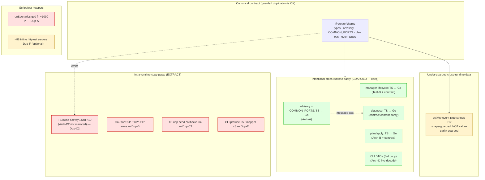

# Portier v1.6 Duplication Audit 1

_Audit date: 2026-06-10. Scope: `shared/`, `server/`, `service/`, `client/`, `tools/cli/`, `tests/e2e/`, `scripts/`. Read-only analysis — no product code, tests, contracts, docs (other than this file), or coverage gates were changed._

This is the seventh v1.6 audit, following:

- `audits/v1.6-coverage-audit-1.md`
- `audits/v1.6-architecture-audit-1.md`
- `audits/v1.6-testing-audit-1.md`
- `audits/v1.6-complexity-metrics-audit-1.md`
- `audits/v1.6-solid-audit-1.md`
- `audits/v1.6-design-pattern-audit-1.md`

It classifies **duplication** across Portier by *risk*, *intent*, and *extraction value*. Portier is a deliberately two-runtime system (TypeScript + Go) with a third REST-contract copy in the CLI, so a naive DRY sweep would be actively harmful. The discipline this audit applies throughout:

- **Good duplication** — intentional, explicit cross-runtime parity that is *guarded* (`validate:contract`, dual unit tests). Keep it; do not collapse it.
- **Bad duplication** — accidental copy-paste or repeated logic *inside one runtime/language* with no single helper or guard. Extract it.
- **Acceptable repetition** — flat dispatch, small command wrappers, per-test fixtures that aid readability/isolation. Leave it.
- **Harmful repetition** — the same transformation/error/event logic repeated *without* a single helper or guard, where drift would be silent.

Findings cite exact files/identifiers; anything not verifiable from code is marked **Unable to verify**.

---

## Executive Summary

**Duplication health rating: 8 / 10.**

Portier's duplication posture is healthy and, crucially, *intentional*. The large cross-runtime duplications (TS ↔ Go manager lifecycle, plan/apply, diagnose, advisory) are by-design parity and are now backstopped by real guards: `validate:contract` content parity (Arch-A), the cross-runtime `compareParity` diff, the Test-D rollback parity tests in both runtimes, and the Arch-D live-decode guard for the CLI DTO third copy. The architecture/SOLID/pattern audits already drove most of the accidental duplication down. What remains is a short list of *intra-runtime* copy-paste hotspots — each already covered by tests, none a correctness risk.

**Biggest good / intentional duplications (keep, do not collapse):**
- **TS ↔ Go manager lifecycle** (`server/sources/forward-manager.ts` ↔ `service/sources/manager/manager.go`) — mirrored create/update/delete/reorder/import with snapshot-rollback, guarded by Test-D parity tests in both runtimes + `validate:contract`.
- **TS ↔ Go plan/apply** (`server/sources/config-plan.ts` ↔ `service/sources/configplan/plan.go`) — pure-function engines, Arch-B-extracted, parity-guarded (156→167 contract assertions).
- **TS ↔ Go advisory + `COMMON_PORTS` 25-row table** (`shared/sources/index.ts` ↔ `service/sources/advisory/advisory.go`) — guarded by Arch-A canonical-wording assertions.
- **CLI DTOs** (`tools/cli/sources/client/client.go`) — deliberate third contract copy, Arch-D live-decode guarded.

**Biggest harmful (intra-runtime) duplications (extract):**
1. **TS `forward-manager.ts` never mirrored Arch-C2** — it inlines `this.activity?.add({type,severity,ruleId,ruleName,protocol,message})` **10×** (6 of them rule-scoped), exactly the shape Go collapsed into `emitRuleEvent`. Real intra-runtime copy-paste *and* the cross-runtime asymmetry Arch-C2 was supposed to close on both sides. (MEDIUM)
2. **Go `StartRule` TCP/UDP arms** (`manager.go:393–431`) — two ~95%-identical ~19-line blocks; root cause is the absent Go `Forwarder` interface. (MEDIUM, == Pattern-B/SOLID-E/Complexity-C)
3. **TS `udp-forwarder.ts` send-callback blocks** — 4 near-identical "on error → set lastError + emit `udp.packet.error`; on success → throttle + emit forwarded/returned" handlers (lines 91–124, 138–169, 260–272, 329–341); the Go twin already has the `maybeEmit*`/`emitPacketError` facade. (MEDIUM, == Pattern-D/SOLID-B/Complexity-B)
4. **CLI `configcmd.go` prelude + DTO mapper** — the `os.ReadFile → parseLocalConfig → validateLocalConfig` prelude repeats **5×** and the `client.ConfigRule{…}` field-map repeats **3×** in product code. (LOW, == Pattern-E)

**Biggest drift risks:**
- **Activity event-type strings** (17 values) are duplicated as a TS union (`shared/sources/activity.ts`) and Go consts (`service/sources/activity/activity.go`). `validate:contract` asserts ActivityEvent **shape** but **not** the cross-runtime parity of the *type-string values* (verified: `scripts/validate-contract.js:686–707` checks required fields only). Under-guarded, though low actual risk (short strings, each runtime self-asserts its values).
- The **TS Arch-C2 gap** (finding 1): because TS emits the rule-event payload inline 6×, a future field addition (e.g. a new `protocol` value) must be hand-applied to every call site, where Go changes one helper.

**Does any duplication issue block further audit work?** **No.** Every harmful finding is intra-runtime, covered by tests, and behavior-preserving to fix. No duplication is a correctness or release risk.

**Recommended first implementation slice:** **Dup-A — scenario registry for `scripts/validate-contract.js`** (== Pattern-A == SOLID-A == Complexity-A). It is the highest-leverage structural duplication fix, removes the worst god-function, touches no product code/contract/gate, and three prior audits already converge on it. If the team would rather fix *product* duplication first, **Dup-C2 (TS `emitRuleEvent` mirror of Arch-C2)** is the smallest, safest product win.

---

## Duplication Taxonomy

| Duplication Type | Example | Intentional? | Guarded? | Risk | Recommendation |
| ---------------- | ------- | -----------: | -------: | ---- | -------------- |
| Cross-runtime manager lifecycle | `forward-manager.ts` ↔ `manager.go` | Yes | Yes (Test-D + contract) | Low | **Keep** — parity by design |
| Cross-runtime plan/apply | `config-plan.ts` ↔ `configplan/plan.go` | Yes | Yes (Arch-B + contract) | Low | **Keep** |
| Cross-runtime diagnose | `diagnose.ts` ↔ `api/diagnose.go` | Yes | Yes (contract content parity) | Low | **Keep** |
| Cross-runtime advisory + COMMON_PORTS table | `shared/index.ts` ↔ `advisory/advisory.go` | Yes | Yes (Arch-A) | Low | **Keep** |
| CLI DTO third contract copy | `client.go` structs | Yes | Yes (Arch-D live decode) | Low | **Keep** |
| Activity event-type string set (17) | `activity.ts` union ↔ `activity.go` consts | Yes | **Partial** (shape only) | Medium | **Document / consider value-parity assertion** |
| Intra-runtime: TS inline activity emission ×10 | `forward-manager.ts` (Arch-C2 not mirrored) | No | Tests cover | Medium | **Extract** `emitRuleEvent` (Dup-C2) |
| Intra-runtime: Go `StartRule` TCP/UDP arms | `manager.go:393–431` | No | Tests cover | Medium | **Extract** via `Forwarder` interface (Dup-B) |
| Intra-runtime: TS UDP send callbacks ×4 | `udp-forwarder.ts` | No | Tests cover (99.4%) | Medium | **Extract** emit helpers (Dup-C1) |
| Intra-runtime: CLI config prelude ×5 / mapper ×3 | `configcmd.go` | No | Tests cover (97.7%) | Low | **Extract** loader+mapper (Dup-E) |
| God function (no decomposition) | `validate-contract.js::runScenarios` (~1090 ln) | No | n/a (is the guard) | Medium | **Decompose** (Dup-A) |
| CLI exit codes as bare literals | `return 1/2/3/4` across `configcmd.go` | Partial | Tests cover | Low | Optional named consts (Dup-F-adjacent) |
| Plan op strings as bare literals (Go) | `"add"/"update"/"remove"/"unchanged"` ×8 in `plan.go` | Partial | contract | Low | Optional Go consts |
| Test: CLI httptest server setup | ~88 inline `httptest.NewServer` | Partial | n/a | Low | **Keep mostly** — readability/isolation |
| Test: shared `failingWriter`/fakes | `json_err_test.go`, `ControllableStore`, `failingStore` | Yes | n/a | Low | **Keep** — already centralized |

---

## Duplication Map



**Reading the map:** the green cluster (intentional, guarded cross-runtime parity) is broad and healthy — do not touch it. The yellow node (event-type value parity) is the one *under-guarded* cross-runtime data duplication. The red cluster is four localized intra-runtime copy-paste sites, all covered, all behavior-preserving to fix.

---

## Findings

| Duplication Type | File / Identifier | Finding | Severity | Category | Recommended Action | Effort | Risk | Notes |
| ---------------- | ----------------- | ------- | -------: | -------- | ------------------ | ------ | ---- | ----- |
| God function (no decomposition) | `scripts/validate-contract.js` `runScenarios` (384–1476) | ~1090-line monolith, ~50 inline scenarios; the contract guard is itself the least-decomposed artifact | 6 | HIGH | Per-endpoint `run<Endpoint>Scenarios` + ordered registry (Dup-A) | M | Low | Verbatim block moves; regression = same count |
| Intra-runtime copy-paste + cross-runtime asymmetry | `server/sources/forward-manager.ts` (10× `this.activity?.add({…})`; rule-scoped at 105, 166, 201, 229, 241, 259) | TS never mirrored **Arch-C2**: 6 rule-scoped emissions repeat the `{type,severity,ruleId,ruleName,protocol,message}` shape inline; Go uses `emitRuleEvent` | 5 | MEDIUM | Add TS `emitRuleEvent` helper (Dup-C2) | S | Low | Payload byte-identical; cover with existing manager tests |
| Intra-runtime copy-paste (missing Strategy) | `service/sources/manager/manager.go` `StartRule` (380–434) | TCP arm (393–411) and UDP arm (413–431) ~95% identical; only constructor + `state.tcp`/`state.udp` differ | 4 | MEDIUM | Extract Go `Forwarder` interface; collapse arms (Dup-B == Pattern-B/SOLID-E) | S–M | Low | `Start/Stop/Status` already match on both forwarders |
| Intra-runtime copy-paste (missing facade) | `server/sources/forwarders/udp-forwarder.ts` (send callbacks at 91–124, 138–169, 260–272, 329–341) | 4 near-identical error-emit + throttle blocks; Go twin already factors `maybeEmit*`/`emitPacketError` | 5 | MEDIUM | Extract `emitForwarded`/`emitReturned`/`emitSendError` (Dup-C1 == Pattern-D/SOLID-B) | M | Medium (live socket) | Preserve bind handshake + `UDP_LOG_INTERVAL_MS` |
| Under-guarded cross-runtime data | `shared/sources/activity.ts` union (17) ↔ `service/sources/activity/activity.go` consts (5–21) | Event-type string set duplicated; `validate:contract` asserts ActivityEvent *shape* only (`runScenarios` 686–707), not value parity | 4 | MEDIUM | Document; optionally add a value-parity assertion to contract (Dup-G, optional) | S | Low | Each runtime self-asserts its strings; drift would be silent cross-runtime |
| Intra-runtime copy-paste | `tools/cli/sources/commands/configcmd.go` prelude (284–302, 372–399, 604–621, 664–681, 912–923) + `client.ConfigRule{…}` (306, 705, 952) | `ReadFile→parse→validate` prelude ×5; DTO field-map ×3 | 3 | LOW | Extract `loadAndValidateConfigFile` + `toConfigRules` (Dup-E == Pattern-E) | S | Low | **Preserve exit-code priority** (read-error 2 vs validation 1 vs API 3/1 vs drift 4) |
| Data: bare-literal exit codes | `configcmd.go` `return 1/2/3/4` (dozens of sites) | Exit-code contract encoded as bare ints, not named consts; documented only in help text | 2 | LOW | Optional `ExitUsage`/`ExitPlan`/`ExitConn`/`ExitDrift` consts | S | Low | Numbers are the external contract; consts aid readability only |
| Data: bare-literal plan ops (Go) | `service/sources/configplan/plan.go` `"add"/"update"/"remove"/"unchanged"` (194, 204, 216, 240, 421–427, 494, 506, 528–531) | Op type strings repeated ~12× as bare literals within Go; TS has a union type | 2 | LOW | Optional Go `const opAdd = "add"` cluster | S | Low | Closed set; contract-guarded |
| Test repetition (acceptable) | `tools/cli/.../**_test.go` (~88 `httptest.NewServer`) | Per-test inline servers; no shared `newTestServer` helper | 2 | OBSERVATION | Mostly **keep**; extract only the most boilerplate-heavy handler (Dup-F, optional) | S | Low | Inline servers aid readability + isolation; a helper risks hiding intent |
| Test fakes (healthy) | `json_err_test.go::failingWriter`, `ControllableStore`, `failingStore` | Failure doubles each defined once per package; no over-mocking | — | OBSERVATION | **Keep** | — | — | Slice-C `failingWriter` already centralized in `commands` |
| Positive: rollback parity | `forward-manager.ts` ↔ `manager.go` snapshot-restore | Mirrored persist-failure rollback, dual tests (Test-D) | — | OBSERVATION | **Keep** — model guarded duplication | — | — | Divergence would be a correctness bug; tests prevent it |
| Positive: Arch-D guard | `tools/cli/.../client/contract_decode_test.go` | CLI DTO copy proven against live runtime JSON | — | OBSERVATION | **Keep** | — | — | The reason CLI duplication is acceptable |

---

## Exact Duplication Analysis

**Repeated functions / helpers.** No fully duplicated top-level *functions* within a single runtime were found — the cross-runtime twins (`forwardingFieldsChanged`/`ForwardingFieldsChanged`, `listenKey`, `ensureNoDuplicate*`, `buildSummary`, `tryBind`/`tryTcpBind`/`tryUdpBind`) are one-per-runtime, not duplicated *inside* a runtime. That is the correct state.

**Repeated blocks (the real intra-runtime hotspots):**

- **Go `StartRule` arms** (`manager.go:393–411` vs `413–431`). The two arms differ only in (a) `NewTCPForwarderWithRegistry`/`m.tcpRegistry` vs `NewUDPForwarderWithRegistry`/`m.udpRegistry` and (b) `state.tcp` vs `state.udp`. Everything else — the failure branch (`state.running=false; startedAt=""; lastError=err; <field>=nil; runtime[id]=state; emitRuleEvent(EventRuleError…); return`) and the success branch (`running=true; startedAt=Status().StartedAt; lastError=""; <field>=forwarder; emitRuleEvent(EventRuleStarted…)`) — is byte-for-byte parallel. ~19 duplicated lines. Root cause: `runtimeState` holds two concrete pointers instead of one `Forwarder`. TS avoids this entirely (`forward-manager.ts:221–224` selects one `Forwarder` then runs a single code path).

- **TS UDP send callbacks** (`udp-forwarder.ts`). Four blocks share the skeleton:
  ```
  socket.send(..., (error) => {
    if (error) { this.status.lastError = error.message; this.onEvent?.({ type: "udp.packet.error", severity: "error", ruleId, ruleName, protocol: "udp", message: `…${error.message}` }); return; }
    // throttle on UDP_LOG_INTERVAL_MS → this.onEvent?.({ type: "udp.packet.forwarded"|"returned", … })
  });
  ```
  at 91–124 (forward), 138–169 (last-client return), 260–272 (multi-client return), 329–341 (multi-client send). The Go side already factored this into `maybeEmitForwarded`/`maybeEmitReturned`/`emitPacketError`/`emitEvent` (`udp.go:491–588`).

- **TS inline activity emission** (`forward-manager.ts`). **10** `this.activity?.add({…})` literals; 6 are rule-scoped (created 105, updated 166, deleted 201, started 229, error 241, stopped 259) and repeat the same six keys. Go collapsed exactly these into `emitRuleEvent(eventType, severity, rule, message)` in **Arch-C2** (`manager.go:644–654`, called 10×). The TS twin was never updated, so the asymmetry Arch-C2 documented as "TS could mirror" is still open — and it is genuine intra-TS copy-paste, not just cross-runtime difference.

**Repeated constants / messages.** The advisory messages, diagnostic check messages, and the 25-row `COMMON_PORTS` table exist once per runtime (TS in `shared/sources/index.ts`, Go in `service/sources/advisory/advisory.go` + `service/sources/api/diagnose.go`). These are *cross-runtime* duplications guarded by Arch-A content-parity assertions — acceptable (see Data section).

**Repeated DTO mappings.** `client.ConfigRule{…}` field-by-field map appears 3× in `configcmd.go` (306, 705, 952). `rulesToResponses`/`toRuleResponse` (Go `api.go` / TS `api.ts`) are one-per-runtime. The CLI mapper is the only *intra-runtime* DTO-map duplication.

**Repeated command boilerplate.** Each CLI `RunConfig*` reimplements flag-set creation + help-on-`ErrHelp` + nil-arg check. This is *acceptable* flat-command repetition (each command's flags differ), with one *non-acceptable* sub-part: the file-load+validate prelude (Dup-E).

---

## Structural Duplication Analysis

**TS ↔ Go mirrored runtime logic (intentional, guarded — keep).** Same *shape*, different language:
- **Manager lifecycle.** `addRule`/`CreateRule`, `updateRule`/`UpdateRule`, `deleteRule`/`DeleteRule`, `reorderRules`/`ReorderRules`, `importConfig`/`ImportConfig` all follow: validate → conflict-check → snapshot → mutate → `persist()` → on-failure restore snapshot. Test-D made the TS rollback match Go and added parity tests in both runtimes. **Guarded.**
- **Plan/apply.** `buildConfigPlan`/`BuildConfigPlan` and `buildApplyImportFromPlan`/`BuildApplyImportFromPlan` are the Arch-B pure-function pair, parity-asserted by `validate:contract`. **Guarded.**
- **Diagnose.** `diagnose.ts::diagnoseRule` (8 checks) ↔ `api/diagnose.go::diagnoseRule` (same 8, same ids/labels/messages). The *message text* is duplicated cross-runtime; `validate:contract` includes diagnose in its parity capture. **Guarded** (content parity).

**TCP/UDP paths.** Within each runtime, TCP and UDP forwarders share a lifecycle *shape* (`start/stop/getStatus`) but legitimately different bodies; this is *not* harmful duplication — it is two protocols. The harmful part is only where the **manager** branches on protocol with duplicated arms (Go `StartRule`, Dup-B) or where the **UDP forwarder** repeats its own send-callbacks (Dup-C1).

**API handlers.** TS uses centralized error mapping: every route does `catch (error) { next(error); }` and a single Express error middleware maps `ValidationError`/`ConflictError`/`NotFoundError` → 400/409/404 (`api.ts:352–360`). That `catch → next(error)` line repeats ~10× but is the idiomatic Express minimum, not harmful. Go uses a flat `serveAPI` with inline `writeJSON(w, http.StatusBadRequest, map[string][]string{"errors": {…}})` repeated ~15× *plus* a centralized `errors.As` mapper (`api.go:702–716`). The Go inline 400-writes are a mild stringly-shaped repetition but inherent to flat routing and low-risk; not recommended for extraction.

**CLI command structure.** Flat dispatch (`RunConfig` switch → `RunConfig*`). The per-command flag/help boilerplate is acceptable; only the file-load prelude and DTO map are extractable (Dup-E).

**Validation-script scenario shape.** `runScenarios` repeats the `const res = await api.get(...); if (res.status === X) { pass(...) } else { fail(...) }` micro-shape ~50×. This is the god-function problem (Dup-A): the repetition is fine, but it lives in one 1090-line function with no grouping, so adding a scenario family means scroll-and-splice.

**E2E setup shape.** Already centralized in `tests/e2e/helpers/` (`api.ts`, `network.ts`, `port.ts`, `setup.ts`, `ui.ts`). No structural E2E duplication of concern; Test-E removed brittle selector repetition.

---

## Data / Contract Duplication Analysis

| Data | TypeScript | Go | Guard | Verdict |
| ---- | ---------- | -- | ----- | ------- |
| `COMMON_PORTS` (25 rows: port/label/category/severity) | `shared/sources/index.ts:52` | `service/sources/advisory/advisory.go` `CommonPorts` | Arch-A content parity | **OK — guarded** |
| Advisory codes (`COMMON_PORT`, `PRIVILEGED_PORT`, `OUTSIDE_RECOMMENDED_RANGE`, `LAN_EXPOSURE`, `MANAGEMENT_LAN_EXPOSURE`) + messages | `index.ts:80–360` | `advisory.go::GetPortAdvisories` | Arch-A (canonical wording asserted both runtimes + `compareParity`) | **OK — guarded** |
| Recommended forward range `48000–48999`, mgmt default `127.0.0.1:47831` | `shared` constants | `advisory.go` consts | contract | **OK** |
| Diagnostic check ids/labels/messages (8 checks) | `diagnose.ts` | `api/diagnose.go` | `validate:contract` parity capture | **OK — guarded** |
| Plan operation strings `add/update/remove/unchanged` | `plan.ts:1` union | `plan.go` bare literals ×~12 | contract | **OK cross-runtime; mild intra-Go repetition** |
| Activity event-type strings (17) | `activity.ts` union | `activity.go:5–21` consts | **shape only** (`runScenarios:686–707`) | **Under-guarded — see below** |
| Activity severity (`info/success/warning/error`) | `activity.ts` | `activity.go` | shape | **Low risk** (4 values, self-asserted) |
| CLI exit codes (1/2/3/4) | n/a | `configcmd.go` bare returns + help text | CLI tests | **Intra-CLI; not named** |
| API error response shape `{errors: string[]}` | `api.ts` | `api.go::writeJSON` | contract | **OK — guarded** |

**Activity event-type drift risk (the one under-guarded data duplication).** The 17 event-type strings are authored independently in the TS union and Go consts. `validate:contract` captures `/api/activity` and asserts each event has the required *fields* (`id,timestamp,type,severity,…`) but does **not** assert that the *set of type values* matches across runtimes (verified at `scripts/validate-contract.js:686–707` and the `captureCLIFixtures` save at line 327 — saved, not value-diffed). If one runtime renamed `udp.packet.returned` → `udp.packet.reply`, unit tests in *that* runtime would be updated in lockstep and the contract shape check would still pass, so the divergence could ship silently. Actual risk is low (short closed set, each runtime self-asserts), but this is the single duplication that is *intentional yet under-guarded*. Recommend documenting it and optionally adding a cheap value-parity assertion (Dup-G).

**Docs/checklist consistency.** The CLAUDE.md durable rules and `docs/coverage-baseline.md` carry overlapping per-slice prose (e.g. the same Slice C/D/E numbers appear in both CLAUDE.md and `docs/coverage-baseline.md`). This is mild documentation duplication; it has not visibly drifted (numbers match: cli 97.7/gate 95, service 90.3/gate 90, server 98.9/93.6/100). **Unable to verify** every doc cross-reference exhaustively; no contradiction was found in the files inspected. Keep CLAUDE.md as the durable rule index and `docs/` as the curated detail; avoid re-pasting numeric baselines into a third location.

---

## Test Duplication Analysis

**Where repetition improves readability (keep):**
- **CLI inline `httptest.NewServer`** (~88 across `tools/cli/.../*_test.go`). Each test stands up a tiny server whose handler encodes that test's exact scenario. Inlining keeps the expected request/response *next to the assertion* and isolates tests. A shared `newTestServer(routes)` helper would centralize the boilerplate but *hide intent* for the many one-off handlers. **Keep mostly**; if anything, extract only a single helper for the most repeated "return this JSON for GET /api/forwards" shape, and leave scenario-specific servers inline.
- **Per-runtime diagnose/advisory message assertions.** Repeating the expected message text in tests is good — it is the spec.

**Where helper extraction already happened (healthy, keep):**
- **`failingWriter`** (Coverage Slice C) is centralized in `commands/json_err_test.go` and reused by every JSON-emitting command's encode-failure test. Clean.
- **`ControllableStore`/`MemoryStore`** (`forward-manager.test.ts`) and **`failingStore`** (`manager_test.go`) are each defined once. No duplication.
- **Test-A port helpers** are centralized per package: `server/sources/test-helpers.ts` (`startForwarderOnFreePort`), `service/sources/forwarders/portretry_test.go`, `service/sources/manager/portretry_test.go`. The residuals CLAUDE.md flagged (TS `udp-forwarder.test.ts`, the api `/start` sites, E2E `port.ts`) remain as documented follow-ups, not new duplication.
- **E2E helpers** (`tests/e2e/helpers/*`) centralize setup/network/ui/port — no per-spec duplication of concern.

**Where helper extraction would *reduce risk* (minor):**
- The CLI `httptest` handlers that decode a `ConfigPlanRequest`/`ConfigApplyRequest` and echo a canned plan are repeated across `configplancmd_test.go`/`configapplycmd_test.go`. A single `newPlanServer(response)` helper would reduce ~10 near-identical handler bodies *without* hiding intent (the canned response stays per-test). Optional, low value.

**Verdict:** test duplication is well-managed. The Slice-C/Test-A helpers are clean and centralized; the only broad repetition (inline httptest servers) is the *readable* kind and should largely stay.

---

## Runtime Parity Duplication Analysis

**Necessary because of the TS/Go split (keep):** manager lifecycle, plan/apply engines, diagnose, advisory, forwarder implementations, error models, registries. Portier is deliberately two runtimes; these twins are the cost of that decision.

**Guarded by `validate:contract` (167 assertions):** API status codes/shapes, error-response shape, advisory content (Arch-A canonical wording + `compareParity`), plan/apply observable behavior, diagnose output, and — since Arch-D — the CLI DTO live-decode.

**Guarded by dual unit tests in both runtimes:** persist-failure rollback (Test-D: TS `ControllableStore` ↔ Go `failingStore`), forwarder start/stop, manager activity emission.

**Under-guarded (the gap):** activity event-type *value* parity (shape-only) — see Data section. This is the one cross-runtime duplication that could drift silently.

**Should any of this become a shared helper/interface?** Mostly **no** — the cross-runtime twins cannot share code (different languages) and codegen was explicitly rejected by the architecture audit (the `validate:contract` + Arch-D guards are cheaper than a generator). The *intra-runtime* extractions (Dup-B Go `Forwarder` interface, Dup-C1/C2 TS helpers) are the only "make it a helper/interface" recommendations, and each is small and behavior-preserving. The Go `Store` interface (Pattern-G) remains an optional parity polish, not required by this audit.

---

## Interaction With Previous Audits

**Architecture audit (7/10).** Confirms its conclusions in duplication terms. "Contract defined three times" = the guarded cross-runtime + CLI-DTO duplication this audit classifies as *good* (Arch-D closed the last gap). "Apply orchestration in handlers" was duplicated transformation logic, **removed by Arch-B**. This audit adds the observation that Arch-C2 was applied to Go only — the TS inline-emission duplication is the architecture audit's parity principle left half-done.

**Testing audit.** Confirms Test-D **eliminated a dangerous duplication asymmetry** (TS lacked Go's rollback, so the "same" lifecycle logic actually diverged) and Test-A **centralized** fixture helpers rather than duplicating them. This audit credits both and finds no new test-helper duplication.

**Complexity audit (8/10).** Same hotspots. Complexity-B/C/D map to Dup-C1/B/E. Duplication adds the *why-it-repeats*: Go `StartRule` is duplicated because the Strategy interface is absent (so Dup-B/Pattern-B is structurally better than a plain dedupe).

**SOLID audit (7/10).** SOLID-B = Dup-C1 (UDP facade), SOLID-E ≈ Dup-B (Forwarder interface), SOLID-F = Dup-E (CLI helpers). This audit reaches the same seams via duplication and **adds the TS Arch-C2 gap (Dup-C2)** as a distinct intra-runtime finding the SOLID audit folded into general SRP.

**Design-pattern audit (8/10).** Near-complete overlap: Pattern-A = Dup-A, Pattern-B ≈ Dup-B, Pattern-D = Dup-C1, Pattern-E = Dup-E. The pattern audit framed the *bidirectional asymmetry* (TS leads at manager seams; Go leads in the UDP forwarder). This audit's distinctive addition is **Dup-C2** — a *third* asymmetry where Go's Arch-C2 `emitRuleEvent` was never mirrored into TS, producing real intra-TS copy-paste.

**Coverage audit.** Its "structurally unreachable / document-don't-abstract" boundaries are respected: none of the recommended extractions chase those branches. The duplications that *are* covered (StartRule arms, UDP callbacks, CLI prelude — all 90–99%) can be collapsed with the existing tests as the safety net.

**Where prior fixes already reduced duplication:**
- **Arch-B** removed apply-transformation duplication from handlers.
- **Arch-C1** unified Go rule-ID generation (`domain.NewRuleID`) — killed `randomID`/`newApplyRuleID` divergence.
- **Arch-C2** collapsed Go's 10 rule-event emissions into `emitRuleEvent` — **but only in Go** (Dup-C2 is the TS follow-through).
- **Arch-D** made the CLI DTO third copy *acceptable* by guarding it against live runtime JSON.
- **Test-A** centralized port helpers instead of duplicating bind-retry logic per test.
- **Test-D** removed the silent rollback *divergence* between runtimes.
- **Coverage Slice C** centralized `failingWriter`.
- **Test-E** removed brittle duplicated E2E selectors.

---

## 100% Meaningful Coverage Interaction

- **Duplications that are safe because they are guarded:** the cross-runtime manager/plan/diagnose/advisory twins (Test-D + `validate:contract` + Arch-A/D). Their meaningful coverage is *higher* than line coverage suggests, because parity assertions cover the relationship, not just each copy.
- **Duplications that make meaningful coverage harder:** the Go `StartRule` arms (Dup-B) and TS UDP callbacks (Dup-C1) force the *same* error/success branches to be re-tested per copy; extraction would let one helper test cover the shared behavior (coverage neutral-to-positive). The `runScenarios` monolith (Dup-A) doesn't lower a percentage but *soft-blocks* adding new contract scenarios cleanly.
- **Duplications to document, not remove:** the cross-runtime advisory/diagnose/event-type duplication is required by the two-runtime architecture — document the activity event-type value-parity gap rather than collapsing the runtimes.
- **Where extraction improves both coverage and maintainability:** Dup-C2 (TS `emitRuleEvent`) — one helper replaces 6 inline blocks, covered by existing manager tests, and closes the Arch-C2 asymmetry. Dup-B (Go `Forwarder`) — one interface deletes ~19 duplicated lines and adds compiler-enforced parity.
- **Where extraction would be harmful / overengineering:** collapsing the cross-runtime twins via codegen (rejected); a shared `newTestServer` for all ~88 inline CLI servers (would hide per-test intent); a socket/listener factory to dedupe forwarder binds (Test-A bounded-retry is the right tool); abstracting the 4 closed plan-op strings into a registry.

---

## Recommended Implementation Slices

Small, behavior-preserving, coverage-neutral unless noted. Ordered by value-to-risk. Targets coincide with the complexity/SOLID/pattern audits so one fix discharges several.

### Dup-A — Scenario registry for `validate-contract.js`  (== Pattern-A == SOLID-A == Complexity-A)
- **Goal:** Replace the ~1090-line `runScenarios` with one `run<Endpoint>Scenarios(...)` per endpoint group invoked from a small ordered registry array. Assertions moved verbatim.
- **Files:** `scripts/validate-contract.js` only.
- **Tests to add/update:** none (it *is* the harness); regression = identical scenario count.
- **Coverage impact:** none (unmeasured).
- **Risk:** Low — only hazard is accidental reordering; move blocks verbatim.
- **Validation:** `npm run validate:contract` (expect 167/167, unchanged).

### Dup-C2 — TS `emitRuleEvent` mirror of Arch-C2  (smallest product win)
- **Goal:** Add a private `emitRuleEvent(type, severity, rule, message)` to `ForwardManager` and replace the 6 rule-scoped `this.activity?.add({…})` blocks; leave the 4 config-scoped emissions (`config.exported`/`config.imported`/`config.import.failed` ×2) on direct `activity?.add` (they carry `details`, mirroring Go's `emitActivity`). Closes the last Arch-C/parity gap.
- **Files:** `server/sources/forward-manager.ts`.
- **Tests:** existing `forward-manager.test.ts` covers all emissions; assert payload shape unchanged (type/severity/ruleId/ruleName/protocol/message).
- **Coverage impact:** neutral/slightly positive (fewer lines).
- **Risk:** Low — payload must stay byte-identical (it is a user-visible diagnostic, like Go's Arch-C2 rule).
- **Validation:** `npm run test -w server`, `npm run validate:coverage:server`, `npm run validate:contract`.

### Dup-B — Go `Forwarder` interface + collapse `StartRule` arms  (== Pattern-B == SOLID-E == Complexity-C)
- **Goal:** Declare `type Forwarder interface { Start() error; Stop(); Status() domain.ForwardStatus }` (both forwarders already satisfy it), store one `forwarder Forwarder` on `runtimeState`, and collapse the TCP/UDP arms of `StartRule` plus the nil-branches in `stopRuntime`/`statusForRule`.
- **Files:** `service/sources/forwarders/` (add interface), `service/sources/manager/manager.go`.
- **Tests:** existing `manager_test.go` covers start success/failure + activity emission; add `var _ Forwarder = (*TCPForwarder)(nil)` / `(*UDPForwarder)(nil)`.
- **Coverage impact:** neutral/slightly positive.
- **Risk:** Low–Medium — verify `Status().StartedAt` wiring preserved per protocol.
- **Validation:** `npm run validate:coverage:service`, `npm run validate:contract`.

### Dup-C1 — Server UDP emit facade (mirror Go `udp.go`)  (== Pattern-D == SOLID-B == Complexity-B)
- **Goal:** Extract `emitForwarded`/`emitReturned`/`emitSendError` from `udp-forwarder.ts`, collapsing the 4 near-duplicate send callbacks, mirroring the Go `maybeEmit*`/`emitPacketError` facade. **No socket seam.**
- **Files:** `server/sources/forwarders/udp-forwarder.ts`.
- **Tests:** reuse `udp-forwarder.test.ts` (the four send-error branches already exist, 99.4%); assert no helper names.
- **Coverage impact:** neutral.
- **Risk:** Medium (live socket) — preserve bind handshake + `UDP_LOG_INTERVAL_MS` throttle exactly.
- **Validation:** `npm run test -w server`; `npm run build:client && npm run test:e2e` (udp spec).

### Dup-E — CLI config loader/mapper helpers  (== Pattern-E == SOLID-F)
- **Goal:** Extract `loadAndValidateConfigFile(path) ([]rawConfigRule, exitCode)` and `toConfigRules([]rawConfigRule) []client.ConfigRule` to remove the 5× prelude and 3× mapper across `RunConfigImport`/`Plan`/`Diff`/`Apply`.
- **Files:** `tools/cli/sources/commands/configcmd.go`.
- **Tests:** existing command tests cover all paths (97.7%); **preserve exit-code priority** (read-error 2 vs validation 1 vs API 3/1 vs drift 4).
- **Coverage impact:** neutral (gate stays 95%).
- **Risk:** Low — exit codes are the contract.
- **Validation:** `npm run validate:cli`, `npm run validate:coverage:cli`.

**Optional / weigh carefully:**

### Dup-G (optional) — Activity event-type value-parity assertion
- **Goal:** Close the one under-guarded cross-runtime data duplication by asserting, in `validate:contract`, that the set of activity `type` values observed/emitted matches between runtimes (or that both equal a canonical list). Alternatively, just document the gap in `docs/coverage-baseline.md`.
- **Files:** `scripts/validate-contract.js` (best done *after* Dup-A's registry exists).
- **Risk:** Low. **Defer** behind Dup-A; document if not implemented.

**Suggested order:** Dup-A → Dup-C2 (tiny) → Dup-E (low risk) → Dup-B (low–med, highest structural value) → Dup-C1 (med, contained) → Dup-G (optional). **No large rewrites recommended.** `SettingsView` decomposition stays deferred (biggest test churn, lowest payoff). Do **not** attempt cross-language codegen.

---

## Validation Commands Used

| Command | Result |
|---------|--------|
| `npm run lint` | **PASS** (eslint, clean — no output). |
| `npm run typecheck` | **PASS** (shared + server + client `tsc --noEmit`). |
| `npm run validate:coverage` | **PASS** — all 5 gates (see below). |

`npm run validate:coverage` was executed and **all five gates passed**: shared 100.0/100.0/100.0 (gate 100/100/100), server 98.9/93.6/100.0 (gate 95/92/99), client 95.2/90.2/80.3 (gate 94/89/78), service 90.3 (funcs 95.9, gate 90), cli 97.7 (funcs 98.6, gate 95). This is a read-only audit — **no product code, tests, contracts, or gates were modified** — so the coverage posture is unchanged from Coverage Slice E.

Not run (per task scope / cost): `npm run test` (subsumed by the coverage run), `npm run validate:contract` (no product/contract code changed by this read-only audit; last recorded 167/167), release packaging, OS service install scripts.

**Source inspection (read in full or part):** `server/sources/{forward-manager.ts, forwarders/udp-forwarder.ts, diagnose.ts, api.ts}`; `service/sources/{manager/manager.go, forwarders/udp.go, advisory/advisory.go, api/api.go, api/diagnose.go, activity/activity.go, configplan/plan.go (surface)}`; `shared/sources/{index.ts (advisory), activity.ts, plan.ts}`; `tools/cli/sources/{commands/configcmd.go, commands/root.go, client/client.go (surface)}`; `scripts/validate-contract.js` (structure + `runScenarios` boundaries); `tests/e2e/helpers/` (listing); CLI `*_test.go` (httptest counts). Cross-checked against the six prior v1.6 audits and `docs/coverage-baseline.md`.

---

## Final Recommendation

**Continue to the next audit first, or begin the fix-slice phase with Dup-A — either is safe; no duplication issue blocks further work.**

Portier's duplication health is strong (8/10). The large cross-runtime duplications are *intentional and guarded* (Arch-A advisory parity, Arch-B plan/apply extraction, Arch-D CLI DTO live-decode, Test-D rollback parity, `validate:contract` 167 assertions) — this is exactly the "good duplication" a two-runtime system should have, and it must not be collapsed. The harmful duplication is a short, fully-covered, intra-runtime list: the Go `StartRule` arms (Dup-B), the TS UDP send callbacks (Dup-C1), the TS inline activity emissions that never received Arch-C2's treatment (Dup-C2), and the CLI config prelude/mapper (Dup-E) — plus the one *under-guarded* cross-runtime datum, the activity event-type value set (Dup-G).

When fix work resumes, **Dup-A** (scenario registry for `validate-contract.js`) is the highest-leverage, zero-product-risk first slice and is the *same artifact* as Pattern-A/SOLID-A/Complexity-A — one fix discharges four audits. If a *product* win is preferred first, **Dup-C2** (TS `emitRuleEvent`) is the smallest and safest, and it finally makes Arch-C2 symmetric across both runtimes. Keep rejecting cross-language codegen and socket/factory abstractions — the existing guards are cheaper than the duplication they would remove.
