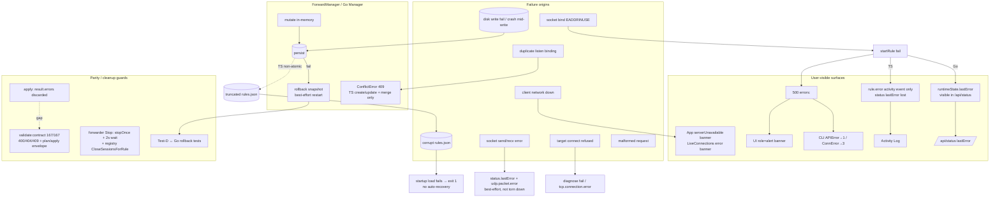

# Portier v1.6 Resilience & Fault Tolerance Audit 1

_Audit date: 2026-06-10. Scope: `shared/`, `server/`, `service/`, `client/`, `tools/cli/`, `tests/e2e/`, `scripts/`, plus `docs/coverage-baseline.md`, `docs/e2e-coverage.md`, `docs/api-contract.md`, `tools/cli/readme.md`. Read-only analysis — no product code, tests, contracts, durable docs (other than this file), or coverage gates were changed._

This is the ninth v1.6 audit, following:

- `audits/v1.6-coverage-audit-1.md`
- `audits/v1.6-architecture-audit-1.md`
- `audits/v1.6-testing-audit-1.md`
- `audits/v1.6-complexity-metrics-audit-1.md`
- `audits/v1.6-solid-audit-1.md`
- `audits/v1.6-design-pattern-audit-1.md`
- `audits/v1.6-duplication-audit-1.md`
- `audits/v1.6-error-flow-audit-1.md`

It evaluates how Portier behaves under **partial failure** — persistence failure, config corruption, socket bind/send/receive errors, runtime startup failure, API failure, CLI connection failure, UI offline, contract/parity failure, cleanup failure, repeated operations, and OS-specific failure modes. Where the error-flow audit traced *how an error becomes a response*, this audit asks *what state the system is left in, what the user can see, and whether the system recovers*. Findings cite exact files/identifiers; anything not verifiable from code is marked **Unable to verify**.

Portier is a deliberately two-runtime system (TypeScript server = Node fallback; Go service = primary packaged runtime) implementing one REST contract, with a third contract copy in the Go CLI. Resilience **parity** between the runtimes is therefore a first-class concern: a fault that the Go service survives but the Node fallback does not (or vice versa) is a real, user-visible divergence.

This audit does **not** recommend distributed-systems machinery. Portier is a local port-forwarding manager; circuit breakers, retry storms, and replication are out of scope. Resilience patterns are recommended only where they reduce real product risk for a local desktop/server tool.

---

## Executive Summary

**Resilience rating: 7 / 10.**

Portier is, on the whole, deliberately fault-tolerant for a local tool. Both managers roll back in-memory state on persist failure with tested parity (Test-D ↔ Go `Test*PersistFailureRollsBack`); the Go config store writes atomically (temp + `Sync` + `Rename`); forwarders stop idempotently (`stopOnce` in Go, no-op guards in TS) and bound their shutdown wait (2 s); there are **no product-side retry loops** that could mask a port conflict; diagnostics, CLI, and UI all degrade visibly and bound their timeouts (diagnose 2 s, CLI HTTP 10 s, Go `ReadHeaderTimeout` 5 s); and the CLI's backup-before-apply fails *closed* (a backup write error prevents the apply). The UI cleanly separates "server unreachable" (a persistent `role="alert"` banner) from a per-request error and renders defensively against partial data (`data?.tcpConnections ?? []`).

The risks are concentrated at three seams, all on the resilience-*parity* and resilience-*visibility* axes rather than systemic:

- **Biggest strengths:** tested rollback parity for create/update/delete/reorder/import in both runtimes; atomic Go persistence with temp-file cleanup; bounded timeouts everywhere with **no product retry loops**; idempotent, `stopOnce`-guarded forwarder shutdown with belt-and-suspenders registry cleanup; visible, well-separated UI degradation; CLI fail-closed backup + partial-failure-tolerant diagnostics export.
- **Biggest resilience risks:**
  1. **TS `ConfigStore.save` is non-atomic** (`config-store.ts:32-35`, a bare `writeFile`). A crash or disk-full mid-write can truncate `rules.json`; on next start `ConfigStore.load` (or Go `Store.Load`) **fails to parse and the service refuses to start** (TS `index.ts:35-38` exits 1; Go `main.go:75-78` returns error → exit 1). The Node fallback can therefore brick its own startup from a single bad write. Go is immune (atomic rename).
  2. **TS `startRule` discards `lastError` from status after a failed start** (`forward-manager.ts:239`) — the forwarder is deleted, so `getStatus` returns a default object with no `lastError`. Go retains it in `runtimeState.lastError` (`manager.go:398`, surfaced by `statusForRule` at `manager.go:500-502`). A failed start is visible in Go's `/api/status` but only in TS's activity log — a cross-runtime visibility divergence.
  3. **Config apply discards `importConfig` result.errors in both runtimes** (`api.ts:261`, `api.go:657-664`). In Go, `ImportConfig` returns `(result-with-Errors, nil)` on an intra-desired duplicate binding (`manager.go:303-310`) **without persisting**; apply then reports `ok:true` — a silent apply failure if the plan engine did not pre-flag it. Carried from the error-flow audit (Error-C) and reconfirmed here.
- **Correctness / release risks:** #1 is the only finding with a credible path to a *bricked runtime* (corrupt config on the Node fallback). It is a durability risk, not a logic bug, and the Go primary runtime is unaffected. It is **not** a release blocker (the packaged runtime is Go; Node is the documented fallback) but it is the highest-value fix.
- **Should any issue block further audit work?** No. All five coverage gates pass (see Validation), `validate:contract` is at 167/167, and lint/typecheck are clean. Every finding is an improvement slice, not a blocker.
- **Recommended first implementation slice:** **Resilience-A — give TS `ConfigStore.save` atomic write parity with Go** (write-temp-then-rename). Self-contained, mirrors an existing, tested Go pattern, removes the only bricking path, and is testable with a failing-rename seam. It also subsumes the durability half of the error-flow audit's Persistence finding.

---

## Resilience Map

---

## Resilience Taxonomy

| Failure Class | Origin | Existing Mitigation | User-visible Surface | State Guarantee | Tests / Guards | Risk |
| --- | --- | --- | --- | --- | --- | --- |
| Persist write failure | `store.save` (`config-store.ts:32`, `config.go:48`) | TS: rollback in-memory only (non-atomic write). Go: rollback **+** atomic temp/Sync/Rename | API/CLI/UI 500 `errors[]` | In-memory restored both runtimes; **on-disk integrity only guaranteed in Go** | Test-D (TS) ↔ `Test*PersistFailureRollsBack` (Go) | **Med-High** |
| Config corruption | truncated/partial `rules.json` (from #1, manual edit, ext crash) | none — `Load` rejects, no backup restore | service fails to start, exits 1 | No partial load (all-or-nothing) | `config-store.test.ts` / Go `config` load tests (valid/ENOENT/invalid-JSON) | Med |
| Duplicate listen binding | create/update/import | TS: guarded on create/update/**merge**; **not** replace-import. Go: guarded everywhere incl. `ensureNoDuplicateBindings` | 409 (create/update) / import error (merge) | No mutation when guarded | `validate:contract` 409; `validate:config` duplicate fixture | Med (TS replace gap) |
| Forwarder start (bind) | `forwarder.start()` EADDRINUSE | delete forwarder, emit `rule.error`, rethrow → 500 | API/CLI/UI 500 + `rule.error`; **Go also `/api/status` lastError** | Rule stays configured-but-stopped | unit tests; Test-A residual EADDRINUSE flake | Med |
| Socket send/recv error | UDP send cb / `socket.on("error")` / TCP copy | set `status.lastError` + `udp.packet.error`/`tcp.connection.error`; **not torn down** | `lastError` in status; activity event | Forwarder stays up (best-effort UDP) | Coverage Slice D/E send-error branches | Low |
| Target connect refused | `net.Dial`/`DialUDP` | per-connection error event; diagnose `target-connect` fail | activity event / diagnose | Read-only / per-conn | diagnose tests; forwarder tests | Low |
| Repeated start/stop | double start, double stop | start no-op if running; stop no-op if absent; Go `stopOnce` | idempotent | No double-bind, no double-close | manager + forwarder tests | Low |
| Shutdown / cleanup | forwarder Stop hang | 2 s bounded wait then `setLastError`; registry `CloseSessionsForRule` belt-and-suspenders | log + lastError | Sockets closed, sessions cleared | forwarder stop tests | Low |
| Runtime startup | port in use / bad config / bad opts | fail fast, exit (1/2); no retry | log + exit code | No half-started server | startup paths; `validate:binary` smoke | Low |
| Malformed request body | bad JSON / empty body | Go: 400. **TS: 500** (body-parser error not mapped) | 400 (Go) / 500 (TS) | No mutation | Go decode tests; **TS path not contract-guarded** | Low |
| API unreachable (CLI) | service down / bad host | `ConnectionError` → exit 3 + hint; 10 s timeout | CLI stderr | N/A | CLI httptest connection tests | Low |
| API unreachable (UI) | fetch reject | `serverUnavailable` banner (App) / error banner (views); auto-refresh swallows | `role="alert"` banner / stale data | Local UI only | client unit + Test-E `page.route` abort E2E | Low |
| Contract/parity drift | TS vs Go divergence | `validate:contract` 167/167 + `compareParity`; CLI DTO live decode (Arch-D) | CI failure | N/A | `scripts/validate-contract.js` | Low |
| Apply import rejection | intra-desired dup / invalid | **`result.errors` discarded** both runtimes | apply reports `ok:true` | Go: no persist (silent); TS: persists (divergence) | unit tests per runtime; **not parity-guarded** | Med |

---

## Findings

| Area | File / Identifier | Finding | Severity 1-10 | Category | Recommended Action | Effort | Risk | Notes |
| --- | --- | --- | ---: | --- | --- | --- | --- | --- |
| Persistence durability | `server/sources/config-store.ts:32-35` (`save` = `mkdir` + bare `writeFile`) vs `service/sources/config/config.go:48-102` (temp + `Sync` + atomic `Rename` + recovery) | TS writes `rules.json` **non-atomically**. A crash / disk-full / power loss mid-write truncates the file; the next start fails to parse it (`config-store.ts:13-23` throws → `index.ts:35-38` exits 1) with **no backup/recovery**. The Node fallback can brick its own startup from one bad write. In-memory rollback (Test-D) does not protect on-disk integrity. | 6 | HIGH | **Resilience-A:** adopt write-temp-then-`rename` (mirror Go). Optionally `fsync`. Add a failing-rename test seam. | S–M | Low | Go is the primary packaged runtime and is immune; Node is the documented fallback. Highest real product risk found. |
| Start-failure visibility | `server/sources/forward-manager.ts:239` (`this.forwarders.delete(ruleId)` in start catch) vs `service/sources/manager/manager.go:396-402,500-502` | After a failed `startRule`, TS **deletes the forwarder**, so `getStatus` returns a default `ForwardStatus` with **no `lastError`** — the failure survives only as a `rule.error` activity event. Go keeps `runtimeState.lastError`, surfaced by `/api/status`. Cross-runtime resilience-*visibility* divergence: an operator polling `/api/status` sees the failure on Go but not on TS. | 4 | MEDIUM | Record `lastError` on the rule's status in TS after a failed start (without leaving a half-live forwarder), or document the divergence as intentional. Add a parity assertion. | S | Low | Not a correctness bug — the rule is correctly stopped in both. Pure observability parity. |
| Apply silent failure | `server/sources/api.ts:255-262`; `service/sources/api/api.go:657-664`; Go `manager.go:303-310` | Config **apply** discards `ImportResult.errors`. Go `ImportConfig` returns `(Errors, nil)` for an intra-desired duplicate binding **before persisting**; apply ignores it and reports `ok:true` though nothing changed. Reproducible only if `buildConfigPlan` does not pre-flag intra-desired duplicate bindings as a plan error. | 5 | MEDIUM | **Resilience-C:** either prove the plan engine flags intra-desired duplicate bindings (`hasErrors`) — add a contract scenario — or have apply surface `result.errors`. | M | Low | Carried from error-flow Error-C. Interacts with the TS replace-import gap below. **Unable to verify** plan-engine behavior here without reading `config-plan.ts`/`configplan` (out of this read set); marked accordingly. |
| Import parity | `server/sources/forward-manager.ts:326-348` (replace branch) vs `service/sources/manager/manager.go:303-310` (`ensureNoDuplicateBindings(validated)`) | TS replace-import has **no duplicate-listen-binding guard**; Go rejects duplicate bindings in the imported set for both modes. Two desired rules with distinct ids but identical `protocol:host:port` survive in TS (Map keyed by id), persist, then the second forwarder start is swallowed by `.catch(()=>{})` (`forward-manager.ts:346`) → only a `rule.error` event. | 6 | HIGH | **Resilience-B:** align TS replace-import to reject duplicate bindings before persist (mirror Go) + add a TS↔Go import-duplicate parity scenario. | M | Low | Same divergence flagged by the error-flow audit; reconfirmed. Merge mode IS guarded in both runtimes. |
| Malformed-body parity | `server/sources/api.ts:38-39,351-367` (express.json + error middleware) vs `service/sources/api/api.go:677-699,615-618` | An invalid-JSON request body in TS is rejected by `express.json()` with a body-parser `SyntaxError` that the custom error middleware does not recognize → **500**. Go returns **400** (`json.Unmarshal` → 400). Status divergence on a malformed request. | 3 | LOW | Map body-parser/`SyntaxError` (it carries `.status=400`/`.type`) to 400 in the TS error middleware; add a contract scenario. | S | Low | Localhost-only API limits exposure; still a parity gap. Not currently in `validate:contract`. |
| Auto-refresh degradation | `client/sources/app/App.tsx:64-73` (`.catch(() => {})`) vs `LiveConnectionsView.tsx:81-94` (`setError` on failure) | App-level auto-refresh **silently swallows** fetch failures — on a mid-session backend outage the dashboard/rules views keep showing **stale data with no indication**. LiveConnections surfaces an error banner under the same condition. Inconsistent degradation. | 3 | LOW | Decide one policy: either surface a subtle "last update failed / stale" hint on App auto-refresh, or document the deliberate silence. Keep the persistent `serverUnavailable` banner for initial load. | S | Low | Swallowing transient refresh errors is defensible (avoid banner spam); the inconsistency with LiveConnections is the smell. |
| Activity value parity | `shared/sources/activity.ts:1-20`; `service/sources/activity/activity.go:5-29`; `scripts/validate-contract.js` | The 17 event-type strings + 4 severities are hand-duplicated and **match today (verified byte-for-byte)** but `validate:contract` asserts only `ActivityEvent` *shape*, not values, and no scenario asserts an error condition emits its expected `rule.error`/`config.import.failed`. Resilience-relevant: the Activity Log is the *only* surface for several best-effort failures (UDP send error, swallowed post-import start). | 4 | MEDIUM | **Resilience-E:** add value-level type/severity parity assertions + assert one error path emits its event. Script/tests only. | S | Low | Carried from error-flow Error-A and the duplication audit. |
| EADDRINUSE residual | `server/sources/forward-manager.test.ts` api `/start` sites; `server/sources/forwarders/udp-forwarder.test.ts` | Test-A residual: allocate-close-rebind helpers not yet migrated to bounded bind-retry can flake on the api `/start` and TS udp-forwarder paths. Documented in CLAUDE.md. A test-infra resilience gap, not a product defect. | 3 | LOW | **Resilience-D:** finish Test-A migration for these sites (bounded bind-retry, EADDRINUSE-only). Tests only. | S–M | Low | Must never hide a real EADDRINUSE by whole-test/suite retry. |
| Script child cleanup | `scripts/validate-contract.js:253-295,1502-1564` | Child runtimes are killed via `cleanup()` in per-runtime `finally` blocks (good), but there is **no outer guard** ensuring both children die if an exception escapes between the TS `finally` and the Go block (e.g. in `compareParity`/`runCLIContractGuard`). Low CI-hygiene risk. | 2 | OBSERVATION | **Resilience-F:** wrap both runtimes in one `try/finally` that kills any live child; or register a `process.on("exit")` killer. | S | Low | Each runtime is already individually cleaned; leak window is narrow. |
| Best-effort swallow (accepted) | TS `.catch(()=>{})` (`forward-manager.ts:161,196,346,387,398`); Go `_, _ = StartRule/StopRule` (`manager.go:92,210,366`) | Best-effort restart/stop during rollback and post-import start are intentionally swallowed so a restart error cannot mask the real persist error, and a post-import start failure cannot abort a successful import. | 1 | OBSERVATION | None — correct. Document intent (already commented in TS). The post-import swallow interacts with Resilience-B/C (a rule that fails to start post-import is persisted but stopped, surfaced only via `rule.error`). | — | — | Masking the persist error would be strictly worse. |
| Info leak (accepted) | `server/sources/api.ts:365-366`; `service/sources/api/api.go:720` | Catch-all 500 echoes raw internal error text (paths, `os` errors). | 2 | OBSERVATION | Acceptable while the management API is localhost-only by default; revisit if ever LAN-exposed. | S | Low | Consistent across runtimes (parity preserved). |

---

## Persistence Resilience

**Save atomicity.** The two runtimes diverge sharply. Go `Store.Save` (`config.go:48-102`) validates every rule, writes to a temp file in the target directory, `Sync`s, `Close`s, then `os.Rename`s over the destination — with a `defer` that removes the temp file unless the rename succeeded, and a remove-and-retry recovery branch. This is textbook atomic persistence and survives crash/disk-full mid-write (the old file stays intact). TS `ConfigStore.save` (`config-store.ts:32-35`) is a bare `mkdir` + `writeFile` — **non-atomic**. A crash between truncation and full write leaves a partial `rules.json`.

**Corruption recovery.** Neither runtime keeps a backup or attempts recovery on load. `ConfigStore.load` (`config-store.ts:9-30`) and Go `Store.Load` (`config.go:22-46`) treat ENOENT as "empty config" (`[]`) but **throw/return error on malformed JSON or an invalid rule**. That error propagates to startup: TS `index.ts:35-38` (`main().catch → process.exit(1)`) and Go `main.go:75-78` (`return fmt.Errorf("Failed to load config") → os.Exit(1)`). Consequence: a corrupt `rules.json` **prevents the service from starting at all**, with the operator left to hand-edit the file. Combined with the TS non-atomic write, the Node fallback has a self-inflicted bricking path: one bad write → corrupt file → won't restart. This is the chain behind Finding #1 and the rationale for Resilience-A.

**Import/apply rollback.** Strong and tested in both runtimes. `forward-manager.ts:294-414` and `manager.go:285-378` snapshot the prior rule set (`previousRules`/`previousRuntime`), mutate, persist, and on persist failure restore the snapshot — replace mode restores the whole map; merge mode additionally stops any forwarders it started. Proven by Test-D (TS `ControllableStore`) ↔ Go `Test*PersistFailureRollsBack`. The one gap is **validation parity**, not rollback: TS replace-import omits the duplicate-binding guard (Finding: Import parity / Resilience-B).

**Apply result handling.** Both runtimes discard `ImportResult.errors` in apply (`api.ts:261`, `api.go:657-664`). Because Go's `ImportConfig` returns errors-without-`err` for a duplicate binding *before persisting* (`manager.go:303-310`), apply can report `ok:true` while having changed nothing. Whether this is reachable depends on whether `buildConfigPlan` pre-flags intra-desired duplicate bindings as `hasErrors` — **Unable to verify** from this audit's read set (`config-plan.ts`/`configplan/` not read in full); flagged as Resilience-C with that caveat.

**Backup/export.** Export is read-only and side-effect-free in both runtimes (`exportConfig`). The CLI's `config apply --backup-out` writes a backup *before* applying and **fails closed** — a backup write error prevents the apply (`configcmd.go:933-945`, tested by `TestRunConfigApply_BackupOut_InvalidPath_PreventsApply`). This is the correct resilience posture: never destroy state you could not back up.

**TS vs Go asymmetry summary.** Go persists eagerly and atomically on every mutation and does **not** flush on shutdown (`main.go:128` calls `StopAll` only — correct, since running state is not persisted). TS persists per mutation **and** flushes on shutdown (`index.ts:108-110`). The shutdown flush is harmless but the per-mutation write is the one that matters, and it is the non-atomic one. **Recommendation:** Resilience-A closes the only durability-parity gap; the rest of the persistence story is sound.

---

## Socket / Forwarder Resilience

**Bind failure.** TCP/UDP `start` propagate bind errors cleanly. TS rejects the `start` promise on `server.on("error")` / `socket.on("error")` before `listening` (`tcp-forwarder.ts:37-52`, `udp-forwarder.ts:182-197`); Go returns the `net.Listen`/`ListenUDP` error directly (`tcp.go:59-65`, `udp.go:89-100`) and, for one-way/last-client UDP, closes the listen socket if the target dial fails (`udp.go:106-119`) — no leaked listen socket. A failed start therefore leaves the rule **stopped** in both runtimes.

**Start-failure visibility divergence.** The managers differ in what they *retain*. Go `StartRule` writes `state.lastError = err.Error()` into `runtimeState` and keeps the entry (`manager.go:396-402`), so `/api/status` shows the failure (`statusForRule` → `manager.go:500-502`). TS `startRule` **deletes the forwarder** in its catch (`forward-manager.ts:239`), so `getStatus` returns a default status with no `lastError`; the only durable trace is the `rule.error` activity event. This is Finding #2 (Resilience-visibility, severity 4) — both correctly stop the rule, but Go is observably more diagnosable via status.

**Send / receive errors.** Best-effort and non-fatal in both runtimes, which is correct for UDP. TS UDP send callbacks set `status.lastError` + emit `udp.packet.error` and `return` without tearing down (`udp-forwarder.ts:91-102,138-150,260-272,329-341`). Go mirrors this with `setLastError` + `emitPacketError` guarded by `f.isRunning()` (`udp.go:261-267,299-306,347-353,428-432,459-465`). TCP copy errors are emitted at most once across both copy goroutines via a CAS guard (`tcp.go:178,223-233,242-255`); TS uses a `loggedError` boolean (`tcp-forwarder.ts:135-156`). Accept-loop / read-loop errors are suppressed when not running (`tcp.go:143-148`, `udp.go:228-234`) so a normal `Stop()` does not log a spurious error — good.

**Repeated start/stop & idempotency.** Start is a no-op when already running (`forward-manager.ts:213-215`, `manager.go:386-389`). Stop is a no-op when no forwarder is registered (`forward-manager.ts:255-267`); Go `stopRuntime` deletes the runtime entry when `lastError==""` (`manager.go:466-470`). Go forwarders guard teardown with `sync.Once` (`tcp.go:81`, `udp.go:143`), so a double `Stop()` cannot double-close. Repeated operations are safe.

**Cleanup robustness.** Both forwarders close all tracked sockets/sessions on stop and bound the wait: Go waits up to 2 s for goroutines then records a timeout error and proceeds (`tcp.go:98-107`, `udp.go:171-180`), and clears the registry as belt-and-suspenders even if a goroutine defer did not (`udp.go:182-186`). TS clears sessions, closes listen+target sockets, and calls `registry.closeSessionsForRule` (`udp-forwarder.ts:200-218`). No unbounded waits, no leaked sockets on the normal paths.

**EADDRINUSE residual.** The remaining flake is in *tests*, not the product — allocate-close-rebind helpers on the api `/start` and TS udp-forwarder paths (Test-A residual, Finding: EADDRINUSE residual / Resilience-D). The product correctly surfaces EADDRINUSE as a 500 + `rule.error`; only the test harness races. Crucially, the existing Test-A guidance is right: **do not add a product-side bind retry** — it would hide genuine port conflicts.

---

## Runtime / API Resilience

**Startup.** Both runtimes fail fast with distinct exit codes — TS exits 1 on any startup failure (`index.ts:35-38`); Go exits 2 on bad options (`main.go:36-40`) and 1 on config-load/start/listen failure (`main.go:75-78,84-87`, `runPortier` error return). A port already in use at startup surfaces as a listen error and a clean exit, not a hang. There is no half-started server state.

**Static client serving.** Degrades gracefully and identically: both gate the SPA/static handler on `index.html` existing (`api.ts:344-349` / `hasStaticClient`; Go `static.HasClient` → `ServeClient` else `http.NotFound`, `api.go:75-81`). A missing `web/` directory leaves the API fully functional with a startup warning (`index.ts:87-92`, `main.go:71-73`). Covered by Go `static_test.go`.

**Malformed requests.** Go is robust: `readBody` rejects an empty body (`api.go:695-697`) and caps the body at 1 MB via `io.LimitReader` (`api.go:691`); `decodeRequest` maps a JSON error to 400 (`api.go:683-686`). TS relies on `express.json()`, which (a) defaults to a **100 kb** limit (vs Go's 1 MB — a bounded but divergent cap) and (b) throws a body-parser `SyntaxError` on malformed JSON that the custom error middleware does **not** map, yielding **500 instead of 400** (Finding: Malformed-body parity). Both are bounded and safe; the status divergence is the only issue.

**Manager error mapping.** Uniform and parity-correct: `ValidationError→400`, `ConflictError→409`, `NotFoundError→404`, else 500 (`api.ts:351-367`, `api.go:701-721`). Tested via `validate:contract`.

**Shutdown / cleanup.** Both runtimes shut down gracefully on SIGINT/SIGTERM. TS destroys tracked HTTP sockets, stops forwarders, flushes config, and closes the server with duplicate-signal guarding (`index.ts:94-131`). Go uses `signal.NotifyContext` + `server.Shutdown` with a 10 s timeout, then `StopAll` (`main.go:53-135`). Neither leaks the listener; both bound their cleanup.

**Validation scripts.** `validate-contract.js` is resilient by design (Test-A): `startServer` retries the child bind on a fresh port up to 5 times, only on a non-ready child, and `waitForReady` bails immediately if the child exits (`validate-contract.js:236-290`). Child processes are killed via `cleanup()` in per-runtime `finally` blocks (`:1511-1546`). The one hardening opportunity is an *outer* guard so a leak cannot occur if an exception escapes between runtimes (Finding: Script child cleanup / Resilience-F). `validate-coverage.js` enforces gates and exits 1 on any gate failure; not a runtime-resilience surface.

---

## CLI Resilience

The CLI is a pure API client with a clear, tested failure ladder.

- **Connection failure.** `do`/`doWithBody` wrap a failed `httpClient.Do` in `*ConnectionError` (`client.go:72-75,356-359`) → exit 3 with an actionable hint; the 10 s `defaultTimeout` (`client.go:17,29`) bounds every call so the CLI never hangs on a dead service.
- **API errors.** Non-2xx → `*APIError{StatusCode, Messages}` decoded from the `errors[]` body (`client.go:83-87,367-371`) → exit 1; a non-JSON error body falls back to `APIError{StatusCode}` without crashing (`_ = json.Unmarshal`).
- **Invalid URL / local file errors.** Invalid `--url` exits 2 (dispatch table tested in `main_test.go`); local config read/parse errors exit 2 for plan/diff/apply and 1 for import/validate (the known exit-code inconsistency carried as error-flow Error-D — operator confusion, not breakage).
- **Backup-out write failure.** Fails closed — prevents the apply (`configcmd.go:933-945`). Correct resilience posture.
- **Diagnostics export.** Partial-failure tolerant: each source failure is recorded in `bundle.Errors` rather than aborting the bundle (`diagnosticscmd.go:187-265`), so a support bundle is produced even when the runtime is degraded.
- **JSON output failure.** Every JSON-emitting command routes encode failures to exit 1 + "Error encoding JSON" (Coverage Slice C, `json_err_test.go`).

**Assessment:** CLI resilience is the strongest surface in the codebase — bounded, typed, fail-closed, and partial-failure tolerant. No new risk found; the only open item is the cosmetic exit-code normalization (Error-D), which is out of this audit's recommended slices.

---

## Client / UI Resilience

**Offline / initial-load failure.** `App.loadInitial` distinguishes a *network* error (`isNetworkError` → persistent `serverUnavailable` banner with the management address, `App.tsx:96-118,307-314`) from a server-returned error (`errors` banner, `:316-322`). This is good degradation: the user is told the service is down vs. a request failed.

**Per-view failure.** `LiveConnectionsView.load` sets an error banner (`role="alert"`) on fetch failure and renders defensively against partial data via `data?.tcpConnections ?? []` (`LiveConnectionsView.tsx:81-94,107-109`) — the view cannot crash on a missing field. The API funnel `ensureOk` (`portierApi.ts:172-179`) surfaces server `errors[]` and falls back to `Request failed with <status>.` when the body is not JSON.

**Auto-refresh under failure.** Divergent (Finding: Auto-refresh degradation). App-level auto-refresh swallows errors (`App.tsx:70`) → stale data, no signal; LiveConnections auto-refresh surfaces the error. Swallowing transient refresh blips is defensible, but the inconsistency is a smell worth a deliberate decision.

**Stale data / partial data.** No crash paths found — all consumers use optional chaining and array fallbacks. A backend that returns a partial or empty payload degrades to empty tables, not a white screen.

**E2E coverage.** Test-E added the two critical resilience E2Es: a **populated** Live Connections TCP table (real held connection) and an **API-failure error banner** (`page.route` aborts `/api/connections` → `role="alert"`, app stays usable) — `connections.spec.ts I`/`J`, documented in `docs/e2e-coverage.md:67-71,129-136`. The one deliberate gap is a held *UDP* active session across a browser fetch (hard to keep deterministic; deferred, documented).

**Assessment:** UI resilience is solid. The only action is harmonizing the App vs LiveConnections auto-refresh-failure policy (low severity).

---

## Retry / Timeout / Degradation Analysis

**Bounded retries (present, correct).**
- `validate-contract.js startServer`: bounded (5×), fresh-port, only on a non-ready child, never the whole suite (`:265-289`). Transparent and Test-A-sanctioned.
- No others. There are **no product-side retry loops** — confirmed across managers and forwarders.

**No-retry decisions (correct, deliberate).**
- Forwarder **bind/start** is *not* retried — a port conflict surfaces immediately as 500 + `rule.error`. Retrying would hide the conflict (Test-A rule). ✔
- Persist failure is *not* retried — it rolls back and reports. Retrying a failing disk write could mask a real fault. ✔
- CLI does not retry a failed request — it reports the typed error and exits. ✔

**Timeouts (all bounded).**
- Diagnose: `TIMEOUT_MS` (2 s) on TCP/UDP bind and TCP connect (`diagnose.ts:228-268`); Go uses immediate `net.Listen` results plus dial timeouts. Bounded — diagnose cannot hang.
- Forwarder shutdown wait: 2 s (`tcp.go:105`, `udp.go:178`).
- CLI HTTP: 10 s (`client.go:17`).
- Go server: `ReadHeaderTimeout` 5 s (`main.go:99`); graceful-shutdown 10 s (`main.go:123`).
- **Gap:** TS Express server sets no per-request/read timeout (Node default is none). A slow-loris client could hold a TS connection open. Low risk for a localhost-default API; worth noting, not fixing now.

**Graceful degradation.** Static-client-missing → API-only; UI offline → banner + stale data; diagnostics export → partial bundle with `errors[]`; backup-out failure → abort apply. All explicit.

**Best-effort cleanup.** Forwarder Stop, registry `CloseSessionsForRule`, rollback restart, post-import start — all best-effort and intentionally swallowed where re-raising would mask a more important error (documented).

**Swallowed errors (audited).** The swallow sites (`.catch(()=>{})`, `_, _ =`) are all classified Acceptable except the post-import start swallow, which interacts with Resilience-B/C (a rule that fails to start after import is persisted-but-stopped, surfaced only via `rule.error`). No *dangerous* silent failures found.

---

## Cross-Runtime Resilience Parity

**Parity-guarded resilience paths (`validate:contract`, 167/167):** error-class → status mapping (400/404/409/500), error body shape (`errors[]`), plan/apply envelope (`hasErrors`/`ok:false`/dry-run/no-drift), `ActivityEvent` shape, advisory/plan content (Arch-A + `compareParity`), CLI DTO live decode (Arch-D).

**Tested per runtime but NOT parity-guarded:** persist-failure rollback (Test-D ↔ Go tests prove parity by mirroring, but no live cross-runtime scenario); 422 import-rejected; 400 destructive-apply-without-`yes`.

**Under-guarded divergences (this audit):**
1. **Persistence atomicity** — Go atomic, TS non-atomic (Resilience-A). The most consequential divergence: only one runtime can corrupt its own config.
2. **Start-failure status visibility** — Go retains `lastError` in `/api/status`, TS does not (Resilience-B-adjacent, Finding #2).
3. **Replace-import duplicate-binding guard** — Go guards, TS does not (Resilience-B).
4. **Malformed-JSON-body status** — Go 400, TS 500 (Finding: Malformed-body parity).
5. **Apply import-error handling** — both discard `result.errors`; the *observable* effect differs (Go silently no-ops, TS persists a duplicate) (Resilience-C).
6. **Activity event-type/severity values** — duplicated, matching, but not value-guarded (Resilience-E).

**Acceptable / intentional divergences (should stay, document):** diagnose `fail`/bind/connect **message text** (OS-specific; status is the contract); TS 2 s diagnose timeout branches vs Go immediate-result bind (both yield `fail`); body-size cap (TS 100 kb vs Go 1 MB — both bounded); shutdown flush (TS flushes, Go persists eagerly). These are correct or harmless and need only a documentation note, not code change.

---

## Structurally Unreachable / Accepted Gaps Review

| Documented gap | Source | Still correct? | Recommendation |
| --- | --- | --- | --- |
| `crypto/rand` fallbacks (`randomEventID`, `NewRuleID`, `generateConnectionID`) | `coverage-baseline.md:268` | Yes — OS entropy never fails in tests; no injection point. | **Keep documented.** No action. |
| `config.Save` write/`Sync`/`Close` + atomic-rename recovery branch | `coverage-baseline.md:269` | Yes — `os.Rename` is atomic on Win/Linux, so the remove-and-retry branch is effectively dead. | **Keep documented.** Note: Resilience-A would add a TS analogue worth its own (testable) seam. |
| Socket internals needing brittle injection (real send-buffer timeout, post-stop reply races) | `coverage-baseline.md`, error-flow audit | Yes — clean instance-level `.send`/`.emit` override is the sanctioned technique; prototype/`dgram` monkeypatching rejected. | **Keep documented.** No action. |
| Diagnose 2 s bind/connect **timeout** branches | `coverage-baseline.md:200,340` | Yes — triggering a ~2 s hang is nondeterministic/slow; success and error paths are covered. | **Keep documented.** No action. |
| `main()`/`os.Exit` wrappers; CLI `json.Marshal` on concrete DTOs | `coverage-baseline.md:126-130` | Yes — wrappers and impossible-marshal branches. | **Keep documented.** No action. |
| E2E held-UDP active-session across a browser fetch | `e2e-coverage.md:68,136` | Yes — deferred; populated-TCP-table proves the table path, UDP data paths covered by `udp.spec.ts`. | **Keep documented.** No action. |

All documented gaps remain accurate. The only adjustment is that Resilience-A will *introduce* a new, **testable** TS atomic-write seam (a failing-rename injection) — so the durability path should be covered, not added to the accepted-gap list.

---

## 100% Meaningful Coverage Interaction

**Meaningfully covered resilience paths:** persist-failure rollback (both runtimes, Test-D ↔ Go); forwarder start-failure `rule.error`; UDP send/socket error branches (Slice D/E); diagnose check failures; API rejection mapping (400/404/409/500); CLI connection/API/local-file/JSON-encode failures and exit codes (Slice C); CLI backup-fail-closed and partial diagnostics export; client API-failure banner and populated-state (Test-E). All five gates pass at audit time.

**Gaps that warrant tests (behavior-driven, not number-driven):**
- TS atomic-write failure path (new with Resilience-A) — failing-rename leaves the old file intact, in-memory rolled back.
- TS↔Go replace-import duplicate-binding parity (Resilience-B).
- Apply import-error handling / plan pre-flag of intra-desired duplicates (Resilience-C).
- TS start-failure `lastError` visibility (Finding #2), if the divergence is closed rather than documented.
- Activity event-type/severity value parity (Resilience-E).
- Malformed-JSON-body → 400 in TS (Finding: Malformed-body parity), if closed.

**Gaps that should stay documented (brittle/production-only seam):** the structurally-unreachable list above — unchanged.

**Should coverage gates change? No.** None of these findings is closed by raising a numeric gate. They are parity/durability/visibility behaviors that need *specific* tests or small seams. Keep gates at current values (90–95% practical, 100% meaningful), consistent with every prior v1.6 audit.

---

## Recommended Implementation Slices

### Resilience-A — TS `ConfigStore` atomic write parity with Go
- **Goal:** make TS `rules.json` writes crash-safe (write-temp-then-`rename`, optional `fsync`), mirroring `config.go:48-102`, so a crash/disk-full mid-write cannot corrupt the file and brick startup. Closes the highest real product risk.
- **Files:** `server/sources/config-store.ts`; `server/sources/config-store.test.ts`.
- **Tests:** success (file replaced atomically); failing-`rename`/`writeFile` seam leaves the **prior** file intact and the manager rolls back in-memory; temp file cleaned up on failure.
- **Coverage impact:** small positive on `config-store.ts`; introduces a new testable seam (do not add to accepted gaps).
- **Risk:** Low (self-contained; behavior preserved on the success path; guarded by `validate:config`).
- **Validation:** `npm run test -w server`, `npm run validate:coverage:server`, `npm run validate:config`.

### Resilience-B — TS replace-import duplicate-binding parity
- **Goal:** reject duplicate listen bindings in the imported set on **replace** import (mirror Go `ensureNoDuplicateBindings`), eliminating the silent two-rules-one-port divergence; add a TS↔Go parity scenario.
- **Files:** `server/sources/forward-manager.ts` (replace branch, `:326-348`); `server/sources/forward-manager.test.ts`; `scripts/validate-contract.js`.
- **Tests:** replace-import with intra-set duplicate bindings → rejected before persist (TS), parity with Go; existing valid-import contract preserved.
- **Coverage impact:** small positive on import paths.
- **Risk:** Medium (touches import behavior — must preserve the valid-import contract; guarded by `validate:contract` + `validate:config`).
- **Validation:** `npm run test`, `npm run validate:contract`, `npm run validate:config`.

### Resilience-C — Config apply import-error handling parity
- **Goal:** prove and test what apply does when `importConfig` returns `result.errors` — either assert the plan engine flags intra-desired duplicate bindings as a plan error (preferred; add a contract scenario) or have apply surface `result.errors` instead of reporting `ok:true`.
- **Files:** `server/sources/config-plan.ts` and/or `server/sources/api.ts`; `service/sources/configplan/` and/or `service/sources/api/api.go`; `scripts/validate-contract.js`; unit tests both runtimes.
- **Tests:** apply with intra-desired duplicate bindings → observable, parity-correct outcome (not a false `ok:true`); 422/destructive-400 apply parity scenarios.
- **Coverage impact:** small positive on apply/plan paths.
- **Risk:** Medium (touches apply semantics — guarded by `validate:contract`).
- **Validation:** `npm run test`, `npm run validate:contract`.

### Resilience-D — Residual Test-A EADDRINUSE helper migration (API `/start`, TS udp-forwarder)
- **Goal:** migrate the residual allocate-close-rebind sites to bounded bind-retry helpers; remove the documented flake. Test-infra only.
- **Files:** `server/sources/forward-manager.test.ts`, `server/sources/forwarders/udp-forwarder.test.ts`.
- **Tests:** existing tests, stabilized; run twice to confirm no flake.
- **Coverage impact:** neutral.
- **Risk:** Low–Medium (must not hide a real EADDRINUSE by whole-test retry).
- **Validation:** `npm run test` (twice).

### Resilience-E — Activity event-type/severity value parity guard
- **Goal:** assert event-**type/severity values** (not just shape) in `validate:contract`, and assert one error condition emits its expected event (e.g. forced `config.import.failed`). Closes the silent-drift gap on the Activity Log, which is the only surface for several best-effort failures.
- **Files:** `scripts/validate-contract.js`; optionally a shared unit test enumerating the canonical set against `activity.ts`/`activity.go`.
- **Tests:** value-level type/severity assertions; one error-path emission assertion.
- **Coverage impact:** none (script-level).
- **Risk:** Low.
- **Validation:** `npm run validate:contract`.

> Slice **Resilience-F** (validate-contract outer child-cleanup guard) and the **TS malformed-body→400** fix are optional hardening; fold into Resilience-E or defer. **Finding #2** (TS start-failure `lastError` visibility) can ride with Resilience-B if the team chooses to close rather than document it.

---

## Validation Commands Used

| Command | Result |
| --- | --- |
| `npm run lint` | ✅ pass (eslint clean) |
| `npm run typecheck` | ✅ pass (shared + server + client) |
| `npm run validate:coverage` | ✅ all five gates pass — shared 100/100/100, server 98.9/93.6/100, client 95.2/90.2/80.3, service 90.3/—/95.9, cli 97.7/—/98.6 (this session) |
| `npm run validate:contract` | _not re-run this session_ — last known 167/167 (TypeScript + Go); no product code changed by this read-only audit |

Not run (per audit instructions and cost): release packaging, OS service install scripts. `npm run test` / `npm run validate:contract` were not re-run because this audit changed no product code, tests, or contracts; the coverage suite exercises the relevant unit/integration tests and the contract suite's last result stands.

---

## Final Recommendation

**Continue to next audit first**, then schedule **Resilience-A** as the first resilience fix slice.

Rationale: Portier's fault tolerance is structurally sound for a local tool — tested rollback parity, atomic Go persistence, bounded timeouts, no dangerous retries, idempotent forwarder cleanup, and visible UI degradation. None of the findings is a release blocker, and the primary packaged runtime (Go) is immune to the single bricking path. The highest-value work is **Resilience-A** (TS atomic-write parity) because it removes the only credible self-inflicted-corruption path on the Node fallback, mirrors an existing tested pattern, and is low-risk and self-contained — but it can wait for the team's pivot from auditing to implementation. **Resilience-B/C** (import/apply duplicate-binding + result-error parity) are real divergences best fixed deliberately with parity tests, not rushed. Coverage gates should not change.
