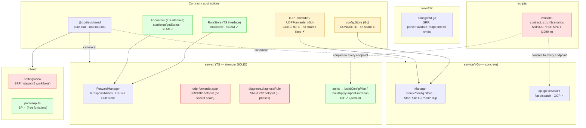

# Portier v1.6 SOLID Audit 1

_Audit date: 2026-06-10. Scope: `shared/`, `server/`, `service/`, `client/`, `tools/cli/`, `tests/e2e/`, `scripts/`. Read-only analysis — no product code, tests, contracts, docs (other than this file), or coverage gates were changed._

This is the fifth v1.6 audit, following:

- `audits/v1.6-coverage-audit-1.md`
- `audits/v1.6-architecture-audit-1.md`
- `audits/v1.6-testing-audit-1.md`
- `audits/v1.6-complexity-metrics-audit-1.md`

It evaluates the codebase against the five SOLID principles (SRP, OCP, LSP, ISP, DIP). It uses the complexity audit's hotspot map as input but does **not** re-litigate complexity; it re-frames those hotspots (and several new ones) through the lens of *responsibility, extensibility, substitutability, interface size, and dependency direction*. Findings cite exact files/identifiers; anything not verifiable from code is marked **Unable to verify**.

---

## Executive Summary

**SOLID rating: 7 / 10.**

Portier's SOLID posture is good and — importantly — **asymmetric between its two runtimes**. The TypeScript runtime is the stronger SOLID citizen: it has a real `Forwarder` interface (`server/sources/forwarders/types.ts`) that `ForwardManager` consumes polymorphically, and a real `RuleStore` persistence abstraction (`server/sources/forward-manager.ts:11`) injected through the constructor. The Go runtime achieves the *same observable behavior* but with **concrete types and no interfaces** at those two seams: `manager.runtimeState` holds separate `*TCPForwarder`/`*UDPForwarder` pointers and `Manager.store` is a concrete `*config.Store`. That single design difference is the root cause of two of this audit's findings (the duplicated `StartRule` arms and the filesystem-trickery `failingStore` test) and is the main thing holding the rating below 8.

**Biggest SOLID strengths**

- **Dependency Inversion on the TS persistence seam.** `ForwardManager(store: RuleStore, activity?: ActivityStore)` depends on abstractions, not `config-store.ts`. This is what let Test-D add clean rollback tests via `ControllableStore` (a faithful `RuleStore` substitute) instead of touching the filesystem.
- **Liskov-clean forwarder polymorphism (TS).** `TcpForwarder` and `UdpForwarder` both satisfy `Forwarder`; `ForwardManager` varies only at the single construction site (`forward-manager.ts:221-224`) and otherwise calls `forwarder.start()/stop()/getStatus()` polymorphically. Adding a protocol touches *one* ternary on the TS side.
- **Clean Open/Closed dispatch for commands, routes, and subcommands.** `RunConfig` (`configcmd.go:162`), the Go `serveAPI` router, and the CLI `run()` table are flat dispatch points where a new case is additive — textbook OCP for those axes.
- **Interface Segregation by free functions.** `client/sources/api/portierApi.ts` is ~15 small named exports, not one fat client object; consumers import only the calls they use. `Forwarder` (3 methods) and `RuleStore` (2 methods) are minimal, role-shaped interfaces.
- **Substitutability proven across the REST seam.** Arch-D's live-runtime decode guard (`contract_decode_test.go`) proves the CLI DTOs are LSP-faithful to real responses, not just to `httptest` mocks; `validate:contract` (167/167) proves the two runtimes are mutually substitutable behind the API.

**Biggest SOLID risks**

1. **`scripts/validate-contract.js::runScenarios`** (~1090 lines, ~50 inline scenarios) is the worst SRP violation in the repo and is *closed* against cleanly adding a new API response family (OCP). (HIGH — same artifact as Complexity-A.)
2. **Go runtime lacks the two abstractions the TS runtime has.** No `Store` interface (DIP asymmetry) → persist-failure is tested by pointing a real `config.Store` at an unwritable path (`failingStore`, `manager_test.go:1534`). No forwarder interface → `StartRule`/`stopRuntime`/`statusForRule` each branch on `protocol`/nil-pointer (LSP/OCP), and the TCP/UDP arms of `StartRule` are ~95% duplicated. (MEDIUM.)
3. **Several god functions concentrate multiple reasons-to-change:** `diagnose.ts::diagnoseRule` (5 inline check phases, OCP-closed against new checks), `udp-forwarder.ts::start` (socket wiring + byte accounting + activity emission + log throttling in one nested closure), and `SettingsView.tsx` (5 unrelated workflows / 22 `useState`). (MEDIUM.)
4. **White-box test coupling to Go manager internals.** Tests assign `m.store = failingStore(t)` directly, depending on an unexported field. A symptom of the missing `Store` abstraction. (LOW.)

**Does any SOLID issue block further audit work?** **No.** Every finding is a maintainability/testability concern, not a correctness or release risk. All five coverage gates pass (see Validation). The SOLID weaknesses are exactly the kind the existing test net makes *safe* to fix.

**Recommended first implementation slice:** **SOLID-A — split `validate-contract.js::runScenarios` into per-endpoint scenario functions.** It is identical in target to the complexity audit's **Complexity-A**, is the single highest-leverage SRP+OCP win, and touches no product code, contract, or gate. Doing it satisfies both audits at once.

---

## SOLID Scorecard

| Principle | Rating 1-10 | Strongest examples | Weakest examples | Risk |
| --------- | ----------: | ------------------ | ---------------- | ---- |
| **SRP** | 6 | `config-plan.ts`/`plan.go` (pure, single-purpose); `shared/index.ts`; E2E `network.ts` helpers | `runScenarios` (1090 ln/~50 jobs); `diagnoseRule` (5 phases); `udp-forwarder.start`; `SettingsView` (5 workflows); `manager.go`/`ForwardManager` (6 responsibilities) | God functions are untested-as-units (`runScenarios`) or live-socket (`start`); refactor risk is contained by good coverage |
| **OCP** | 7 | `RunConfig`/`serveAPI`/`run()` dispatch tables (new case = additive); `Forwarder`-polymorphic `ForwardManager` (TS) | Add-a-protocol touches `StartRule`+`stopRuntime`+`statusForRule`+`tryBind`+validation (Go); add-a-diagnostics-check edits the `diagnoseRule` monolith; add-a-contract-family edits `runScenarios` | Multi-site edits invite "edited one arm, forgot the other" drift |
| **LSP** | 7 | TS `Forwarder` impls fully substitutable; `ControllableStore` faithful to `RuleStore`; CLI DTOs ↔ live runtime (Arch-D); runtime parity (validate:contract) | Go has no forwarder/store interface → no substitution point; `failingStore` substitutes behavior via OS misconfiguration, not abstraction | Asymmetry is a design smell, not a defect; behavior parity is gate-guarded |
| **ISP** | 8 | `Forwarder` (3), `RuleStore` (2), `portierApi.ts` free functions, `SettingsViewProps` (2 props) | Consumers depend on the *concrete* `ForwardManager`/`*Manager` (no role interface); white-box test access to `m.store` | Low — surfaces are cohesive even when not formally segregated |
| **DIP** | 7 | TS persistence injection (`RuleStore`, `ActivityStore`); Arch-B apply logic now a pure-function dependency | Go manager → concrete `*config.Store`/forwarders; no socket seam in `udp-forwarder.start`/api `/start` (live-bind test flake observed this run); `config.Save` no FS seam | Mostly *justified* omissions; the Go `Store` gap is the one worth weighing |

**Overall: 7/10.** Strong, idiomatic interface/dependency hygiene on the TS side; the Go runtime trades two abstractions for concrete simplicity and pays for it in duplication and white-box tests.

---

## SOLID Map

**Where responsibility/dependency pressure concentrates:** `runScenarios` (couples to every endpoint of both runtimes + CLI DTOs), the manager aggregates (6 responsibilities each), and the two Go "no-seam" nodes that force branching and white-box tests.

---

## Findings

| Principle | File / Identifier | Finding | Severity | Category | Recommended Action | Effort | Risk | Notes |
| --------- | ----------------- | ------- | -------: | -------- | ------------------ | ------ | ---- | ----- |
| SRP / OCP | `scripts/validate-contract.js` `runScenarios` (≈384–1476) | One ~1090-line function with ~50 inline scenarios = dozens of reasons to change; *closed* against adding a new API response family without scrolling the monolith | 6 | HIGH | Split into per-endpoint scenario fns + ordered registry (== Complexity-A / SOLID-A) | M | Low (test infra; output unchanged) | The contract guard is itself the least SOLID artifact in the repo |
| LSP / OCP / DIP | `service/sources/manager/manager.go` `runtimeState` (27–33), `StartRule` (380–434), `stopRuntime` (452–471), `statusForRule` (482–522) | Go forwarders have **no shared interface**; `runtimeState` carries separate `tcp`/`udp` pointers, so three methods branch on protocol/nil and `StartRule`'s TCP and UDP arms are ~95% duplicated. TS avoids this with the `Forwarder` interface | 4 | MEDIUM | Introduce a Go `Forwarder` interface (`Start/Stop/Status`); store one `forwarder Forwarder` in `runtimeState`; collapse the arms (== Complexity-C + interface) | S–M | Low (covered by manager tests) | Root cause of both the duplication and the LSP asymmetry vs TS |
| DIP / LSP | `service/sources/manager/manager.go` `store *config.Store` (19) vs `server/.../forward-manager.ts` `RuleStore` (11) | Go manager depends on the **concrete** `config.Store`; TS depends on the `RuleStore` abstraction. Persist-failure can only be forced by misconfiguring a real store at the OS level | 4 | MEDIUM | Define a small `Store` interface in Go (`Load`/`Save`) the manager accepts; OR explicitly document the asymmetry as an accepted Go-idiom trade-off | S–M | Low | Weigh against Go idiom & overengineering — see DIP analysis; do **not** abstract beyond Load/Save |
| SRP / OCP | `server/sources/diagnose.ts` `diagnoseRule` (9–201) | Five check phases (listen-host, lan-exposure, privileged/common port, bind, dns, connect, udp-mode) inlined into one function; adding a check means editing the monolith — no check abstraction | 5 | MEDIUM | Extract per-phase helpers each returning `DiagnosticCheck[]`; assemble in one fn (== SOLID-C) | M | Low (98.0% covered) | Each phase is an independent append — extraction is mechanical |
| SRP / DIP | `server/sources/forwarders/udp-forwarder.ts` `start` (45–198) | Single ~154-line method mixes socket wiring, byte/packet accounting, registry calls, activity emission, and log throttling across 3-deep nesting; forward-send & return-send callbacks are near-duplicates. No injected socket seam → tests bind real sockets | 5 | MEDIUM | Extract `emitForwarded`/`emitReturned`/`emitSendError` (mirror Go `udp.go`); do **not** add a socket-factory seam (overengineering — see DIP) (== SOLID-B) | M | Medium (live socket) | A residual real-bind flake surfaced during this audit's coverage run (see Validation) |
| SRP | `client/sources/features/settings/SettingsView.tsx` (whole, 22 `useState`) | One component owns five unrelated workflows (export, import, runtime info, diagnostics export, plan/apply); changing any one means reading past the others | 5 | MEDIUM | Extract `PlanApplySection` (+ optional `useImportConfig`) (== SOLID-D / Complexity-E) | M | Medium (large test surface + settings E2E) | Props surface is fine (2 props); the SRP problem is internal state |
| SRP | `service/sources/manager/manager.go` (697), `server/.../forward-manager.ts` (502) | Each manager has ~6 reasons to change (store, persistence, lifecycle, activity, registries, import/export) | 4 | MEDIUM | Keep as the domain aggregate; do **not** split the class — only extract methods (forwarder iface, emitter). Arch-C2 already extracted `emitRuleEvent` | M | Med | Legitimate aggregate; splitting risks runtime divergence — keep TS/Go parallel |
| ISP / encapsulation | `service/.../manager_test.go` `failingStore` usage (`m.store = failingStore(t)`, 1548+) | Tests reach into the unexported `store` field to inject failure — white-box coupling to manager internals, a symptom of the missing `Store` abstraction | 3 | LOW | Resolved automatically if a `Store` interface + constructor injection is added; otherwise acceptable & documented | S | Low | Currently the only way to force Go persist-failure |
| SRP | `tools/cli/sources/commands/configcmd.go` (1030) | File mixes parse (`parseLocalConfig`), local validation (`validateLocalConfig`), DTO mapping (inlined 3×), 6 subcommand handlers, and human printers; the flag→read→parse→validate prelude repeats 4× | 3 | LOW | Extract `loadAndValidateConfigFile` + `toConfigRules`; optionally split plan/diff/apply (== SOLID-F / Complexity-D) | S | Low | Per-command cohesion is high; the smell is duplication + file size |
| OCP | `client/.../configcmd.go` `opDiffPrefix`/`opDiffLabel` (835–859) + plan-op `Type` strings | A new plan operation type requires edits in the engine **and** two CLI switches **and** the printers | 2 | OBSERVATION | Acceptable — only 4 op types exist and they are a closed domain set; revisit only if op types grow | — | — | Stringly-typed but contract-fixed; not worth an enum abstraction now |
| OCP / SRP (positive) | `server/sources/api.ts` → `buildConfigPlan`/`buildApplyImportFromPlan` (Arch-B) | Apply orchestration is now a pure-function dependency beside the plan engine, not embedded in the handler | — | OBSERVATION | None — preserve; this is the model the manager methods should follow | — | — | Arch-B materially improved DIP/SRP here |
| LSP (positive) | `tools/cli/.../client/contract_decode_test.go` (Arch-D) | CLI DTOs verified against **live** runtime JSON, proving the mock-based tests are LSP-faithful | — | OBSERVATION | None — keep both the live capture and the decode guard in sync | — | — | Closed the one unguarded substitutability gap |

---

## Single Responsibility Analysis

**Modules with one clear reason to change (SRP-clean):**

- `shared/sources/index.ts` + `plan.ts` — types/validation/advisory/port constants. One canonical contract; the reason to change is "the contract changed." Pure leaf, 100/100/100.
- `server/sources/config-plan.ts` / `service/sources/configplan/plan.go` — the diff/plan/apply engine. Pure functions, small named helpers (`diffMaterialFields`, `detectDuplicate*`, `buildApplyImportFromPlan`). Arch-B pulled apply *into* here from the handlers, which sharpened the responsibility line.
- `server/sources/forwarders/types.ts` (`Forwarder`) and the `RuleStore` interface — single-role abstractions.
- `tests/e2e/helpers/network.ts` — seven small single-purpose socket helpers; no mini-framework.

**Modules with mixed responsibilities (SRP-violating, ranked):**

1. **`scripts/validate-contract.js::runScenarios`** — the archetype. It is simultaneously the runtime/forwards/config-plan/connections/diagnose/advisory contract checker. ~50 independent jobs, one function, no unit isolation. *The most reasons-to-change of anything in the repo.*
2. **`diagnose.ts::diagnoseRule`** — owns advisory-style checks, real socket binds, DNS resolution, TCP connect probing, UDP-mode advice, *and* summary aggregation. Five orthogonal reasons to change in one body.
3. **`udp-forwarder.ts::start`** — owns socket lifecycle wiring, statistics accounting, live-session registry updates, activity-event emission, and log-rate throttling, all interleaved in nested callbacks. The Go twin (`udp.go`) already factors `maybeEmitForwarded`/`maybeEmitReturned`/`emitPacketError`; the TS side has not mirrored that, so it carries the higher SRP load.
4. **`SettingsView.tsx`** — five user workflows in one component (22 `useState`). The lowest-cohesion component in the client.
5. **`configcmd.go`** — parsing + validation + DTO mapping + 6 commands + printers in one file.

**God-object risk:** `ForwardManager` and `Manager` each hold six responsibilities, but they are **cohesive domain aggregates** (rule store + runtime + registries + activity for one product concept), every mutation is covered, and the two are deliberately kept structurally parallel. The correct SRP action is *method extraction* (forwarder interface, activity emitter — Arch-C2 already did the latter for Go), **not** class splitting, which would risk TS/Go divergence (Arch-E was explicitly deferred for this reason). Verdict: god-*ish* but justified; do not split.

**UI component cohesion:** `App.tsx` (16 `useState`) is an acceptable smart-root container. `SettingsView` is the real cohesion problem. Feature views like `ForwardRuleList`, `LiveConnectionsView`, `ActivityLogView` are single-purpose and SRP-clean.

**Script/scenario responsibility:** `validate-contract.js` (the harness) and `validate-coverage.js` (the gate) are each one giant script. `validate-coverage.js` is structured and acceptable; `validate-contract.js` concentrates all scenario responsibility in `runScenarios` and is the priority SRP fix.

---

## Open/Closed Analysis

**New protocol beyond TCP/UDP — moderately closed, asymmetric:**

- **TS:** Add a `Forwarder` impl + one ternary branch at `forward-manager.ts:221-224`; the rest of `ForwardManager` is already protocol-agnostic (`forwarder.start()/getStatus()`). Plus validation in `@portier/shared` and a `tryBind` arm in `diagnose.ts`. **Fairly open** thanks to the interface.
- **Go:** Add a forwarder + a new arm in `StartRule`, a nil-pointer branch in both `stopRuntime` and `statusForRule`, plus `runtimeState` gains a field. **More closed** — the missing interface forces edits at 3–4 sites. This is the OCP cost of the LSP/DIP gap noted above.
- Realistically Portier is a TCP/UDP port forwarder; a third protocol is unlikely. The closure is acceptable, but the *Go* side is needlessly more closed than the TS side for no benefit — SOLID-E removes that gap as a side effect of dedupe.

**New config plan operation — closed but contract-bounded:** Operation types are the fixed set `add/update/remove/unchanged`. Adding one touches the engine (both runtimes), the CLI `opDiffPrefix`/`opDiffLabel` switches, and the printers. Since the op set is a contract constant, this closure is *appropriate* — an enum/registry abstraction would be abstraction-for-its-own-sake. Leave as-is (OBSERVATION).

**New diagnostics check — closed (real OCP smell):** Every check is hard-coded inline in `diagnoseRule`. There is no check list/registry, so adding a check means editing the monolith and its test. SOLID-C (per-phase helpers) converts this to "add a helper + push its result," which is meaningfully more open without inventing a heavyweight plugin system.

**New CLI command / output mode — open (good):** `RunConfig`'s `switch` (`configcmd.go:162`) and the top-level `run()` dispatch are additive: a new subcommand is one `case` + one `Run*` function. `--json` vs human output is a per-command branch (`if jsonOutput { PrintJSON } else { printHuman }`) — repetitive but locally open. No OCP concern at the command axis.

**New API endpoint / contract scenario — closed at the harness:** Adding an endpoint requires editing `runScenarios` (the monolith) *and* the CLI decode guard. The product handlers themselves are open (Express routes / `serveAPI` cases are additive), but the *parity harness* is closed. SOLID-A makes the harness open (drop in a new `run<Endpoint>Scenarios` fn + registry entry).

**Acceptable vs problematic dispatch:** `serveAPI`'s if-chain and the CLI switches are *acceptable* OCP dispatch (flat, additive, idiomatic). The *problematic* "switches" are the implicit ones created by missing abstractions — the protocol branching spread across three Go manager methods, and the inlined check phases in `diagnoseRule`.

---

## Liskov Substitution Analysis

**Stores and fake stores:**

- **TS — clean.** `RuleStore` has two methods; `ControllableStore` (`forward-manager.test.ts:24`) implements both faithfully — `load()` returns copies, `save()` throws *only* when armed (`shouldFail`), which is a legitimate `RuleStore` outcome (persistence can fail). It strengthens, never weakens, the contract. Fully substitutable; this is why Test-D rollback tests are clean.
- **Go — substitution by misconfiguration, not abstraction.** There is no `Store` interface; `failingStore(t)` (`manager_test.go:1534`) returns a *real* `*config.Store` whose `Save` fails because it is pointed at an unwritable path. This works and is faithful to real failure, but it is not Liskov substitution — it is configuring the concrete type into a failure mode. The asymmetry is a design smell (DIP), surfaced here as the *absence* of an LSP substitution point.

**Manager behavior parity (TS ↔ Go):** Behaviorally substitutable at the REST seam. Rollback semantics were brought to parity in Test-D (TS) to match the Go `*PersistFailureRollsBack` tests; create/update/delete/reorder/import all roll back identically. `validate:contract` (167/167) is the enforcement. The runtimes are mutually substitutable behind `GET /api/runtime` — verified.

**Forwarder lifecycle assumptions:**

- **TS — substitutable.** Both forwarders honor the same `start()` (resolve on `listening`, reject on bind error), `stop()` (idempotent cleanup), `getStatus()` (returns a snapshot copy) contract. `ForwardManager` relies on nothing protocol-specific except at construction. No LSP violation.
- **Go — not polymorphic.** `TCPForwarder`/`UDPForwarder` are concrete and *not* unified by an interface, so there is no substitution at all — the manager dispatches by nil-checking `state.tcp`/`state.udp`. They are "duck-typed by parallel method sets" (`Start()`/`Stop()`/`Status()`) but the compiler does not enforce it, so the two could drift in signature/behavior unnoticed. SOLID-E (extract the interface) both adds the substitution point and makes the parallelism compiler-enforced.

**Test doubles:** No double observed that violates its role's assumptions. `ControllableStore` and `failingStore` model real failure modes; the CLI `failingWriter` (Coverage Slice C) models a real `io.Writer` error; E2E `page.route` aborts model a real network failure. None fake success it shouldn't.

**Runtime-parity expectations:** The CLI's third DTO copy is the historically riskiest substitution; Arch-D's `contract_decode_test.go` now strictly decodes *live* runtime JSON into the CLI structs, so the mocks are proven LSP-faithful to reality. E2E mocked failures (route abort) are documented in `docs/e2e-coverage.md` as forcing otherwise-nondeterministic states, not as substituting for real behavior — acceptable.

---

## Interface Segregation Analysis

**Manager surfaces:** `ForwardManager` exposes ~20 public methods and `Manager` ~25. Neither is fronted by a role interface — `api.ts` imports the concrete `ForwardManager` and `api.go` holds a concrete `*Manager`. This is **not** an ISP violation in the classic sense (no consumer is forced to implement unused methods, because nobody re-implements the manager), but it does mean the HTTP layer depends on the *whole* class surface rather than a narrow `RuleService`/`LifecycleService` view. Given the app size and that there is exactly one manager implementation per runtime, introducing role interfaces would be speculative — **acceptable as-is**. The one concrete ISP-adjacent smell is white-box tests depending on the unexported `m.store` field (Finding above), which a `Store` interface would resolve.

**API client surfaces:** `portierApi.ts` is the ISP model citizen — ~15 free functions, each a single call, imported à la carte. There is no fat `PortierClient` object forcing consumers to carry methods they don't use. The CLI `client.Client` (Go) is a single struct with one method per endpoint; commands use a subset but the struct is cohesive and small per method. No ISP problem.

**UI props / component surfaces:** `SettingsViewProps` is two props (`onRulesUpdated`, `diagnosisMap`) — lean. The SettingsView problem is *internal state*, not a bloated prop interface, so it is SRP, not ISP. Other views (`ForwardRuleList`, `LiveConnectionsView`) take focused prop sets. No component is forced to receive a god-prop bag. **ISP-clean at the component boundary.**

**Test helper surfaces:** Test-A's `start*OnFreePort`/`startRuleStable` helpers each do one thing; `ControllableStore`/`failingStore`/`failingWriter` are narrow. No "kitchen-sink test context" object is threaded through suites. Clean.

**Contract validation helper surfaces:** `runScenarios` is the anti-ISP example at the function level — it is one entry point coupling to *every* endpoint, so any caller (there is only one) implicitly depends on all ~50 scenarios. SOLID-A segregates it into per-endpoint functions, which is ISP applied to the harness.

---

## Dependency Inversion Analysis

**Persistence seams:**

- **TS — inverted (good).** `ForwardManager` depends on the `RuleStore` *abstraction*, injected via constructor; `config-store.ts` is the concrete detail wired at the composition root. High-level rule logic does not depend on `fs`. This is the cleanest DIP in the codebase and directly enabled clean rollback testing.
- **Go — not inverted.** `Manager.store` is `*config.Store` (concrete). The high-level manager depends on the low-level persistence detail. Consequence: the only way to test persist-failure is OS-level misconfiguration (`failingStore`). **Should Go get a `Store` interface?** It is the one place a seam would *both* improve design and remove a test hack — but Go idiom ("accept interfaces, return structs," avoid premature abstraction) and the fact that it is needed for a *single* failure-test argue for restraint. **Recommendation:** treat a 2-method `Store` interface as a *small, optional* DIP-parity slice (it pays for itself by deleting the white-box `m.store` assignment), but do **not** expand it beyond `Load`/`Save`. If not done, document the asymmetry explicitly so it is a known, accepted trade rather than an oversight.

**Socket seams:**

- `udp-forwarder.ts::start` and the API `/start` integration tests bind **real** sockets — there is no injected listener/socket factory. This audit's own coverage run reproduced the documented residual flake: `validate:coverage:service` failed once with a non-zero `go test` exit (a transient socket-bind race), then passed at 90.3% on re-run. That is concrete evidence that the no-seam design makes these tests nondeterministic. **However**, the coverage and Test-A audits already weighed and rejected a socket-injection seam as overengineering for the handful of structurally-hard branches it would cover, preferring documentation + bounded bind-retry helpers. This audit **agrees**: a socket-factory abstraction is not justified by SOLID here — the right fixes are the Test-A bind-retry residuals (a test-infra issue, not a DIP-of-product issue) and the SRP extraction of the send/emit helpers (SOLID-B), which does not require a seam.

**API / manager / config-plan boundaries:** Healthy and improving. `api.ts` depends on `ForwardManager` plus the pure functions `buildConfigPlan`/`buildApplyImportFromPlan` (Arch-B moved apply out of the handler into these injectable-ish pure deps). Domain errors (`ValidationError`/`ConflictError`/`NotFoundError`) are mapped to status codes in one place, so the handler depends on abstract error *types*, not on manager internals. The Go side mirrors this. No DIP inversion-of-control problem at the API boundary.

**Filesystem abstraction trade-offs:** `config.Save` (`config/config.go:48`) does temp-write + fsync + atomic rename directly on `os`. The coverage audit documented the rename-recovery branch as structurally unreachable (Go `os.Rename` replaces atomically). Adding an `fs` seam to cover a dead branch would be pure overengineering — **documenting it (as already done) is the correct DIP call.** No action.

**UI ↔ global App state:** `App.tsx` is the central state hub and threads props down (a mild form of high-level UI depending on a concrete container). `SettingsView` is comparatively decoupled — it calls `portierApi` directly and takes only two props. The coupling that exists (views depending on App-threaded callbacks like `onRulesUpdated`) is normal React data flow at this scale, not a DIP violation worth inverting via context for v1.6.

**Overengineering risks (explicitly do NOT do):** socket/listener factory seams in the forwarders; an `fs` interface for `config.Save`; role interfaces splitting the manager into many micro-services; an op-type registry for the 4 fixed plan operations; codegen to unify the three contract copies (the architecture audit already rejected this). None of these reduce real risk at Portier's scale.

---

## Interaction With Previous Audits

**Architecture audit (7/10):** This audit *confirms* its central conclusions and re-frames them as SOLID. The "contract defined three times" finding is, in ISP/LSP terms, three copies of one contract whose substitutability is now (post-Arch-D) guarded. The "apply orchestration duplicated in handlers" finding was a DIP/SRP problem that **Arch-B fixed** — apply is now a pure-function dependency, which this audit cites as a *positive* DIP example. The god-module observations align with this audit's SRP analysis (keep the aggregate, extract methods). New vs the architecture audit: the **TS/Go SOLID asymmetry** (Forwarder & Store interfaces present in TS, absent in Go) was not called out before and is this audit's most distinctive finding.

**Complexity audit (8/10):** Strong overlap, different lens. `runScenarios`, `udp-forwarder.start`, `diagnoseRule`, `SettingsView`, `StartRule` dup, and `configcmd.go` repetition are flagged by *both*; the complexity audit frames them as cognitive/size load, this audit as SRP/OCP/DIP violations. The two audits' recommended slices are deliberately the **same artifacts** (SOLID-A=Complexity-A, SOLID-B=Complexity-B, SOLID-E≈Complexity-C, SOLID-D=Complexity-E, SOLID-F=Complexity-D), so a fix satisfies both. SOLID adds *why* beyond "it's big": e.g. `StartRule` is duplicated *because* there is no forwarder interface — a SOLID fix (extract the interface) is structurally better than a pure dedupe.

**Testing audit:** Test-D rollback parity is, in SOLID terms, restoring LSP parity between the TS and Go managers (a failed persist now leaves identical no-partial-mutation state in both). Test-A's bind-retry helpers are the *correct* mitigation for the no-socket-seam DIP gap — this audit explicitly endorses that test-infra approach over adding a product seam. `ControllableStore` is cited here as the LSP-clean store double that the TS `RuleStore` abstraction makes possible (and that Go lacks).

**Coverage audit:** Its Category-C "structurally unreachable / no-seam" classifications (composition roots, `config.Save` rename recovery, socket-internal timeouts) are *the same boundaries* this audit reaches via DIP reasoning — and this audit agrees with its judgment that documenting them beats abstracting them. The one place coverage and SOLID converge on a *fix* rather than a doc is the Go `Store` abstraction: it would let the persist-failure path be tested by substitution instead of OS-misconfiguration, marginally improving both meaningful coverage and design.

**Where prior fixes improved SOLID:**
- **Arch-B** (apply extraction) → DIP+SRP: handler no longer owns apply logic; depends on a pure function.
- **Arch-C1** (`domain.NewRuleID`) → DRY/OCP: one ID generator, can't drift.
- **Arch-C2** (`emitRuleEvent`) → SRP: collapsed 10 emission blocks into one responsibility-bearing helper.
- **Arch-D** (CLI DTO guard) → LSP: proved the third contract copy substitutable for live runtime output.
- **Test-D** (TS rollback) → LSP: TS↔Go manager parity on persist-failure state.
- **Test-A** (bind-retry helpers) → the right answer to the DIP no-socket-seam gap (fix test infra, not product).

---

## 100% Meaningful Coverage Interaction

- **SOLID violations that make meaningful coverage *harder*:** (1) The missing Go `Store` abstraction forces persist-failure tests to misconfigure the filesystem (`failingStore`) — meaningful coverage is achieved, but via a fragile OS hack rather than a substitution. (2) The no-socket-seam in `udp-forwarder.start`/api `/start` makes those tests bind real sockets, producing the residual flake observed this run — a *reliability* tax on coverage, not a gap. (3) `runScenarios` being monolithic does not lower a measured percentage (it is unmeasured test infra) but it *blocks adding* new contract scenarios cleanly — a soft block on future contract coverage.
- **Seams that already exist and are sufficient:** the TS `RuleStore`/`ActivityStore` injection (rollback fully covered via `ControllableStore`), the `Forwarder` interface (forwarders covered polymorphically), the Arch-B pure apply functions (apply branches unit-coverable), and Arch-D's live-decode guard. These are exactly enough; no new TS seam is warranted.
- **Where adding a seam would help both coverage *and* design:** only the Go 2-method `Store` interface — it would delete the `m.store` white-box assignment and let persist-failure be a clean substitution. This is the single justified new seam, and even it is optional/small.
- **Where documenting structurally-unreachable branches beats abstraction:** socket-internal send/timeout branches, `config.Save` atomic-rename recovery, crypto/rand fallbacks, composition roots. The coverage audit already documents these in `docs/coverage-baseline.md`; SOLID reasoning reaches the same verdict — do **not** add product seams to chase them.

---

## Recommended Implementation Slices

Small, behavior-preserving, coverage-neutral unless noted. Ordered by value-to-risk. (Targets intentionally coincide with the complexity audit so one fix satisfies both.)

### SOLID-A — Split `validate-contract.js::runScenarios` by endpoint group
- **Goal:** Replace the ~1090-line function with one `run<Endpoint>Scenarios(...)` per endpoint group, invoked from a small ordered registry. Assertions moved verbatim. Restores SRP (one responsibility per fn) and OCP (new family = new fn + registry entry).
- **Files:** `scripts/validate-contract.js` only.
- **Tests to add/update:** none (it *is* the harness); regression check = same scenario count.
- **Coverage impact:** none (unmeasured).
- **Risk:** Low. Only hazard is accidental reordering — move blocks verbatim.
- **Validation:** `npm run validate:contract` (expect 167/167, unchanged).

### SOLID-B — Extract server UDP forwarder send/emit helpers
- **Goal:** Pull `emitForwarded`/`emitReturned`/`emitSendError` out of `udp-forwarder.ts::start`, collapsing the near-duplicate forward/return callbacks (mirror Go `udp.go`). Reduces SRP load; **no socket seam added** (deliberately — see DIP analysis).
- **Files:** `server/sources/forwarders/udp-forwarder.ts`.
- **Tests:** reuse existing `udp-forwarder.test.ts` (the four send-error branches already exist); assert no helper names.
- **Coverage impact:** neutral (file already 99.4%).
- **Risk:** Medium (live socket path) — keep the bind handshake and `UDP_LOG_INTERVAL_MS` throttle exact.
- **Validation:** `npm run test -w server`; `npm run build:client && npm run test:e2e` (udp spec).

### SOLID-C — Extract `diagnose.ts` check-phase helpers
- **Goal:** Give each check phase its own helper returning `DiagnosticCheck[]`, assembled by a thin `diagnoseRule`. Restores SRP and opens the function to new checks (OCP) without a plugin framework.
- **Files:** `server/sources/diagnose.ts`.
- **Tests:** existing `diagnose.test.ts` covers all branches (98.0%); keep assertions, optionally add direct per-helper tests later (not required by this audit).
- **Coverage impact:** neutral/slightly positive.
- **Risk:** Low — pure restructure; keep the documented 2s-timeout branches as-is.
- **Validation:** `npm run test -w server`, `npm run validate:coverage:server`.

### SOLID-E — Introduce Go `Forwarder` interface + collapse `StartRule` arms
- **Goal:** Define `type Forwarder interface { Start() error; Stop(); Status() domain.ForwardStatus }`; store one `forwarder Forwarder` in `runtimeState`; collapse the TCP/UDP arms of `StartRule` and the nil-checks in `stopRuntime`/`statusForRule`. Fixes the LSP gap (real substitution), the OCP gap (add-a-protocol = one site), and the duplication in one move. Closes the SOLID asymmetry with the TS runtime.
- **Files:** `service/sources/forwarders/` (add interface; `TCPForwarder`/`UDPForwarder` already have the methods), `service/sources/manager/manager.go`.
- **Tests:** existing `manager_test.go` covers start success/failure + activity emission; add a small interface-satisfaction assertion. No behavior change.
- **Coverage impact:** neutral/slightly positive (fewer duplicated lines).
- **Risk:** Low–Medium — verify `Status()`/`StartedAt` wiring is preserved for both protocols.
- **Validation:** `go test ./...` in `service` (or `npm run validate:coverage:service`), `npm run validate:contract`.

### SOLID-F — Consolidate CLI config-file plumbing
- **Goal:** Extract `loadAndValidateConfigFile(path)` and `toConfigRules(rules)` to remove the 4× prelude and 3× DTO-mapping duplication across import/plan/diff/apply; optionally split plan/diff/apply into a sibling file. Restores SRP for `configcmd.go`.
- **Files:** `tools/cli/sources/commands/configcmd.go` (+ optional `configapplycmd.go`).
- **Tests:** existing command tests cover all paths (97.7%); **preserve exit-code priority** (read-error 2 vs validation-error vs API-error 3/1 vs drift 4) — the helper must keep each command's distinctions.
- **Coverage impact:** neutral (gate stays 95%).
- **Risk:** Low — exit codes are the contract.
- **Validation:** `npm run validate:cli`, `npm run validate:coverage:cli`.

**Optional / weigh carefully (do NOT do reflexively):**

### SOLID-G (optional) — Go `Store` interface for DIP parity
- **Goal:** Define a 2-method `Store` interface (`Load`/`Save`) the manager accepts, inverting the persistence dependency to match TS and deleting the white-box `m.store = failingStore(t)` test access.
- **Why optional:** It is justified *only* if you value TS/Go DIP symmetry and removing the OS-misconfiguration test hack; it is borderline against Go's "avoid premature abstraction" idiom since there is one implementation. **Keep it to `Load`/`Save` only** if done. If not done, document the asymmetry in `docs/coverage-baseline.md` or the architecture doc so it is a known trade.
- **Risk:** Low. **Defer unless** SOLID-E is being done anyway (natural pairing), or a feature introduces a second storage backend.

**Suggested order:** A → C → F (all low risk) → E (low–med, high SOLID value) → B (med, contained) → G (optional). No large rewrites recommended. **SettingsView (SOLID-D / Complexity-E) remains deferred** — biggest test churn, lowest correctness payoff.

---

## Validation Commands Used

| Command | Result |
|---------|--------|
| `npm run lint` | **PASS** (eslint, clean) |
| `npm run typecheck` | **PASS** (shared + server + client `tsc --noEmit`) |
| `npm run validate:coverage` | **MIXED → PASS on retry.** First aggregate run reported `service FAILED` (`go test` non-zero exit); `client 95.2/90.2/80.3`, `server 98.9/93.6/100`, `shared 100/100/100`, `cli 97.7` all PASS. Direct `npm run coverage:service` = **90.3%** and `npm run validate:coverage:service` (run twice) = **PASS at 90.3%** the second time. The failure was a **transient socket-bind flake** — exactly the Test-A residual EADDRINUSE risk documented for the api HTTP `/start` sites and `udp-forwarder` tests — not a coverage regression. |
| `cd service && go test ./...` | **PASS** (all packages ok). |

Not run (per task scope / cost): `npm run test` (the coverage runs already executed the full Vitest + Go suites under coverage), `npm run validate:contract` (no product/contract code changed by this read-only audit; last recorded 167/167), release packaging, OS service install scripts.

**Live SOLID-relevant observation from validation:** the one-off `validate:coverage:service` failure is concrete evidence for the DIP finding — the forwarder/api tests bind real sockets because there is no injected listener seam, so they remain nondeterministic. The audit's position (shared with Test-A and the coverage audit) is that the fix is the bounded bind-retry test helper, **not** a product socket abstraction.

**Source inspection (read in full or part):** `server/sources/{forward-manager.ts, forwarders/udp-forwarder.ts, forwarders/types.ts, diagnose.ts, api.ts (surface), forward-manager.test.ts (store double)}`; `service/sources/{manager/manager.go, forwarders/tcp.go+udp.go (constructors/struct), config/config.go (Save), manager/manager_test.go (failingStore)}`; `client/sources/{api/portierApi.ts, features/settings/SettingsView.tsx (surface)}`; `tools/cli/sources/commands/configcmd.go`. Cross-checked against the four prior v1.6 audits.

---

## Final Recommendation

**Continue to the next audit first, or begin the fix-slice phase with SOLID-A — either is safe; no SOLID issue blocks further work.**

Portier's SOLID health is solid (7/10): disciplined interface/dependency hygiene on the TypeScript side, idiomatic open dispatch for commands/routes, gate-guarded runtime substitutability, and — crucially — every weakness sitting behind a passing test net. The defining issue is a **TS/Go SOLID asymmetry**: the TypeScript runtime has the `Forwarder` and `RuleStore` abstractions that the Go runtime lacks, which is the root of the duplicated `StartRule` arms and the white-box persist-failure test. None of this is a correctness or release risk.

When fix work resumes, **SOLID-A** (decompose `runScenarios`) is the highest-leverage, zero-product-risk first slice and is the *same* artifact as the complexity audit's Complexity-A — doing it discharges both audits' top recommendation at once. The most SOLID-distinctive win is **SOLID-E** (Go `Forwarder` interface), which converts a pure-dedupe task into a structural LSP/OCP improvement. Defer SettingsView and treat the Go `Store` interface (SOLID-G) as an explicitly-weighed option, not a reflexive abstraction.
