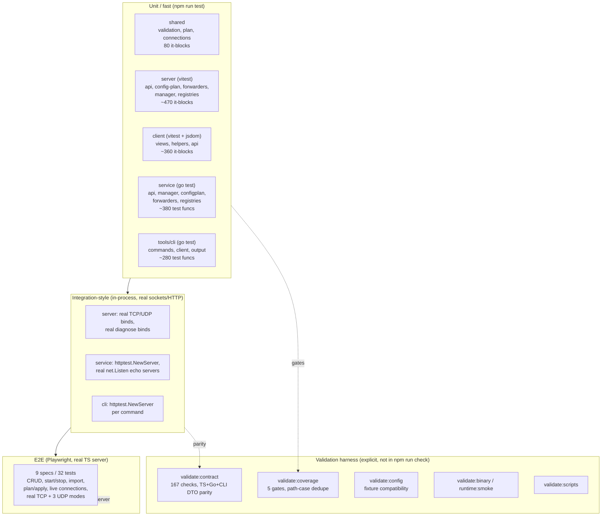

# Portier v1.6 Testing Audit 1

**Date:** 2026-06-09
**Auditor:** Claude (automated inspection) + manual classification
**Branch:** v1.6-arch-hardening (post Arch-A–D, commit c0c29f7)
**Scope:** Test implementation quality, structure, reliability, and completeness across all five components, E2E, and the validation harness.
**Constraints honored:** No fixes implemented, no tests added, no product/contract/doc changes. Audit report only.

> **Implementation status (updated 2026-06-09):**
> - **Test-A — Stabilize port allocation / EADDRINUSE risk — IMPLEMENTED.** Bounded bind-retry helpers added and consumed in the Go service forwarders + manager suites and the TS `tcp-forwarder` suite; `validate-contract.js` `startServer` now retries the child bind on a fresh port; the flagged udp_test.go ordering sleep is now a deadline poll. Test-only; no coverage/gate change. Residual follow-ups: TS `udp-forwarder.test.ts`, the api HTTP `/start` sites, E2E `port.ts` (serial — no intra-suite race).
> - **Test-D — TS ForwardManager persist-failure rollback parity — IMPLEMENTED (and exposed/fixed a real bug).** The TS `ForwardManager` had no persist-failure rollback (Go does), so a failed `store.save()` left in-memory rules inconsistent with `rules.json`. New `ControllableStore`-driven tests in `forward-manager.test.ts` failed against the old code, proving the gap; a minimal fix in `forward-manager.ts` (create/update/delete/reorder/import snapshot-and-restore) brings TS to parity with Go. `forward-manager.ts` 99.4%/88.7% → 99.5%/90.4%; server gate unchanged. `validate:coverage` + `validate:contract` (167/167) pass.
>
> See `docs/changelog.md` (Test-A / Test-D entries) and the durable testing rules in `CLAUDE.md`/`AGENTS.md`. **Recommended next: resume the coverage push** — CLI command edge cases toward 95%+, then the service/server high-value gaps in `audits/v1.6-coverage-audit-1.md`.

---

## Executive Summary

**Testing quality rating: 8 / 10.**

Portier's test suite is unusually disciplined for a project this size. It is real-runtime-oriented (httptest servers, real sockets, a real TypeScript server under Playwright — almost no fetch-level mocking), exit codes are first-class and directly asserted, contract parity is guarded across three runtime copies of the REST contract, and the v1.6 architecture refactors (Arch-C1/C2) shipped with full activity-payload regression tests. There are **no snapshot tests, no `.only`/`.skip`/`fit`/`fdescribe` leftovers, no `t.Skip` escapes, and no assertion-free tests** detected. AAA structure and naming are consistent.

The rating is held below 9 by three things: (1) a **runtime-parity testing asymmetry** — the Go `manager` has explicit persist-failure rollback tests but the TypeScript `forward-manager` does not, despite both having the rollback code; (2) a **structural EADDRINUSE/TOCTOU risk** in the free-port helpers on *both* runtimes (allocate-then-close-then-rebind); and (3) **E2E is workflow-real but thin** (32 tests, several relying on exact UI-copy strings and one CSS-class selector), with no offline/error-state coverage and no live-connection-in-table assertion.

**Biggest testing strengths**
1. Real-runtime bias over mocking — CLI uses `httptest.NewServer`, server/service tests bind real sockets, E2E runs a real server with real TCP/UDP echo servers.
2. Exit codes are a tested contract — `Run*` commands return `int`; tests assert the exact code (`_Exit0/1/2/3`, `applyExitCode`, `planExitCode`).
3. Three-way contract parity guard — `scripts/validate-contract.js` (`compareParity`, `firstDeepDiff`) plus the Arch-D CLI DTO live-decode guard (`contract_decode_test.go`).
4. Refactor safety nets — Arch-C2 activity-emission dedupe is covered by full-payload assertions in `manager_test.go` (`Test*ActivityPayload`).
5. Deterministic polling — Go waits use `waitForTestCondition` (5 s deadline, 10 ms poll) and deadline loops, not fixed sleeps, for assertions.

**Biggest testing risks**
1. **Parity gap:** TS `forward-manager` persist-failure rollback paths are code-covered but not behavior-tested; Go side is. (HIGH)
2. **EADDRINUSE/TOCTOU:** `getFreeTcpPort`/`freeTestTCPPort` close the listener before the forwarder rebinds — a real flake source on Windows under load/TIME_WAIT. **Observed during this audit:** the service `go test` suite failed once under concurrent load (lint+typecheck+coverage running together) and passed on two isolated re-runs with no tree changes. (HIGH)
3. **E2E brittleness & gaps:** exact empty-state copy strings, `label.auto-refresh-toggle` CSS selector, no offline/error-banner test, no "connection visible in table" assertion. (MEDIUM)
4. **Sleep-gated assertions in a few spots** (`udp_test.go:236`, `manager_test.go:1560`, `api_test.go` poll loops) — mostly bounded but worth auditing for the fixed-sleep ones. (LOW–MEDIUM)

**Should more coverage work proceed immediately?**
No — not blindly. The suite is high-quality enough that chasing the last few percentage points toward 100% should be **paused behind two small stability/parity fixes** (Test-A port allocation, Test-D TS parity rollback). Those are higher-value than line-hits and reduce flake risk before the gates are ratcheted further. After those land, resume the coverage push.

**Recommended first implementation slice:** **Test-A — Stabilize port allocation / EADDRINUSE risk** (shared helper that holds the port until the forwarder binds, or retry-on-EADDRINUSE), because it de-risks every other socket-binding test and is a prerequisite for safely raising gates.

---

## Test Architecture Map



---

## Current Test Inventory

Counts: TS `it()`/`test()` blocks; Go `func Test*`. (Excludes table sub-cases, so effective assertion count is higher.)

| Component | Unit test files | Integration-style tests | E2E coverage | Contract/validation | Approx coverage | Notable gaps |
| --------- | --------------- | ----------------------- | ------------ | ------------------- | --------------: | ------------ |
| **shared** | 3 (`validation`, `plan`, `connections`) — 80 blocks | none (pure) | n/a | canonical advisory/plan strings in `validate-contract.js` | 100/100/100 | none material |
| **server** | 18 files — ~470 blocks | `api.test.ts` (84), forwarders bind real sockets, `diagnose.test.ts` | via Playwright (real TS server) | `validate:contract` (TS runtime), `validate:config` | 95.3/92.0/100 | **persist-failure rollback not behavior-tested**; udp send-error callbacks; diagnose timeout paths |
| **service** | 13 files — ~380 funcs | `api_test.go` (90) httptest, forwarders real echo servers | n/a (Go has no browser) | `validate:contract` (Go runtime) | 88.5% stmts | `emitPacketError`, `acceptLoop` error inject, `config.Save` write/sync errors, `FromOSEnv`, platform |
| **client** | 16 files — ~360 blocks | `waitFor`/fake timers in 3 views | Playwright owns real flows | n/a | ~95/~89/~78 | App.tsx view-switch branches, ForwardRuleList handlers (drag/cancel), ActivityLogView filters |
| **tools/cli** | 17 files — ~280 funcs | all `httptest.NewServer`-backed | n/a | `contract_decode_test.go` (Arch-D), `validate:contract` | 93.2% | command error-path branches, `writePrettyJSON` MkdirAll path, `doWithBody` marshal (untestable) |
| **tests/e2e** | 9 specs — 32 tests | real server + real echo servers | — | own runner | n/a (no stmt metric) | offline/error banner, live conn in table, status filter, a11y, CLI E2E |
| **harness** | `validate-contract.js` (1556 lines), `validate-coverage.js` (330) | — | — | self | scripts unmeasured | one ~1100-line `runScenarios` function; scripts have no self-tests |

---

## Findings

| Area | File / Test / Identifier | Finding | Severity 1-10 | Category | Recommended Action | Effort | Risk | Notes |
| ---- | ------------------------ | ------- | ------------: | -------- | ------------------ | ------ | ---- | ----- |
| Runtime parity | `server/sources/forward-manager.test.ts` vs `service/sources/manager/manager_test.go:1583-1705` | Go has `TestCreateRulePersistFailureRollsBack`, `TestUpdateRulePersistFailureRollsBack`, `TestUpdateRulePersistFailureWithRunningRuleRestartsOriginal`, `TestDeleteRulePersistFailureRollsBack`, `TestReorderRulesPersistFailureRollsBack`. TS in-memory fake store `save()` **never throws** — no equivalent rollback behavior tests exist despite the rollback code path (`forward-manager.ts` branch 88.7%). | 7 | HIGH | Add TS tests injecting a `save()` that rejects for create/update/delete/reorder; assert rule list unchanged. | S | Low | Matches Coverage-Audit-1 "persist error rollback paths" category-A gap. The two runtimes' rollback semantics can silently drift. |
| Flakiness | `tests/e2e/helpers/port.ts:4`, `server/sources/test-helpers.ts:4`, `service/.../tcp_test.go:257`, `udp_test.go:22` | All free-port helpers `listen(:0)` → read port → **close** → later rebind. Classic TOCTOU; on Windows the closed port can land in TIME_WAIT or be grabbed by another process, producing EADDRINUSE. | 6 | HIGH | Provide a helper that keeps the listener open and hands it to the forwarder, OR a retry-on-EADDRINUSE wrapper around `Start()`. | M | Low | The "known EADDRINUSE/TIME_WAIT risk" is **still present** and structural, not yet mitigated. |
| E2E brittleness | `tests/e2e/connections.spec.ts:37,48,52`, `portier.spec.ts` empty states | Assertions on exact UI-copy strings ("No active TCP connections.", "No rule summaries available."). Copy changes break tests even when behavior is correct. | 3 | LOW | Prefer role/`data-testid` anchors for container presence; keep one copy assertion per surface, not per state. | S | Low | Acceptable for now; flag before any UI copy pass. |
| E2E brittleness | `tests/e2e/connections.spec.ts:100` | `page.locator("label.auto-refresh-toggle")` couples the test to a CSS class name. | 3 | LOW | Use `getByRole`/`getByLabel` for the toggle. | S | Low | Single occurrence. |
| E2E gap | `docs/e2e-coverage.md:70` | No test exercises the **API-unavailable / offline error banner** (marked "high" priority gap, still open). | 5 | MEDIUM | Add a spec that stops the server (or routes to a dead port) and asserts the error UI. | M | Med | The friendly-error transform is unit-tested but never E2E-exercised. |
| E2E gap | `docs/e2e-coverage.md:66-67` | "TCP/UDP connection visible in table" is never asserted — connections.spec only checks **empty** states. The Live Connections feature's primary value (showing live rows) is unverified E2E. | 5 | MEDIUM | One spec that holds a connection open across a refresh and asserts a row appears. | M | Med | Real-traffic specs exist for forwarding (`tcp/udp.spec.ts`) but not for the *inspector table*. |
| Determinism | `service/sources/forwarders/udp_test.go:236`, `manager_test.go:1560`, `tcp_connection_registry_test.go:98` | Fixed `time.Sleep` used to "let things settle" before asserting (vs the polling `waitForTestCondition` used elsewhere). Under heavy instrumentation these can flake. | 4 | MEDIUM | Convert fixed sleeps that gate assertions into `waitForTestCondition` polls. | S | Low | The `api_test.go` connection loops already poll correctly; these are the laggards. |
| Test speed | `service/sources/forwarders/tcp_test.go:321` | `waitForTestCondition` deadline raised 2 s→5 s for instrumentation robustness; combined with `-p 1` sequential service coverage (~30 s) this is the slowest gate. | 2 | OBSERVATION | Acceptable trade-off; documented in coverage-baseline. | — | — | Note the sequential run is a deliberate flake mitigation for `TestTCPForwarderEmitsConnectionClosedEvent`. |
| Maintainability | `scripts/validate-contract.js:361-1453` | `runScenarios` is a single ~1100-line function covering every endpoint. Hard to navigate; a failure points to a line, not a named scenario. | 4 | MEDIUM | Split into per-endpoint scenario functions sharing the `pass/fail/captureParity` helpers. | M | Low | Behavior is correct (167 checks); this is readability/maintainability only. Do not change in this audit. |
| Harness | `scripts/*.js` | Node validation scripts have **no self-tests** (`docs/coverage-baseline.md:246`). A bug in `validate-coverage.js` dedupe or `compareParity` would silently weaken the gate it enforces. | 5 | MEDIUM | Add a small `tests/scripts/` suite for `normalizePath`, gate math, and `firstDeepDiff`. | M | Med | These scripts ARE the safety net; the net itself is untested. |
| Coverage meaning | `client/.../DashboardView.test.tsx`, `ApiDocsView.test.tsx` | Remaining client branch gaps are zero-rule vs non-zero render variants and search-empty-match — low-value presentational branches. Forcing them risks implementation-detail tests. | 3 | OBSERVATION | Do NOT chase; cover via existing E2E render. | — | — | Coverage-Audit-1 already classified these category-C. |
| Security-relevant | `shared/sources/validation.test.ts`, `server/sources/api.test.ts` | LAN-exposure (`0.0.0.0`) advisory is asserted in shared + contract parity, but there is **no test asserting the management API refuses/ warns on a non-loopback default bind** beyond advisory wording. | 4 | LOW | Add a unit/contract assertion that default bind is `127.0.0.1` and `0.0.0.0` raises the management advisory end-to-end. | S | Low | Advisory *text* parity is strong; the *behavioral default* is implicit. |
| Positive | `service/sources/manager/manager_test.go:989-1051` | Activity payload regression tests (`Test*ActivityPayload`) assert type/severity/ruleId/ruleName/protocol/message after Arch-C2 dedupe — exactly the durable rule's requirement. | — | OBSERVATION | None — keep. | — | — | Strong refactor safety net. |
| Positive | `tools/cli/.../configapplycmd_test.go` | Exit codes asserted directly (`Exit0/1/2/3`), real `httptest` servers, no fetch mocking. CLI is not over-mocked despite being an API client. | — | OBSERVATION | None — keep. | — | — | Answers the "CLI too mock-heavy?" question: no. |

---

## Test Quality Analysis

**Naming.** Clear and behavior-oriented across runtimes. Go: `TestTCPForwarderForwardsBothDirectionsAndTracksStatus`, `TestCreateRulePersistFailureRollsBack`, `TestRunConfigApply_DestructiveWithoutYes_APIError_Exit1`. TS: `it("restarts a running rule when a forwarding field changes")`, `it("rejects merge when imported rule conflicts with existing listen binding")`. Names describe the behavior and the expected outcome, not the implementation.

**AAA structure.** Consistently followed. Go tests arrange (start echo server + forwarder), act (dial/write), assert (status/bytes), and clean up via `defer`. TS forwarder tests use a `cleanup[]` array drained in `afterEach` — clean and leak-free. CLI tests arrange an `httptest` server, run the command capturing stdout/stderr/exit code, then assert.

**Independence.** Strong. E2E isolates state with `clearAllRules()` (replace-import to empty) before each test and `fullyParallel:false, workers:1`. Go tests allocate fresh ephemeral ports per test and `defer` cleanup. No shared mutable global fixtures detected. The one cross-cutting concern is the shared free-port helper race (see Flakiness), not state leakage.

**Fixture quality.** Good and centralized. CLI apply/plan fixtures are small typed builders (`applyNoDriftFixture`, `planWithDriftFixture`) rather than giant JSON blobs. Config compatibility fixtures live in `tests/fixtures/config/` and are reused by `validate:config` and `settings.spec.ts`. The E2E config fixture is generated fresh per run by `globalSetup` into gitignored `test-results/`.

**Helper quality.** Helpers are thin and named, not magical. `tests/e2e/helpers/ui.ts` (`addRuleViaUI`, `startRuleViaUI`) encapsulate multi-step flows but each step is visible and uses semantic locators (`getByRole`, `getByLabel`). `tests/e2e/helpers/api.ts` does direct REST setup with explicit error throwing. Go `startTestEchoServer`/`waitForTestCondition` are appropriately small. **No helper hides assertions** — they hide setup, which is correct. Minor: `addRuleViaUI` asserts drawer-close + row-visible inside the helper, which is reasonable but means a failure there is attributed to setup, not the test body.

**Mocking.** Appropriately minimal. The codebase prefers real loopback servers (`httptest.NewServer`, real `net.Listen`, a real TS server under Playwright) over mocks. Client view tests mock the `portierApi` module / `fetch` and use `vi.useFakeTimers` for auto-refresh — appropriate for jsdom UI tests. No over-mocking of internal collaborators detected.

**Brittle selectors/assertions.** The weak spot. E2E leans on exact UI-copy strings for empty states and one CSS-class selector (`label.auto-refresh-toggle`). These are LOW severity individually but accumulate into a copy-change tax.

**Behavior vs implementation-detail.** Overwhelmingly behavior-focused. Tests assert observable outputs: bytes/packets counters, HTTP status + response shape, exit codes, activity payload fields, rendered text/visibility. The activity-payload tests assert the *contract* of the event (fields a consumer sees), not internal call wiring. No tests reach into private state to assert intermediate values.

**Determinism.** Strong on the Go HTTP/registry side (deadline polling) and TS forwarder side (event-driven `receiveOne`). The exceptions are the handful of fixed `time.Sleep` settle-waits flagged above.

---

## Test Pyramid Analysis

The pyramid is **correctly shaped**: a very wide unit/integration base (~1500+ TS blocks + Go funcs combined), a narrow E2E tip (32), and a contract layer running alongside.

- **Unit/integration balance:** Healthy. Most "integration" here is in-process-real (real sockets, real HTTP via httptest / a real TS server) rather than mocked — this is the right call for a forwarding tool where socket behavior *is* the product. The line between unit and integration is intentionally blurred toward realism.
- **E2E count (32):** Appropriately few, but slightly *too smoke-leaning* for the Live Connections feature: all 8 connections specs check empty states/controls, none verify a populated table. The forwarding specs (`tcp/udp.spec.ts`) are genuine end-to-end data-flow tests and are the strongest E2E.
- **Where contract tests do the right job:** Advisory/plan wording parity, response shapes, status codes, and the CLI DTO live-decode guard (Arch-D). These are cross-runtime invariants that unit tests in a single runtime *cannot* protect — contract is exactly right here.
- **Where contract tests are too broad:** `validate-contract.js` `runScenarios` bundles ~1100 lines into one function. It is the correct *layer* but the wrong *granularity* — a single failing assertion is hard to localize. This is a refactor candidate (Test-C-adjacent), not a relayering.
- **Tests that should become contract tests:** None urgent. The management-default-bind behavior (currently implicit) would be a good *new* contract assertion rather than a per-runtime unit test, since it's a cross-runtime safety invariant.
- **Contract tests that should become unit tests:** None — the contract suite is correctly scoped to cross-runtime observable behavior; it does not duplicate single-runtime unit logic.

---

## Flakiness and Stability Risks

| Risk | Where | Assessment |
| ---- | ----- | ---------- |
| **Port allocation TOCTOU** | `tests/e2e/helpers/port.ts`, `server/sources/test-helpers.ts`, `service/.../tcp_test.go:257`, `udp_test.go:22` | **Present and structural.** Allocate→close→rebind. Highest real flake source, especially on Windows (TIME_WAIT). See Test-A. |
| **TIME_WAIT / EADDRINUSE** | same | Same root cause. No retry-on-EADDRINUSE anywhere; a re-bind collision fails the test outright. |
| **Fixed sleeps gating assertions** | `udp_test.go:236` (20 ms), `manager_test.go:1560` (10 ms), `tcp_connection_registry_test.go:98` (10 ms), `udp_session_registry_test.go:170` (5 ms) | Low-to-moderate. Short, but instrumentation can blow past them. Prefer polling. |
| **Poll loops (good)** | `api_test.go:2312-2405` connection/session loops, `waitForTestCondition` | Well-designed: deadline + retry, tolerant of transient `http.Get` errors. Keep as the pattern. |
| **Filesystem temp paths** | `globalSetup` → `test-results/`, Go `t.TempDir()`, `config_test.go:194 TestSaveMkdirAllFails` | Clean. Gitignored, per-test temp dirs, no real `rules.json` touched. |
| **Windows/Linux differences** | `validate-coverage.js` path-case dedupe; `-p 1` sequential service run | The path-case ghost-entry bug is *mitigated in the gate script* but remains a latent tooling hazard (the script itself is untested — see Harness finding). |
| **Browser/E2E selectors** | `connections.spec.ts` copy strings + `label.auto-refresh-toggle` | Moderate brittleness; not flaky per se but fragile to UI edits. |
| **Random IDs/timestamps** | `domain.NewRuleID` (Arch-C1), `randomEventID`, `appliedAt` | Handled correctly: contract `normalize*` helpers strip timestamps/generated IDs before diffing (`captureParity`/`firstDeepDiff`). No assertion pins a random value. |
| **Runtime startup/shutdown** | Playwright `webServer` (30 s timeout, `reuseExistingServer:false`), `manager.StopAll()` defers, forwarder `Stop()` defers | Solid. Fresh server per run; deferred shutdown everywhere. The `tcp.Stop()`-then-dial assertion (`tcp_test.go:60`) correctly verifies listener closure. |

---

## Missing Critical Tests

| Component / area | Missing scenario | Why it matters | Test type | Coverage/risk impact |
| ---------------- | ---------------- | -------------- | --------- | -------------------- |
| **server forward-manager** | `save()` rejects → create/update/delete/reorder rollback | Data integrity; Go is tested, TS is not — silent parity drift. | unit | branch 88.7%→~95%; closes a HIGH parity gap |
| **server udp-forwarder** | `send()` error callbacks (one-way, last-client, multi-client) emit `udp.error` activity | User-visible error diagnostics; 86.3% stmts gap. | unit (mock conn) | +~1% server stmts |
| **server diagnose** | TCP connect timeout / UDP bind timeout paths | Diagnostic accuracy under failure; 85.9% gap. | integration | +~0.7% server |
| **service forwarders** | `emitPacketError` (currently 0%), `acceptLoop` Accept() error | Error-path parity with TS; flagged in two prior audits. | unit (mock net) | +~0.4% service |
| **service config** | `config.Save` Write/Sync/Rename error (beyond `TestSaveMkdirAllFails`) | Persistence correctness on disk failure. | unit (temp dir perms) | +~0.5% service |
| **service options** | `FromOSEnv` parsing | Env-driven config not unit-tested (needs env injection seam). | unit | needs refactor first |
| **cli** | `writePrettyJSON` MkdirAll path, `RunConfigExport` API error, diagnostics partial-failure `errors[]` | Backup/export safety + bundle completeness; 93.2%→~95%. | unit (httptest) | +~1.8% cli |
| **client** | App.tsx view-switch per route, ForwardRuleList drag/cancel/diagnose handlers, ActivityLogView severity/rule filters | Function coverage ~78%; real interaction branches. | unit (RTL) | +funcs toward 85% |
| **E2E** | API-offline error banner; live TCP/UDP row visible in inspector table; status filter; keyboard-nav smoke | Primary feature value + error UX currently unverified end-to-end. | E2E | risk reduction, no stmt metric |
| **E2E (CLI)** | No CLI E2E harness at all (`config diff/apply` against a real server) | CLI is fully unit/httptest-tested but never run against the real binary+server pair end-to-end. | E2E/integration | parity confidence |
| **harness** | `validate-coverage.js` dedupe + gate math; `validate-contract.js` `firstDeepDiff` | The safety net enforcing every gate is itself untested. | unit (node) | protects all gates |
| **security** | Management API default-bind is loopback; `0.0.0.0` raises management advisory end-to-end | Core safety rule (CLAUDE.md) is only implicitly tested. | contract/unit | safety assurance |

---

## 100% Coverage Interaction

**Tests needed for *meaningful* 100% (worth writing):**
- TS `forward-manager` persist-failure rollback (parity + branch).
- server `udp-forwarder` send-error callbacks; `diagnose` timeout paths.
- service `emitPacketError`, `config.Save` error injection, `acceptLoop` error.
- cli command error branches + `writePrettyJSON`.
These are behavior tests that also happen to raise coverage — the right kind.

**Uncovered areas that should NOT be chased:**
- Entry points / lifecycle: `server/index.ts`, `client/main.tsx`, service `main.go`, `platform/windows.go`, `logger.go` — already excluded as structural zeros (correct).
- `doWithBody` `json.Marshal` error (CLI) and `randomID`/`randomEventID` `crypto/rand` failure — structurally untestable; documented. Leave them.
- Client presentational branch variants (Dashboard zero-rule, ApiDocs empty-search) — low value; covered by E2E render. Forcing them invites implementation-detail tests.

**Areas needing refactor *before* coverage:**
- service `options.FromOSEnv` — needs an env-injection seam to be unit-testable; do not contort a test around real env vars.
- service `config.Save` error paths — cleanest with an injectable `fs.File`/writer seam (Coverage-Audit-1 category B/hard). Optional; temp-dir permission tricks can get partway.

**Should gates be raised or paused?**
**Pause the ratchet** until Test-A (port stability) and Test-D (TS parity rollback) land. Raising gates on top of a structural EADDRINUSE flake risk would convert a latent flake into intermittent CI gate failures. After those two slices, resume ratcheting service→90%, cli→95%, server→hold, client→funcs uplift.

---

## Recommended Implementation Slices

### Test-A — Stabilize port allocation / EADDRINUSE risk *(do first)*
- **Goal:** Eliminate the allocate→close→rebind TOCTOU across all runtimes.
- **Files:** `tests/e2e/helpers/port.ts`, `server/sources/test-helpers.ts`, `service/sources/forwarders/tcp_test.go`, `service/sources/forwarders/udp_test.go` (and any shared `freeTest*Port`).
- **Tests:** No new product tests; refactor helpers. Option 1: hand the already-open listener/socket to the forwarder. Option 2: wrap forwarder `Start()` in a bounded retry-on-EADDRINUSE in test helpers only.
- **Coverage impact:** None (test-infra only).
- **Risk:** Low; isolated to test helpers. Verify on Windows.
- **Validation:** `npm run test`, `npm run test:e2e:fresh`, `npm run coverage:service`.

### Test-D — Server/service parity: persist-failure rollback *(do second)*
- **Goal:** Close the HIGH parity gap — give TS the rollback behavior tests Go already has.
- **Files:** `server/sources/forward-manager.test.ts` (inject a store whose `save()` rejects).
- **Tests:** `create/update/delete/reorder` each with a failing `save()`; assert rule list unchanged and (for update on a running rule) original re-started — mirroring `manager_test.go:1583-1705`.
- **Coverage impact:** server branch 88.7%→~95%.
- **Risk:** Low; pure unit tests with a fake store.
- **Validation:** `npm run test`, `npm run validate:coverage:server`.

### Test-B — CLI exit-code & config command edge tests
- **Goal:** Push cli 93.2%→~95% via error branches.
- **Files:** `tools/cli/sources/commands/configcmd_test.go`, `diagnosticscmd_test.go`, `main_test.go`.
- **Tests:** export API error → non-zero; `--backup-out` write failure; diff `--fail-on-drift` exit 4; diagnostics partial-failure `errors[]`; `--version`; unknown subcommand exit 2; `formatChangeValue` type matrix.
- **Coverage impact:** cli +~1.8%.
- **Risk:** Low; all httptest-backed, no running service.
- **Validation:** `npm run test:cli`, `npm run validate:coverage:cli`.

### Test-C — E2E robustness & workflow matrix fill
- **Goal:** Reduce selector brittleness and cover the two highest-value E2E gaps.
- **Files:** `tests/e2e/connections.spec.ts`, new offline spec, `tests/e2e/helpers/ui.ts`, `docs/e2e-coverage.md`.
- **Tests:** add `data-testid`/role anchors for the auto-refresh toggle and empty-state containers; add "live TCP row appears in inspector" (hold a connection across refresh); add "API offline → error banner".
- **Coverage impact:** No stmt metric; closes two `docs/e2e-coverage.md` high-priority gaps.
- **Risk:** Medium (real-traffic-across-refresh timing); use the deadline-poll pattern.
- **Validation:** `npm run test:e2e:fresh`.

### Test-E — Service forwarder error-path + harness self-tests
- **Goal:** Cover `emitPacketError`/`acceptLoop`/`config.Save` errors and add minimal self-tests for the gate scripts.
- **Files:** `service/sources/forwarders/udp_test.go`, `tcp_test.go`, `config_test.go`; new `tests/scripts/` for `validate-coverage.js` `normalizePath`/gate math and `validate-contract.js` `firstDeepDiff`.
- **Tests:** mock `net.PacketConn`/`net.Listener` to inject errors; node tests for path-case dedupe and deep-diff.
- **Coverage impact:** service +~0.5–1%; protects all five gates.
- **Risk:** Low–Medium (mock net coupling).
- **Validation:** `npm run coverage:service`, `node` script tests.

---

## Validation Commands Used

Run as part of this audit (read-only; no packaging, no OS service installs):

```powershell
npm run lint              # see results below
npm run typecheck         # see results below
npm run validate:coverage # all five gates (path-case dedupe applied)
```

Inspection-only (not executed to avoid long runs unless results were needed): `npm run test`, `npm run validate:contract`. Source of contract status quoted from `docs/coverage-baseline.md`, `audits/v1.6-architecture-audit-1.md` (167/167 contract, gates passing at commit c0c29f7), and direct reading of test sources.

**Results:**

| Command | Result |
| ------- | ------ |
| `npm run lint` | **PASS** (exit 0) |
| `npm run typecheck` | **PASS** (exit 0) |
| `npm run validate:coverage` (run 1) | **FAILED** — but *not* on a gate threshold: `service` `go test` returned a non-zero exit (one service test failed). All other gates passed (shared 100/100/100, server 95.3/92.0/100, client 95.2/90.2/80.3, cli 93.2%). |
| `npm run coverage:service` (run 2, isolated) | **PASS** — all service packages `ok`, no failures. |
| `npm run validate:coverage:service` (run 3, isolated) | **PASS** — service 88.5% ≥ 88% gate. "All gates passed." |

> **Observed flake — direct evidence for Finding "Port allocation TOCTOU / EADDRINUSE".** Run 1 ran `lint`, `typecheck`, and `validate:coverage` **concurrently** (background tasks), putting the machine under CPU/port contention. Under that load the service `go test` suite failed; two isolated re-runs of the same suite passed with zero changes to the tree. This is exactly the non-deterministic, load-sensitive failure mode predicted by the allocate→close→rebind port helpers (`freeTestTCPPort`/`freeTestUDPPort`) and the fixed-sleep settle-waits. The failure was **not** a coverage regression and **not** reproducible in isolation — it is a stability/flake signal, and it elevates the confidence on the **HIGH** flakiness finding from "structural risk" to "observed at least once during this audit." (The first run's `go test` output scrolled past the captured tail, so the exact failing test name was not retained; re-running under load would be needed to capture it.)

All gate **thresholds** pass on clean/isolated runs. The only failure was a load-induced flake, which is itself a documented finding.

---

## Final Recommendation

**Block further coverage *ratcheting* until Test-A and Test-D land, then resume the coverage push.**

The suite is high quality (8/10) and does not need a quality rescue. But two concrete issues are higher-value than any line-hit: the structural EADDRINUSE/TOCTOU port-helper risk (a real flake source, especially on Windows) and the TS↔Go persist-rollback parity asymmetry (a silent-drift risk in data-integrity behavior). Both are small, low-risk slices. Land them first; then proceed to the coverage push (Test-B, Test-E) and the E2E robustness work (Test-C). Do not run the next audit first — the testing picture is clear enough to act on now.

---

## Appendix: Verification Notes

- **Verified from code:** all findings citing specific files/line numbers were read directly (forwarder tests, manager tests, CLI apply tests, E2E helpers/specs, contract script structure, free-port helpers).
- **Unable to verify (stated as such):** exact live `validate:contract` count this session (quoted as 167 from `audits/v1.6-architecture-audit-1.md` / CLAUDE.md, not re-run here); per-test wall-clock timings (no profiling run); whether the EADDRINUSE race has *ever* fired in CI (no CI history inspected — the risk is structural, not observed). Evidence needed to confirm the last point: CI flake logs or a stress run of the socket-binding suites on Windows.
- **No invented files/tests/identifiers:** every `Test*`/`it(...)`/helper/script name in this report was grepped or read in the working tree at commit c0c29f7.
</content>
</invoke>
